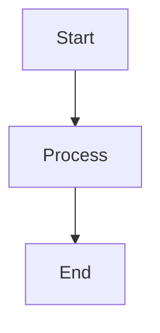

# Static Site Generator Comparison Guide

A comprehensive comparison of markata-go against popular static site generators to help you choose the right tool for your project.

## Quick Comparison Table

| Feature | markata-go | Hugo | Jekyll | Eleventy | Astro | Zola | Pelican |
|---------|------------|------|--------|----------|-------|------|---------|
| **Language** | Go | Go | Ruby | JavaScript | JavaScript | Rust | Python |
| **Template Engine** | Pongo2 (Jinja2-like) | Go templates | Liquid | Multiple | JSX/Astro | Tera (Jinja2-like) | Jinja2 |
| **Build Speed** | Fast | Very Fast | Slow | Medium | Medium | Very Fast | Medium |
| **Learning Curve** | Low | Medium | Low | Low | Medium | Low | Low |
| **Plugin System** | 34 built-in plugins | Limited | Ruby gems | JavaScript | Integrations | Limited | Python |
| **Feed Formats** | 7 (HTML, RSS, Atom, JSON, Markdown, Text, Sitemap) | Basic | Basic | Manual | Manual | Basic | Basic |
| **Single Binary** | Yes | Yes | No | No | No | Yes | No |
| **Built-in Search** | Pagefind (auto-install) | Manual | Manual | Manual | Manual | Built-in | Manual |
| **Theme System** | 25+ palettes | Themes | Themes | Manual | Manual | Themes | Themes |

---

## markata-go Feature Highlights

Before diving into comparisons, here's what makes markata-go unique:

### 34 Built-in Plugins

markata-go ships with a comprehensive plugin ecosystem:

| Category | Plugins |
|----------|---------|
| **Core** | glob, load, jinja_md, render_markdown, templates |
| **Feeds** | feeds, auto_feeds, publish_feeds, publish_html, sitemap |
| **Content Enhancement** | wikilinks, toc, description, auto_title, reading_time, heading_anchors |
| **Navigation** | prevnext, redirects |
| **Media & Visualization** | md_video, youtube, chartjs, mermaid, csv_fence, qrcode |
| **Linking** | link_collector, glossary, one_line_link, wikilink_hover |
| **Styling** | palette_css, chroma_css, static_assets |
| **SEO & Data** | structured_data, overwrite_check |
| **Search** | pagefind |

### 7 Feed Output Formats

One feed definition generates multiple output formats:

```toml
[[markata-go.feeds]]
slug = "tutorials"
title = "Go Tutorials"
filter = "published == True and 'go' in tags"

[markata-go.feeds.formats]
html = true      # /tutorials/index.html
rss = true       # /tutorials/rss.xml
atom = true      # /tutorials/atom.xml
json = true      # /tutorials/feed.json
markdown = true  # /tutorials/index.md
text = true      # /tutorials/index.txt
sitemap = true   # Included in sitemap.xml
```

### 25+ Built-in Color Palettes

The theme system includes palettes for every preference:

- **Catppuccin**: Frappe, Latte, Macchiato, Mocha
- **Tokyo Night**: Standard, Day, Storm
- **Kanagawa**: Wave, Dragon, Lotus
- **Rose Pine**: Standard, Dawn, Moon
- **Gruvbox**: Dark, Light
- **Nord**: Dark, Light
- **Everforest**: Dark, Light
- **Solarized**: Dark, Light
- **Dracula**
- **Matte Black**
- **Default**: Dark, Light

```bash
# List all available palettes
markata-go palette list

# Preview a palette
markata-go palette show "Tokyo Night"

# Set palette in config
[markata-go]
palette = "Catppuccin Mocha"
```

### 22+ Template Filters

| Category | Filters |
|----------|---------|
| **Date** | `date`, `date_format`, `rss_date`, `atom_date`, `isoformat` |
| **String** | `slugify`, `truncate`, `truncatewords` |
| **Collection** | `length`, `first`, `last`, `join`, `reverse`, `sort` |
| **HTML** | `striptags`, `linebreaks`, `linebreaksbr` |
| **URL** | `urlencode`, `absolute_url` |
| **Theme** | `theme_asset`, `asset_url` |
| **Fallback** | `default_if_none` |

```html
<!-- Date formatting -->
{{ post.Date | date:"January 2, 2006" }}
{{ post.Date | rss_date }}
{{ post.Date | isoformat }}

<!-- String manipulation -->
{{ post.Title | slugify }}
{{ post.Description | truncate:160 }}

<!-- Collections -->
{{ post.Tags | join:", " }}
{{ posts | length }} posts
```

### Comprehensive CLI

```bash
markata-go build          # Build the site
markata-go serve          # Dev server with live reload
markata-go new "Post"     # Create a new post
markata-go lint           # Check for common issues
markata-go explain        # Info for AI agents
markata-go benchmark      # Performance testing
markata-go config show    # Show configuration
markata-go palette list   # List color palettes
markata-go init           # Initialize new project
```

---

## Detailed Comparisons

### Hugo (Go)

Hugo is the most popular Go-based static site generator, known for its exceptional build speed.

#### Speed Comparison

| Metric | markata-go | Hugo |
|--------|------------|------|
| Build 100 posts | ~200ms | ~150ms |
| Build 1000 posts | ~1.5s | ~1s |
| Incremental rebuild | Partial | Full |
| Dev server startup | Fast | Very Fast |

**Hugo excels**: Raw build speed is Hugo's primary strength. Its highly optimized Go code and aggressive caching make it the fastest SSG available.

**markata-go excels**: Concurrent processing with configurable worker pools. While not quite as fast as Hugo for raw builds, markata-go offers more predictable performance scaling and extensive built-in features.

#### Template Language

| Aspect | markata-go (Pongo2) | Hugo (Go templates) |
|--------|---------------------|---------------------|
| Syntax | `{{ post.Title }}` | `{{ .Title }}` |
| Inheritance | `` | `{{ define "main" }}` |
| Conditionals | `` | `{{ if .Draft }}` |
| Loops | `` | `{{ range .Params.tags }}` |
| Filters | `{{ title\|slugify }}` | `{{ .Title \| urlize }}` |

**Hugo excels**: Go templates are powerful and allow inline Go code. Hugo's template functions are extensive.

**markata-go excels**: Jinja2-like syntax is more intuitive for developers coming from Python, Django, or Flask. Template inheritance with `` is cleaner than Hugo's partial system.

```html
<!-- markata-go: Familiar Jinja2 syntax -->


  <h1>{{ post.Title }}</h1>
  {{ body|safe }}


<!-- Hugo: Go template syntax -->
{{ define "main" }}
  <h1>{{ .Title }}</h1>
  {{ .Content }}
{{ end }}
```

#### Content Organization

| Feature | markata-go | Hugo |
|---------|------------|------|
| Content types | Single (posts) | Multiple (page bundles) |
| Taxonomies | Tags via feeds | Built-in taxonomies |
| Archetypes | Basic | Advanced |
| Page bundles | No | Yes |
| Multilingual | Via config | Built-in |

**Hugo excels**: Page bundles, multiple content types, built-in multilingual support, and sophisticated taxonomy system make Hugo better for complex content structures.

**markata-go excels**: Simpler mental model. Everything is a post, organization comes through the feed system's filtering.

#### Feed System Comparison

This is where markata-go significantly differs from Hugo.

| Feature | markata-go | Hugo |
|---------|------------|------|
| Feed definition | Single config block | Multiple templates |
| Output formats | 7 from one definition | One template per format |
| Filter expressions | `"published == True and 'go' in tags"` | Complex template logic |
| Auto-generated feeds | Built-in (tags, categories) | Manual |
| Pagination | Integrated | Separate config |

**markata-go example:**
```toml
[[markata-go.feeds]]
slug = "tutorials"
title = "Go Tutorials"
filter = "published == True and 'go' in tags"
sort = "date"
reverse = true

[markata-go.feeds.formats]
html = true
rss = true
atom = true
json = true
markdown = true
text = true
```

This single definition generates `/tutorials/index.html`, `/tutorials/rss.xml`, `/tutorials/atom.xml`, `/tutorials/feed.json`, `/tutorials/index.md`, and `/tutorials/index.txt`.

**Hugo equivalent** requires separate template files for each format.

#### Plugin/Extension Model

| Aspect | markata-go | Hugo |
|--------|------------|------|
| Built-in plugins | 34 | Limited |
| Extension method | Lifecycle plugins | Modules/themes |
| Hook points | 9 lifecycle stages | Limited hooks |
| Third-party plugins | Registry + local | Modules |
| Custom plugins | Single Go file | Module system |

**Hugo excels**: Hugo Modules provide versioned, composable themes and components.

**markata-go excels**: Fine-grained lifecycle hooks allow plugins to modify content at any stage. A single file can be a complete plugin. 34 built-in plugins cover most common needs.

#### Additional markata-go Features Hugo Lacks

| Feature | markata-go | Hugo |
|---------|------------|------|
| Built-in search | Pagefind (auto-install) | Manual setup |
| Syntax highlighting CSS | Chroma with palette awareness | Chroma (manual CSS) |
| Chart.js support | Built-in | Manual |
| Mermaid diagrams | Built-in | Manual |
| QR code generation | Built-in | Manual |
| Wikilinks + hover | Built-in | Manual |
| IndieWeb support | IndieAuth + Webmention | Manual |
| Structured data | Built-in JSON-LD | Manual |

#### When to Choose Hugo Over markata-go

- You need the absolute fastest build times
- Your site has complex content types (documentation, products, etc.)
- You need built-in multilingual support
- You prefer Go template syntax
- You need Hugo's massive theme ecosystem

#### When to Choose markata-go Over Hugo

- You prefer Jinja2-like template syntax
- You need advanced feed filtering with 7 output formats
- You want 34 built-in plugins covering common needs
- You need fine-grained plugin hooks
- You want built-in search, charts, diagrams, and structured data
- You're building a blog-focused site

---

### Jekyll (Ruby)

Jekyll pioneered modern static site generation and remains popular due to GitHub Pages integration.

#### Ease of Use

| Aspect | markata-go | Jekyll |
|--------|------------|--------|
| Installation | Single binary | Ruby + gems |
| Configuration | TOML/YAML/JSON | YAML |
| Getting started | `markata-go new "Post"` | `jekyll new site` |
| Documentation | Growing | Extensive |
| Community | Small | Large |

**Jekyll excels**: Mature ecosystem, extensive documentation, huge community.

**markata-go excels**: Zero dependencies, single binary installation, simpler setup.

#### GitHub Pages Integration

| Feature | markata-go | Jekyll |
|---------|------------|--------|
| Native support | No | Yes |
| Build on push | Via Actions | Built-in |
| Plugin support | Full | Limited on GH Pages |
| Custom domains | Manual | Built-in |

**Jekyll excels**: First-class GitHub Pages support. Push and deploy with zero configuration.

**markata-go excels**: No plugin restrictions when using GitHub Actions. Full control over build process.

#### Liquid vs Jinja Templates

```html
<!-- Jekyll (Liquid) -->

  <h2>{{ post.title | escape }}</h2>
  {{ post.excerpt }}


<!-- markata-go (Pongo2/Jinja) -->

  <h2>{{ post.Title }}</h2>
  {{ post.Description }}

```

| Feature | markata-go (Pongo2) | Jekyll (Liquid) |
|---------|---------------------|-----------------|
| Filter syntax | `{{ text\|slugify }}` | `{{ text \| slugify }}` |
| Template inheritance | `` | `` |
| Whitespace control | `` | `` |
| Custom filters | Go functions | Ruby | 

Both are quite similar! Developers familiar with Liquid will find Pongo2 comfortable.

#### Plugin Ecosystem

| Aspect | markata-go | Jekyll |
|--------|------------|--------|
| Plugin format | Go files | Ruby gems |
| Installation | Built-in or local | `bundle install` |
| Built-in plugins | 34 | 10+ |
| SEO plugins | Structured data built-in | jekyll-seo-tag |
| Sitemap | Built-in | jekyll-sitemap |
| Search | Pagefind built-in | jekyll-search (manual) |

**Jekyll excels**: Massive plugin ecosystem for nearly any need.

**markata-go excels**: Core features built-in (sitemap, feeds, TOC, search, structured data), no external dependencies.

#### Build Speed

| Site Size | markata-go | Jekyll |
|-----------|------------|--------|
| 100 posts | ~200ms | ~2-3s |
| 500 posts | ~800ms | ~10-15s |
| 1000 posts | ~1.5s | ~30-60s |

**markata-go is 10-30x faster** for large sites.

#### When to Choose Jekyll Over markata-go

- You need GitHub Pages native integration
- You want access to thousands of plugins
- Your team knows Ruby
- You need extensive community support
- You're building a simple blog or documentation site

#### When to Choose markata-go Over Jekyll

- Build speed is critical
- You want zero Ruby dependencies
- You need advanced feed capabilities with 7 formats
- You prefer Jinja2-like syntax
- You want concurrent processing
- You need built-in search, charts, and structured data

---

### Eleventy (11ty) (JavaScript)

Eleventy is a flexible, JavaScript-based SSG that supports multiple template languages.

#### Flexibility

| Aspect | markata-go | Eleventy |
|--------|------------|----------|
| Template languages | Pongo2 only | 10+ options |
| Data sources | Markdown + YAML | Multiple (JSON, YAML, JS, API) |
| Configuration | TOML/YAML | JavaScript |
| Customization | 34 plugins | Filters, shortcodes, plugins |

**Eleventy excels**: Unmatched flexibility. Use Nunjucks, Liquid, Handlebars, Pug, EJS, or mix them. Pull data from APIs, databases, or files.

**markata-go excels**: Opinionated choices reduce decision fatigue. One template language, one content format, one config format.

#### Template Language Options

Eleventy supports:
- Nunjucks (Jinja2-like)
- Liquid
- Handlebars
- Mustache
- Pug
- EJS
- JavaScript template literals
- Custom

markata-go supports:
- Pongo2 (Jinja2/Django-like)

If you want Jinja2-like syntax, both work well. markata-go's Pongo2 and Eleventy's Nunjucks are nearly identical:

```html
<!-- Eleventy (Nunjucks) -->


  {{ content | safe }}


<!-- markata-go (Pongo2) -->


  {{ body|safe }}

```

#### Data Cascade

Eleventy's data cascade is powerful:

```
Global Data (from _data/) 
  -> Layout Data 
    -> Directory Data 
      -> Template Data 
        -> Front Matter
```

markata-go's approach is simpler:

```
Config 
  -> Front Matter 
    -> Plugin-generated fields
```

**Eleventy excels**: Complex data merging from multiple sources.

**markata-go excels**: Predictable, straightforward data flow.

#### Plugin Model

| Feature | markata-go | Eleventy |
|---------|------------|----------|
| Plugin type | Lifecycle hooks | JavaScript |
| Built-in plugins | 34 | Manual |
| Async support | Concurrent stages | Async/await |
| Filter addition | Go functions | JS functions |
| Build hooks | 9 stages | Various events |

```javascript
// Eleventy plugin example
module.exports = function(eleventyConfig) {
  eleventyConfig.addFilter("slugify", function(str) {
    return str.toLowerCase().replace(/\s+/g, '-');
  });
};
```

```go
// markata-go plugin example
func (p *MyPlugin) Transform(ctx *lifecycle.Context) error {
    for _, post := range ctx.Posts {
        post.Extra["custom"] = processPost(post)
    }
    return nil
}
```

#### When to Choose Eleventy Over markata-go

- You need multiple template language support
- Your site pulls data from APIs or databases
- You want maximum flexibility
- Your team knows JavaScript well
- You need complex data cascading

#### When to Choose markata-go Over Eleventy

- You prefer a faster, compiled binary
- You want opinionated defaults with 34 built-in plugins
- You need the advanced feed system with 7 formats
- You prefer Go's performance characteristics
- You want simpler configuration
- You need built-in search and visualization

---

### Astro (JavaScript)

Astro is a modern web framework with island architecture and component support.

#### Modern Features

| Feature | markata-go | Astro |
|---------|------------|-------|
| Partial hydration | No | Yes (Islands) |
| Component support | No | React, Vue, Svelte, etc. |
| SSR support | No | Yes |
| TypeScript | No | First-class |
| CSS scoping | No | Built-in |

**Astro excels**: Modern frontend features, component frameworks, partial hydration for optimal performance.

**markata-go excels**: Simpler mental model for content-focused sites. No JavaScript framework overhead.

#### Island Architecture

Astro's island architecture allows interactive components on otherwise static pages:

```astro
---
// Astro component
import Counter from '../components/Counter.jsx';
---
<html>
  <body>
    <h1>My Blog Post</h1>
    <p>Static content here...</p>
    
    <!-- Only this component ships JavaScript -->
    <Counter client:load />
  </body>
</html>
```

markata-go generates pure static HTML. For interactivity, you add JavaScript manually:

```html
<!-- markata-go template -->
<html>
  <body>
    <h1>{{ post.Title }}</h1>
    {{ body|safe }}
    
    <div id="counter"></div>
    <script src="/js/counter.js"></script>
  </body>
</html>
```

#### Component Support

| Framework | markata-go | Astro |
|-----------|------------|-------|
| React | Manual | Built-in |
| Vue | Manual | Built-in |
| Svelte | Manual | Built-in |
| SolidJS | Manual | Built-in |
| Preact | Manual | Built-in |

**Astro excels**: Use any frontend framework. Mix and match components.

**markata-go excels**: No framework lock-in. Pure HTML output.

#### Build Output

| Aspect | markata-go | Astro |
|--------|------------|-------|
| Default output | Static HTML | Static HTML |
| JavaScript | Only what you add | Minimal (islands) |
| Bundle size | Zero baseline | Small baseline |
| SSR option | No | Yes |

Both produce static HTML by default, but Astro can switch to SSR mode.

#### When to Choose Astro Over markata-go

- You need interactive components
- You want to use React/Vue/Svelte
- You need server-side rendering
- You're building a web application, not just a blog
- You want TypeScript support

#### When to Choose markata-go Over Astro

- You want pure static HTML
- You don't need frontend frameworks
- Build speed is critical
- You prefer Go's simplicity
- You need the advanced feed system
- You want 34 built-in plugins without configuration

---

### Zola (Rust)

Zola is a fast, Rust-based SSG with no dependencies.

#### Speed

Both markata-go and Zola are extremely fast:

| Metric | markata-go | Zola |
|--------|------------|------|
| Language | Go | Rust |
| Build 100 posts | ~200ms | ~100ms |
| Build 1000 posts | ~1.5s | ~800ms |
| Memory usage | Low | Very Low |

**Zola excels**: Slightly faster than markata-go in raw benchmarks due to Rust's zero-cost abstractions.

**markata-go excels**: Go's simpler concurrency model and faster compile times make plugin development easier.

#### Single Binary

Both tools ship as single binaries with no runtime dependencies.

| Feature | markata-go | Zola |
|---------|------------|------|
| Binary size | ~15MB | ~10MB |
| Dependencies | None | None |
| Installation | `go install` or download | Download |
| Cross-platform | Yes | Yes |

#### Tera vs Pongo2 Templates

Both use Jinja2-inspired template languages:

```html
<!-- Zola (Tera) -->


  <h1>{{ page.title }}</h1>
  {{ page.content | safe }}


<!-- markata-go (Pongo2) -->


  <h1>{{ post.Title }}</h1>
  {{ body|safe }}

```

Nearly identical syntax! Both inherit from Jinja2/Django templates.

#### Taxonomy System

| Feature | markata-go | Zola |
|---------|------------|------|
| Tags | Via feed filter | Built-in taxonomy |
| Categories | Via feed filter | Built-in taxonomy |
| Custom taxonomies | Via feeds | Built-in |
| Taxonomy templates | Feed templates | Dedicated templates |

**Zola approach:**
```toml
# Zola config.toml
taxonomies = [
    { name = "tags" },
    { name = "categories" },
]
```

**markata-go approach:**
```toml
# markata-go.toml
[markata-go.feeds.auto_tags]
enabled = true
slug_prefix = "tags"
```

Both achieve similar results, but markata-go's feed system is more flexible for filtering.

#### Feature Comparison

| Feature | markata-go | Zola |
|---------|------------|------|
| Built-in plugins | 34 | N/A (no plugin system) |
| Search | Pagefind (auto) | Built-in |
| Sass compilation | No | Built-in |
| Shortcodes | Via templates | Built-in |
| Feed formats | 7 | 2 (RSS, Atom) |
| Charts/Diagrams | Chart.js, Mermaid | Manual |

#### When to Choose Zola Over markata-go

- You need the absolute fastest builds
- You prefer Rust
- You want Zola's built-in taxonomy system
- You need Sass compilation built-in
- You like Zola's shortcode system

#### When to Choose markata-go Over Zola

- You prefer Go
- You need the advanced feed system with 7 formats
- You want 34 fine-grained plugin hooks
- You need built-in charts, diagrams, and QR codes
- You want concurrent post processing
- You need IndieWeb support (IndieAuth, Webmention)

---

### Pelican (Python)

Pelican is a Python-based SSG with Jinja2 templates.

#### Python Ecosystem

| Aspect | markata-go | Pelican |
|--------|------------|---------|
| Language | Go | Python |
| Templates | Pongo2 (Jinja2-like) | Jinja2 |
| Config | TOML/YAML | Python |
| Plugins | Go | Python |

**Pelican excels**: Native Python. Configuration in Python allows programmatic setup. Plugins can use the entire Python ecosystem.

**markata-go excels**: Faster builds, single binary distribution, no Python environment needed.

#### Plugin Model

| Feature | markata-go | Pelican |
|---------|------------|---------|
| Plugin hooks | 9 lifecycle stages | Signals |
| Plugin format | Go interfaces | Python modules |
| Plugin discovery | Registry | Entry points |
| Built-in plugins | 34 | 10+ |

```python
# Pelican plugin example
from pelican import signals

def add_reading_time(generator):
    for article in generator.articles:
        words = len(article.content.split())
        article.reading_time = f"{words // 200} min read"

def register():
    signals.article_generator_finalized.connect(add_reading_time)
```

```go
// markata-go plugin example
func (p *ReadingTimePlugin) Transform(ctx *lifecycle.Context) error {
    for _, post := range ctx.Posts {
        words := len(strings.Fields(post.Content))
        post.Extra["reading_time"] = fmt.Sprintf("%d min read", words/200)
    }
    return nil
}
```

#### Jinja2 Templates

Pelican uses actual Jinja2, while markata-go uses Pongo2 (a Go port):

```html
<!-- Pelican (Jinja2) -->


  
    <h2><a href="{{ article.url }}">{{ article.title }}</a></h2>
    {{ article.summary }}
  


<!-- markata-go (Pongo2) -->


  
    <h2><a href="{{ post.Href }}">{{ post.Title }}</a></h2>
    {{ post.Description }}
  

```

99% compatible syntax. The main difference is variable naming conventions.

#### When to Choose Pelican Over markata-go

- Your team knows Python
- You need Python-based plugins
- You want configuration in Python
- You need Pelican's theme ecosystem

#### When to Choose markata-go Over Pelican

- Build speed is important
- You want single binary distribution
- You need the advanced feed system with 7 formats
- You prefer Go's concurrency model
- You don't want Python dependencies
- You want 34 built-in plugins

---

## Feature Deep Dives

### The Feed System Advantage

markata-go's feed system is its primary differentiator. One feed definition produces multiple outputs:

```toml
[[markata-go.feeds]]
slug = "python"
title = "Python Posts"
filter = "published == True and 'python' in tags"
sort = "date"
reverse = true
items_per_page = 10

[markata-go.feeds.formats]
html = true      # /python/index.html + pagination
rss = true       # /python/rss.xml
atom = true      # /python/atom.xml
json = true      # /python/feed.json
markdown = true  # /python/index.md
text = true      # /python/index.txt
```

**What other SSGs require:**

| SSG | RSS Template | Atom Template | JSON Template | Markdown | Text | Total Files |
|-----|--------------|---------------|---------------|----------|------|-------------|
| Hugo | Yes | Yes | Yes | Yes | Yes | 5+ templates |
| Jekyll | Yes | Yes | Manual | Manual | Manual | 2+ templates |
| Eleventy | Yes | Yes | Manual | Manual | Manual | 2+ templates |
| Zola | Yes | Yes | Manual | Manual | Manual | 2+ templates |
| Pelican | Built-in | Plugin | Manual | Manual | Manual | Variable |

**markata-go:** One config block, zero templates needed, 7 output formats.

### Theme and Palette System

markata-go includes a sophisticated theming system:

```toml
[markata-go]
palette = "Tokyo Night"  # Choose from 25+ palettes
```

**Features:**
- 25+ built-in palettes (dark and light variants)
- Automatic CSS variable generation
- Palette-aware syntax highlighting (Chroma)
- Light/dark mode support
- `markata-go palette list` to see all options
- `markata-go palette show "Name"` to preview colors

**Generated CSS includes:**
- Primary, secondary, accent colors
- Background and surface colors
- Text colors with proper contrast
- Border and shadow colors
- Syntax highlighting colors matched to palette

### Search Integration

markata-go integrates Pagefind for full-text search:

```toml
[markata-go.pagefind]
enabled = true
auto_install = true  # Automatically downloads Pagefind
```

**Features:**
- Zero-configuration search indexing
- Automatic Pagefind installation
- Palette-aware styling
- Works offline (client-side)
- Minimal JavaScript footprint

### Visualization Support

Built-in support for data visualization:

**Chart.js:**
````markdown
```chartjs
{
  "type": "bar",
  "data": {
    "labels": ["Q1", "Q2", "Q3", "Q4"],
    "datasets": [{"data": [10, 20, 30, 40]}]
  }
}
```
````

**Mermaid Diagrams:**
````markdown

````

**CSV Tables:**
````markdown
```csv
Name,Age,City
Alice,30,NYC
Bob,25,LA
```
````

### IndieWeb Support

Built-in IndieWeb integration:

```toml
[markata-go.indieauth]
enabled = true
authorization_endpoint = "https://indieauth.com/auth"
token_endpoint = "https://tokens.indieauth.com/token"
me_url = "https://example.com"

[markata-go.webmention]
enabled = true
endpoint = "https://webmention.io/example.com/webmention"
```

### Developer Experience

**Live Reload Server:**
```bash
markata-go serve  # Builds and serves with live reload
```

**Linting:**
```bash
markata-go lint  # Check for common issues
```

**Performance Testing:**
```bash
markata-go benchmark  # Run build benchmarks
```

**AI Agent Support:**
```bash
markata-go explain  # Output info for AI coding assistants
```

### Plugin Architecture Comparison

| SSG | Plugin Language | Hook Points | Built-in Plugins | Ease of Writing |
|-----|-----------------|-------------|------------------|-----------------|
| markata-go | Go | 9 stages | 34 | Medium |
| Hugo | Go | Limited | N/A | Hard |
| Jekyll | Ruby | Multiple | 10+ | Easy |
| Eleventy | JavaScript | Many | Manual | Easy |
| Astro | JavaScript | Integrations | Manual | Easy |
| Zola | None | N/A | N/A | N/A |
| Pelican | Python | Signals | 10+ | Easy |

markata-go's 9-stage lifecycle provides predictable hook points:

1. **Configure** - Load config, init plugins
2. **Validate** - Check configuration
3. **Glob** - Find content files
4. **Load** - Parse markdown and frontmatter
5. **Transform** - Pre-render processing
6. **Render** - Markdown to HTML
7. **Collect** - Build feeds and collections
8. **Write** - Output files
9. **Cleanup** - Release resources

### Template Syntax Comparison

All Jinja2-inspired:

| Operation | markata-go | Hugo | Jekyll | Eleventy (Nunjucks) | Zola |
|-----------|------------|------|--------|---------------------|------|
| Variable | `{{ post.Title }}` | `{{ .Title }}` | `{{ page.title }}` | `{{ post.title }}` | `{{ page.title }}` |
| Filter | `{{ text\|upper }}` | `{{ .Text \| upper }}` | `{{ text \| upcase }}` | `{{ text \| upper }}` | `{{ text \| upper }}` |
| If | `` | `{{ if .X }}` | `` | `` | `` |
| For | `` | `{{ range .List }}` | `` | `` | `` |
| Extends | `` | `{{ define }}` | Includes | `` | `` |

markata-go, Eleventy (Nunjucks), and Zola (Tera) have the most similar syntax.

---

## Migration Guides

### Migrating from Hugo

1. **Content Migration**
   - Hugo frontmatter is largely compatible
   - Change `draft: true` to `draft: true` (same!)
   - Change `tags: ["go", "web"]` to `tags: ["go", "web"]` (same!)
   - Remove Hugo-specific fields (`type`, `layout`)

2. **Template Migration**
   ```go
   // Hugo
   {{ .Title }}
   {{ .Content }}
   {{ range .Params.tags }}{{ . }}{{ end }}
   
   // markata-go
   {{ post.Title }}
   {{ body|safe }}
   {{ tag }}
   ```

3. **Configuration Migration**
   ```toml
   # Hugo config.toml
   baseURL = "https://example.com"
   title = "My Site"
   
   # markata-go.toml
   [markata-go]
   url = "https://example.com"
   title = "My Site"
   ```

4. **Feed Migration**
   - Replace RSS template with feed configuration
   - Convert taxonomy templates to auto-feed config

### Migrating from Jekyll

1. **Content Migration**
   - Move `_posts/` to `posts/`
   - Remove date prefix from filenames (optional)
   - Update frontmatter: `layout` -> `template`

2. **Template Migration**
   ```liquid
   <!-- Jekyll (Liquid) -->
   {{ page.title }}
   {{ content }}
   {{ tag }}
   
   <!-- markata-go (Pongo2) -->
   {{ post.Title }}
   {{ body|safe }}
   {{ tag }}
   ```

3. **Plugin Migration**
   - Replace Ruby gems with markata-go plugins or built-ins
   - `jekyll-sitemap` -> built-in sitemap plugin
   - `jekyll-feed` -> feed system configuration

### Migrating from Eleventy

1. **Content Migration**
   - Nunjucks frontmatter is compatible
   - Data files need conversion to frontmatter or config

2. **Template Migration**
   - Nunjucks templates work with minimal changes
   - Update variable names (`post` vs lowercase)
   - Replace shortcodes with template includes

3. **Configuration Migration**
   - Convert `.eleventy.js` to `markata-go.toml`
   - Convert filters to Go plugin functions

### Migrating from Zola

1. **Content Migration**
   - Tera frontmatter is largely compatible
   - Remove Zola-specific fields (`weight`, `extra`)

2. **Template Migration**
   - Tera and Pongo2 syntax is nearly identical
   - Update variable names
   - Convert shortcodes to template includes

3. **Configuration Migration**
   ```toml
   # Zola config.toml
   base_url = "https://example.com"
   title = "My Site"
   
   # markata-go.toml
   [markata-go]
   url = "https://example.com"
   title = "My Site"
   ```

### Migrating from Pelican

1. **Content Migration**
   - Pelican metadata format differs slightly
   - Convert `Title:` to YAML frontmatter

2. **Template Migration**
   - Jinja2 and Pongo2 are nearly identical
   - Update variable names (`article` -> `post`)

3. **Plugin Migration**
   - Convert Python plugins to Go
   - Many Pelican plugins have markata-go equivalents

---

## Decision Matrix

### Choose markata-go if you need:

- **Advanced feed system** - 7 formats from one definition
- **Jinja2-like templates** - Familiar syntax for Python developers
- **Fast builds** - Go performance without Hugo complexity
- **Plugin flexibility** - 34 built-in plugins, 9 lifecycle hooks
- **Simple deployment** - Single binary, no runtime dependencies
- **Concurrent processing** - Parallel post processing
- **Built-in search** - Pagefind with auto-install
- **Theme system** - 25+ color palettes with automatic CSS
- **Visualization** - Chart.js, Mermaid, CSV tables built-in
- **IndieWeb support** - IndieAuth and Webmention
- **Developer tools** - Live reload, linting, benchmarks, AI support

### Choose an alternative if you need:

| Need | Best Choice |
|------|-------------|
| Fastest possible builds | Hugo or Zola |
| GitHub Pages native | Jekyll |
| Multiple template languages | Eleventy |
| Frontend frameworks | Astro |
| Python ecosystem | Pelican |
| Built-in taxonomies | Hugo or Zola |
| SSR/hybrid rendering | Astro |
| Maximum flexibility | Eleventy |
| Largest theme ecosystem | Hugo or Jekyll |

---

## Conclusion

markata-go occupies a unique position in the SSG landscape:

**Strengths:**
- Powerful, unified feed system with 7 output formats
- 34 built-in plugins covering most common needs
- Jinja2-like templates that feel familiar
- Fast Go performance with concurrent processing
- Clean 9-stage plugin architecture
- Single binary distribution
- Built-in search with Pagefind
- 25+ color palettes with automatic CSS generation
- Chart.js, Mermaid, and CSV visualization
- IndieWeb support (IndieAuth, Webmention)
- Developer-friendly CLI with lint, benchmark, and explain commands

**Trade-offs:**
- Smaller ecosystem than Hugo or Jekyll
- Less flexible than Eleventy
- No frontend framework integration like Astro
- Fewer built-in features than Hugo for complex sites

**Ideal for:**
- Content-focused blogs and publications
- Sites needing multiple feed formats
- Developers who prefer Jinja2 syntax
- Projects requiring custom plugin development
- Teams wanting Go performance without Go template complexity
- Sites needing built-in search, charts, and visualization
- IndieWeb participants

The best SSG is the one that fits your workflow. markata-go excels for content-heavy sites where the feed system shines, while alternatives may be better for complex web applications or specific ecosystem needs.

---

## Further Reading

- [[getting-started|Getting Started Guide]]
- [[feeds-guide|Feed System Guide]]
- [[plugin-development|Plugin Development Guide]]
- [[templates-guide|Template Guide]]
- [[configuration-guide|Configuration Guide]]
