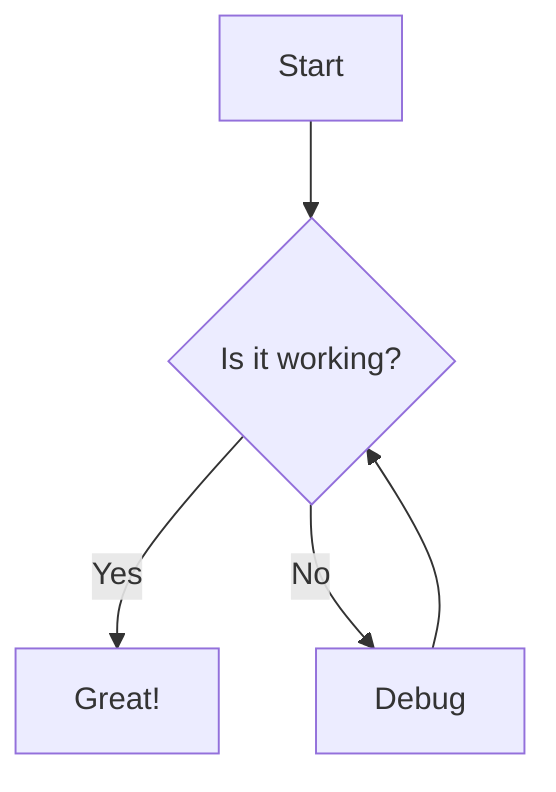

# Built-in Plugins Reference

This reference documents all built-in plugins that ship with markata-go. Plugins are organized by their lifecycle stage.

**Related guides:**
- [[plugin-development|Plugin Development]] - Create your own plugins
- [[configuration-guide|Configuration]] - Configure plugins
- [[feeds-guide|Feeds]] - Feed plugins in detail

## Plugin Lifecycle Overview

```
Configure -> Glob -> Load -> Transform -> Render -> Collect -> Write -> Cleanup
```

| Stage | Purpose | Example Plugins |
|-------|---------|-----------------|
| Configure | Initialize plugin settings | templates |
| Glob | Discover content files | glob |
| Load | Parse files into posts | load, frontmatter |
| Transform | Pre-render modifications | description, reading_time, jinja_md, wikilinks, toc |
| Render | Convert content to HTML | render_markdown, templates, admonitions, heading_anchors, link_collector, mermaid, glossary, csv_fence |
| Collect | Build collections/feeds | feeds, auto_feeds, prevnext |
| Write | Output files to disk | publish_html, publish_feeds, sitemap, rss, atom, jsonfeed, static_assets, redirects |
| Cleanup | Post-build cleanup | (none built-in) |

---

## Glob Stage

### glob

**Name:** `glob`  
**Stage:** Glob  
**Purpose:** Discovers content files using configurable glob patterns with gitignore support.

**Configuration (TOML):**
```toml
[markata]
glob_patterns = ["**/*.md"]  # Patterns to match

[markata.glob]
use_gitignore = true  # Respect .gitignore patterns
```

**Behavior:**
1. Matches files against configured glob patterns (supports `**` recursive matching)
2. Excludes files matching `.gitignore` patterns if enabled
3. Deduplicates files matched by multiple patterns
4. Returns sorted list for deterministic builds

**Example:**
```toml
[markata]
glob_patterns = [
    "posts/**/*.md",
    "pages/*.md",
    "docs/**/*.md"
]

[markata.glob]
use_gitignore = true
```

---

## Load Stage

### load

**Name:** `load`  
**Stage:** Load  
**Purpose:** Reads discovered files and parses them into Post objects with frontmatter and content.

**Configuration:** None (uses `content_dir` from main config)

**Behavior:**
1. Reads each file as UTF-8
2. Extracts YAML frontmatter between `---` delimiters
3. Creates Post object with parsed metadata and content
4. Generates slug from frontmatter, title, or filename
5. Generates href as `/{slug}/`

**Post fields set:**
| Field | Type | Description |
|-------|------|-------------|
| `path` | string | Source file path |
| `content` | string | Raw markdown content (after frontmatter) |
| `slug` | string | URL-friendly identifier |
| `href` | string | URL path (`/{slug}/`) |
| `title` | *string | From frontmatter |
| `date` | *time.Time | From frontmatter |
| `published` | bool | From frontmatter (default: false) |
| `draft` | bool | From frontmatter (default: false) |
| `skip` | bool | From frontmatter (default: false) |
| `tags` | []string | From frontmatter |
| `description` | *string | From frontmatter |
| `template` | string | Template name from frontmatter |

**Supported date formats:**
- RFC3339: `2024-01-15T10:30:00Z`
- ISO datetime: `2024-01-15T10:30:00`
- ISO datetime with space: `2024-01-15 10:30:00`
- ISO date: `2024-01-15`
- US format: `01/15/2024`
- European format: `15-01-2024`
- Long format: `January 15, 2024`
- Short format: `Jan 15, 2024`

---

### frontmatter

**Name:** `frontmatter`  
**Stage:** Load (utility)  
**Purpose:** Parses YAML frontmatter from markdown files. Used internally by the `load` plugin.

**Behavior:**
- Extracts content between `---` delimiters
- Parses YAML into a map
- Handles edge cases: no frontmatter, empty frontmatter, unclosed delimiters

**Example frontmatter:**
```yaml
---
title: My Post
date: 2024-01-15
published: true
tags:
  - go
  - programming
description: A short description
template: post.html
custom_field: custom value
---
```

---

## Transform Stage

### auto_title

**Name:** `auto_title`  
**Stage:** Transform (first priority)  
**Purpose:** Auto-generates human-readable titles for posts that don't have one by deriving them from filenames.

**Configuration:** None required.

**Behavior:**
1. Runs with highest priority in Transform stage (before other transform plugins)
2. Skips posts that already have a title set
3. Extracts the filename without extension
4. Replaces hyphens and underscores with spaces
5. Applies title case (first letter of each word capitalized)
6. Sets `post.Title`

**Post fields set:**
| Field | Type | Description |
|-------|------|-------------|
| `title` | *string | Generated title (if not already set) |

**Example transformations:**

| Filename | Generated Title |
|----------|-----------------|
| `my-first-post.md` | "My First Post" |
| `getting_started_guide.md` | "Getting Started Guide" |
| `hello-world.md` | "Hello World" |
| `2024-01-15-release-notes.md` | "2024 01 15 Release Notes" |

**When to use:**
- For quick drafts where you want titles auto-derived
- When filenames already describe the content well
- For sites with many posts where manual titling is tedious

**Limitations:**
- Does not extract titles from H1 headings in content (only uses filename)
- Numeric prefixes in filenames (like dates) become part of the title
- Special characters are kept as-is (not removed or transformed)

---

### description

**Name:** `description`  
**Stage:** Transform  
**Purpose:** Auto-generates meta descriptions for posts that don't have one by extracting the first paragraph.

**Configuration (TOML):**
```toml
[markata]
description_max_length = 160  # Maximum characters (default: 160)
```

**Behavior:**
1. Skips posts that already have a description
2. Extracts first paragraph from content
3. Strips markdown formatting (links, images, code, emphasis, headers, HTML)
4. Truncates at word boundary with ellipsis
5. Sets `post.Description`

**Post fields set:**
| Field | Type | Description |
|-------|------|-------------|
| `description` | *string | Generated description (if not already set) |

**Example:**
```markdown
---
title: My Post
# No description - will be auto-generated
---

This is my first paragraph that will become the description.
It continues here but will be truncated at 160 characters...

## Second Section
More content here.
```

---

### reading_time

**Name:** `reading_time`  
**Stage:** Transform  
**Purpose:** Calculates word count and estimated reading time for each post.

**Configuration (TOML):**
```toml
[markata]
words_per_minute = 200  # Average reading speed (default: 200)
```

**Behavior:**
1. Counts words in content (excludes code blocks, URLs, HTML)
2. Calculates reading time based on words per minute
3. Rounds up to nearest minute (minimum 1 minute)
4. Stores results in post's Extra map

**Post fields added (in `Extra`):**
| Field | Type | Description |
|-------|------|-------------|
| `word_count` | int | Number of words |
| `reading_time` | int | Minutes to read |
| `reading_time_text` | string | Formatted string (e.g., "5 min read") |

**Template usage:**
```html
<span class="reading-time">{{ post.Extra.reading_time_text }}</span>
<span class="word-count">{{ post.Extra.word_count }} words</span>
```

---

### jinja_md

**Name:** `jinja_md`  
**Stage:** Transform  
**Purpose:** Processes Jinja2 template expressions within markdown content before rendering.

**Configuration:** Requires `jinja: true` in post frontmatter.

**Activation:**
Posts must explicitly enable Jinja processing:
```yaml
---
title: Dynamic Post
jinja: true
---
```

**Template context:**
| Variable | Type | Description |
|----------|------|-------------|
| `post` | Post | Current post object |
| `config` | Config | Site configuration |
| `posts` | []Post | All posts |
| `core` | Manager | Lifecycle manager for filtering |
| `filter` | func | Filter posts by expression |
| `map` | func | Map field values from posts |

**Example content:**
```markdown
---
title: Recent Posts Index
jinja: true
---

# Latest Posts


- [{{ p.Title }}]({{ p.Href }}) - {{ p.Date.Format "Jan 2, 2006" }}


## All Tags

- {{ tag }}

```

---

### wikilinks

**Name:** `wikilinks`  
**Stage:** Transform  
**Purpose:** Transforms `[[slug]]` and `[[slug|text]]` wikilink syntax into HTML anchor tags.

**Configuration (TOML):**
```toml
[markata]
wikilinks_warn_broken = true  # Warn about broken links (default: true)
```

**Syntax:**
```markdown
Link to another post: [[other-post-slug]]
With custom text: [[other-post-slug|Click here to read more]]
```

**Behavior:**
1. Finds all `[[...]]` patterns in content
2. Looks up target post by slug (case-insensitive)
3. If found: converts to `<a href="/slug/">Title</a>`
4. If not found: keeps original syntax, adds warning to post

**Post fields added (in `Extra`):**
| Field | Type | Description |
|-------|------|-------------|
| `wikilink_warnings` | []string | List of broken wikilink warnings |

**Example:**
```markdown
Check out my [[getting-started]] guide.
You might also like [[advanced-topics|the advanced guide]].
```

Becomes:
```html
Check out my <a href="/getting-started/">Getting Started</a> guide.
You might also like <a href="/advanced-topics/">the advanced guide</a>.
```

---

### toc

**Name:** `toc`  
**Stage:** Transform  
**Purpose:** Extracts headings from markdown and builds a hierarchical table of contents.

**Configuration (TOML):**
```toml
[markata]
toc_min_level = 2  # Minimum heading level (default: 2, h2)
toc_max_level = 4  # Maximum heading level (default: 4, h4)
```

**Behavior:**
1. Parses ATX-style headings (`# Heading`)
2. Generates URL-safe IDs from heading text
3. Handles duplicate IDs by appending numbers
4. Builds hierarchical structure

**Post fields added (in `Extra`):**
| Field | Type | Description |
|-------|------|-------------|
| `toc` | []TocEntry | Hierarchical table of contents |

**TocEntry structure:**
```go
type TocEntry struct {
    Level    int         // Heading level (2-6)
    Text     string      // Heading text
    ID       string      // Anchor ID
    Children []*TocEntry // Nested headings
}
```

**Template usage:**
```html

<nav class="toc">
    <h2>Table of Contents</h2>
    <ul>
    
        <li>
            <a href="#{{ entry.ID }}">{{ entry.Text }}</a>
            
            <ul>
            
                <li><a href="#{{ child.ID }}">{{ child.Text }}</a></li>
            
            </ul>
            
        </li>
    
    </ul>
</nav>

```

---

## Render Stage

### admonitions

**Name:** `admonitions`  
**Stage:** Render (goldmark extension)  
**Purpose:** Renders admonition blocks (notes, warnings, tips) from markdown.

**Syntax:**
```markdown
!!! note "Optional Title"
    Content of the note goes here.
    Must be indented with 4 spaces.

!!! warning
    Default title will be "Warning"

!!! tip "Pro Tip"
    Helpful information here.
```

**Supported types:**
- `note` - General information
- `warning` - Caution/warning
- `tip` - Helpful tips
- `important` - Important information
- `danger` - Dangerous/critical warnings
- `caution` - Proceed with care

**HTML output:**
```html
<div class="admonition note">
    <p class="admonition-title">Note</p>
    <p>Content of the note goes here.</p>
</div>
```

**CSS styling:**
```css
.admonition {
    padding: 1rem;
    margin: 1rem 0;
    border-left: 4px solid;
    border-radius: 4px;
}
.admonition.note { border-color: #448aff; background: #e3f2fd; }
.admonition.warning { border-color: #ff9800; background: #fff3e0; }
.admonition.tip { border-color: #4caf50; background: #e8f5e9; }
.admonition.danger { border-color: #f44336; background: #ffebee; }
.admonition-title { font-weight: bold; margin-bottom: 0.5rem; }
```

---

### render_markdown

**Name:** `render_markdown`  
**Stage:** Render  
**Purpose:** Converts markdown content to HTML using goldmark with extensions.

**Configuration:** None (extensions enabled by default)

**Enabled extensions:**
- **GFM** - GitHub Flavored Markdown (tables, strikethrough, autolinks, task lists)
- **Syntax Highlighting** - Code block highlighting with Chroma (monokai theme)
- **Admonitions** - Note/warning blocks
- **Auto Heading IDs** - Generates IDs for headings

**Behavior:**
1. Takes `post.Content` (raw markdown)
2. Converts to HTML with all extensions
3. Stores result in `post.ArticleHTML`

**Post fields set:**
| Field | Type | Description |
|-------|------|-------------|
| `article_html` | string | Rendered HTML content |

**Supported markdown features:**
```markdown
## Tables
| Header | Header |
|--------|--------|
| Cell   | Cell   |

## Task Lists
- [x] Completed task
- [ ] Pending task

## Strikethrough
~~deleted text~~

## Code Blocks
```go
func main() {
    fmt.Println("Syntax highlighted!")
}
```

## Footnotes
Here's a sentence with a footnote.[^1]

[^1]: This is the footnote content.
```

---

### templates

**Name:** `templates`  
**Stage:** Render  
**Purpose:** Wraps rendered markdown content in HTML templates with theme support.

**Configuration (TOML):**
```toml
[markata]
templates_dir = "templates"  # Templates directory (default: "templates")
theme = "default"            # Theme name (default: "default")

# Or with theme options:
[markata.theme]
name = "default"
```

**Behavior:**
1. Looks up template from `post.Template` (default: `post.html`)
2. Renders template with post context
3. Falls back to raw `ArticleHTML` if no template exists
4. Stores result in `post.HTML`

**Template context:**
| Variable | Type | Description |
|----------|------|-------------|
| `post` | Post | Current post |
| `body` | string | `post.ArticleHTML` |
| `config` | Config | Site configuration |
| `core` | Manager | Lifecycle manager |

**Post fields set:**
| Field | Type | Description |
|-------|------|-------------|
| `html` | string | Final HTML (content + template) |

**Example template (`templates/post.html`):**
```html
<!DOCTYPE html>
<html>
<head>
    <title>{{ post.Title }} | {{ config.Title }}</title>
    <meta name="description" content="{{ post.Description }}">
</head>
<body>
    <article>
        <h1>{{ post.Title }}</h1>
        <time>{{ post.Date.Format "January 2, 2006" }}</time>
        <div class="content">{{ body | safe }}</div>
    </article>
</body>
</html>
```

---

### heading_anchors

**Name:** `heading_anchors`  
**Stage:** Render (post_render)  
**Purpose:** Adds clickable anchor links to headings in rendered HTML for easy linking to sections.

**Configuration (TOML):**
```toml
[markata.heading_anchors]
enabled = true        # Enable/disable the plugin (default: true)
min_level = 2         # Minimum heading level to process (default: 2, h2)
max_level = 4         # Maximum heading level to process (default: 4, h4)
position = "end"      # Anchor position: "start" or "end" (default: "end")
symbol = "#"          # Link text for the anchor (default: "#")
class = "heading-anchor"  # CSS class for the anchor link (default: "heading-anchor")
```

**Behavior:**
1. Runs after `render_markdown` to process `ArticleHTML`
2. Finds all heading tags within the configured level range
3. Extracts existing IDs or generates URL-safe IDs from heading text
4. Handles duplicate IDs by appending numbers (e.g., `my-heading`, `my-heading-1`)
5. Inserts anchor link at the configured position (start or end of heading)

**HTML output example:**
```html
<!-- Input (from render_markdown) -->
<h2 id="getting-started">Getting Started</h2>

<!-- Output (with default config, position="end") -->
<h2 id="getting-started">Getting Started <a href="#getting-started" class="heading-anchor">#</a></h2>

<!-- Output (with position="start") -->
<h2 id="getting-started"><a href="#getting-started" class="heading-anchor">#</a> Getting Started</h2>
```

**CSS styling:**
```css
.heading-anchor {
    opacity: 0;
    text-decoration: none;
    margin-left: 0.5rem;
    color: #666;
}
h2:hover .heading-anchor,
h3:hover .heading-anchor,
h4:hover .heading-anchor {
    opacity: 1;
}
```

---

### md_video

**Name:** `md_video`  
**Stage:** Render (post_render)  
**Purpose:** Converts markdown image syntax for video files into HTML video elements with GIF-like autoplay behavior by default.

**Configuration (TOML):**
```toml
[markata.md_video]
enabled = true                    # Enable the plugin (default: true)
video_extensions = [".mp4", ".webm", ".ogg", ".ogv", ".mov", ".m4v"]  # Extensions to treat as video
video_class = "md-video"          # CSS class for video elements (default)
controls = true                   # Show video controls (default: true)
autoplay = true                   # Auto-start playback (default: true)
loop = true                       # Loop video continuously (default: true)
muted = true                      # Mute audio (default: true, required for autoplay)
playsinline = true                # Play inline on mobile (default: true)
preload = "metadata"              # Preload hint: "none", "metadata", "auto" (default: "metadata")
```

**Why GIF-like defaults?**

The default configuration mimics animated GIF behavior because most embedded videos in blog posts are short demonstrations, screen recordings, or animations. Users expect these to play automatically without sound, similar to GIFs.

To use traditional video behavior (click to play with sound):
```toml
[markata.md_video]
autoplay = false
loop = false
muted = false
controls = true
```

**Markdown usage:**
```markdown


```

**Behavior:**
1. Scans `ArticleHTML` for `` tags after markdown rendering
2. Checks if the `src` attribute ends with a video extension (handles query parameters)
3. Replaces matching `` tags with `<video>` elements
4. Preserves the `alt` text as fallback content
5. Automatically detects MIME type from file extension

**HTML output:**
```html
<video autoplay loop muted playsinline controls preload="metadata" class="md-video">
  <source src="https://example.com/video.mp4" type="video/mp4">
  kickflip down the 3 stair - fingerboarding
</video>
```

**MIME type detection:**

| Extension | MIME Type |
|-----------|-----------|
| `.mp4` | `video/mp4` |
| `.webm` | `video/webm` |
| `.ogg`, `.ogv` | `video/ogg` |
| `.mov` | `video/quicktime` |
| `.m4v` | `video/x-m4v` |
| `.avi` | `video/x-msvideo` |

**CSS styling:**
```css
.md-video {
    max-width: 100%;
    height: auto;
    border-radius: 4px;
}
```

---

### link_collector

**Name:** `link_collector`  
**Stage:** Render (post_render)  
**Purpose:** Collects all hyperlinks from posts and tracks inlinks (pages linking TO a post) and outlinks (pages a post links TO).

**Configuration (TOML):**
```toml
[markata.link_collector]
include_feeds = false  # Include feed pages in inlinks (default: false)
include_index = false  # Include index page in inlinks (default: false)
```

**Note:** The plugin also reads `url` from `config.Extra` to determine internal vs external links.

**Behavior:**
1. Runs after `render_markdown` to process `ArticleHTML`
2. Extracts all `<a href="...">` links from each post
3. Resolves relative URLs against the post's URL
4. Distinguishes internal links (same domain) from external links
5. Looks up target posts for internal links
6. Populates `Inlinks` and `Outlinks` on each post
7. Stores all links in cache for use by other plugins

**Post fields set:**
| Field | Type | Description |
|-------|------|-------------|
| `hrefs` | []string | All href values found in the post |
| `inlinks` | []*Link | Links from other posts pointing to this post |
| `outlinks` | []*Link | Links from this post to other pages |

**Link structure:**
```go
type Link struct {
    SourceURL    string  // Full URL of the source page
    SourcePost   *Post   // Source post object (if internal)
    TargetPost   *Post   // Target post object (if internal)
    RawTarget    string  // Original href value
    TargetURL    string  // Resolved full URL
    TargetDomain string  // Domain of target URL
    IsInternal   bool    // True if same domain
    IsSelf       bool    // True if self-link
    SourceText   string  // Link text from source
    TargetText   string  // Title of target post (if internal)
}
```

**Template usage:**
```html

<aside class="backlinks">
    <h3>Pages that link here</h3>
    <ul>
    
        <li><a href="{{ link.SourcePost.Href }}">{{ link.SourcePost.Title }}</a></li>
    
    </ul>
</aside>



<aside class="outlinks">
    <h3>Links from this page</h3>
    <ul>
    
        <li>
            <a href="{{ link.TargetURL }}">
                {{ link.TargetText }}{{ link.TargetDomain }}
            </a>
            <span class="external">↗</span>
        </li>
    
    </ul>
</aside>

```

---

### chartjs

**Name:** `chartjs`  
**Stage:** Render (after render_markdown)  
**Purpose:** Converts `chartjs` code blocks into interactive Chart.js charts.

**Configuration (TOML):**
```toml
[markata.chartjs]
enabled = true
cdn_url = "https://cdn.jsdelivr.net/npm/chart.js"
container_class = "chartjs-container"
```

**Options:**
| Option | Default | Description |
|--------|---------|-------------|
| `enabled` | `true` | Enable/disable the plugin |
| `cdn_url` | `https://cdn.jsdelivr.net/npm/chart.js` | Chart.js CDN URL |
| `container_class` | `chartjs-container` | CSS class for wrapper div |

**Markdown syntax:**
````markdown
```chartjs
{
  "type": "bar",
  "data": {
    "labels": ["Red", "Blue", "Yellow"],
    "datasets": [{
      "label": "My Dataset",
      "data": [12, 19, 3],
      "backgroundColor": ["#ff6384", "#36a2eb", "#ffce56"]
    }]
  }
}
```
````

**HTML output:**
```html
<div class="chartjs-container">
  <canvas id="chart-abc123"></canvas>
  <script>
    (function() {
      var ctx = document.getElementById('chart-abc123').getContext('2d');
      new Chart(ctx, {"type":"bar","data":{...}});
    })();
  </script>
</div>
```

**Supported chart types:**
- `bar`, `line`, `pie`, `doughnut`, `radar`, `polarArea`, `bubble`, `scatter`

**Template requirements:**
Include Chart.js in your base template:
```html
<script src="https://cdn.jsdelivr.net/npm/chart.js"></script>
```

---

### one_line_link

**Name:** `one_line_link`  
**Stage:** Render (after render_markdown)  
**Purpose:** Expands standalone URLs in paragraphs into styled link preview cards.

**Configuration (TOML):**
```toml
[markata.one_line_link]
enabled = true
card_class = "link-card"
fallback_title = "Link"
timeout = 5
exclude_patterns = ["^https://twitter\\.com", "^https://x\\.com"]
```

**Options:**
| Option | Default | Description |
|--------|---------|-------------|
| `enabled` | `true` | Enable/disable the plugin |
| `card_class` | `link-card` | CSS class for the link card |
| `fallback_title` | `Link` | Title when metadata unavailable |
| `timeout` | `5` | HTTP timeout in seconds |
| `exclude_patterns` | `[]` | Regex patterns for URLs to skip |

**Behavior:**
1. Finds paragraphs containing only a URL (`<p>https://...</p>`)
2. Extracts the domain from the URL
3. Converts to a styled link card

**Before:**
```html
<p>https://example.com/article</p>
```

**After:**
```html
<a href="https://example.com/article" class="link-card" target="_blank" rel="noopener noreferrer">
  <div class="link-card-content">
    <div class="link-card-title">Link</div>
    <div class="link-card-url">example.com</div>
  </div>
</a>
```

**CSS example:**
```css
.link-card {
  display: block;
  padding: 1rem;
  border: 1px solid var(--color-border);
  border-radius: 8px;
  text-decoration: none;
  transition: box-shadow 0.2s;
}
.link-card:hover {
  box-shadow: 0 2px 8px rgba(0,0,0,0.1);
}
.link-card-title {
  font-weight: bold;
  color: var(--color-text);
}
.link-card-url {
  font-size: 0.875rem;
  color: var(--color-text-muted);
}
```

---

### wikilink_hover

**Name:** `wikilink_hover`  
**Stage:** Render (after wikilinks)  
**Purpose:** Adds hover preview data attributes to wikilinks for tooltip/popup previews.

**Configuration (TOML):**
```toml
[markata.wikilink_hover]
enabled = true
preview_length = 200
include_image = true
screenshot_service = ""  # Optional: "https://screenshot.example.com/capture?url="
```

**Options:**
| Option | Default | Description |
|--------|---------|-------------|
| `enabled` | `true` | Enable/disable the plugin |
| `preview_length` | `200` | Max characters for preview text |
| `include_image` | `true` | Add preview image if available |
| `screenshot_service` | `""` | URL prefix for screenshot service |

**Behavior:**
1. Finds `<a class="wikilink">` tags created by the wikilinks plugin
2. Looks up the target post by href
3. Adds data attributes for hover previews

**Data attributes added:**
| Attribute | Description |
|-----------|-------------|
| `data-preview` | Truncated description or content |
| `data-preview-image` | Featured image URL (if available) |
| `data-preview-screenshot` | Screenshot service URL (if configured) |

**Before:**
```html
<a href="/my-post/" class="wikilink">My Post</a>
```

**After:**
```html
<a href="/my-post/" class="wikilink" 
   data-preview="This is a description of the post..."
   data-preview-image="/images/featured.jpg">My Post</a>
```

**JavaScript for hover previews:**
```javascript
document.querySelectorAll('.wikilink[data-preview]').forEach(link => {
  link.addEventListener('mouseenter', (e) => {
    const preview = e.target.dataset.preview;
    const image = e.target.dataset.previewImage;
    // Show tooltip with preview content and optional image
  });
});
```

**Image field lookup order:**
The plugin checks these Extra fields for images:
1. `image`
2. `featured_image`
3. `cover_image`
4. `og_image`
5. `thumbnail`

---

## Collect Stage

### feeds

**Name:** `feeds`  
**Stage:** Collect  
**Purpose:** Processes configured feed definitions, filtering, sorting, and paginating posts.

**Configuration (TOML):**
```toml
[[markata.feeds]]
slug = "blog"
title = "Blog Posts"
description = "All blog posts"
filter = "published == true and not draft"
sort = "date"
reverse = true
items_per_page = 10

[markata.feeds.formats]
html = true
rss = true
atom = false
json = false

[[markata.feeds]]
slug = "tutorials"
title = "Tutorials"
filter = "tags contains 'tutorial'"
sort = "date"
reverse = true
```

**Feed configuration options:**
| Option | Type | Default | Description |
|--------|------|---------|-------------|
| `slug` | string | required | URL path for the feed |
| `title` | string | "" | Feed title |
| `description` | string | "" | Feed description |
| `filter` | string | "" | Filter expression |
| `sort` | string | "date" | Sort field |
| `reverse` | bool | true | Reverse sort order |
| `items_per_page` | int | 10 | Posts per page |
| `formats` | object | varies | Output formats |

**Filter expression syntax:**
```toml
# Equality
filter = "published == true"
filter = "category == 'news'"

# Contains (for arrays)
filter = "tags contains 'go'"

# Boolean combinations
filter = "published == true and not draft"
filter = "tags contains 'go' or tags contains 'python'"

# Comparisons
filter = "date >= '2024-01-01'"
```

See [[feeds-guide|Feeds Guide]] for complete filter syntax.

---

### auto_feeds

**Name:** `auto_feeds`  
**Stage:** Collect  
**Purpose:** Automatically generates feeds for tags, categories, and date archives.

**Configuration (TOML):**
```toml
[markata.auto_feeds.tags]
enabled = true
slug_prefix = "tags"  # Results in /tags/python/, /tags/go/, etc.

[markata.auto_feeds.tags.formats]
html = true
rss = true

[markata.auto_feeds.categories]
enabled = true
slug_prefix = "categories"

[markata.auto_feeds.categories.formats]
html = true
rss = true

[markata.auto_feeds.archives]
enabled = true
slug_prefix = "archive"
yearly_feeds = true   # /archive/2024/
monthly_feeds = false # /archive/2024/01/

[markata.auto_feeds.archives.formats]
html = true
rss = false
```

**Generated feeds:**

For tags:
- `/tags/python/` - Posts tagged "python"
- `/tags/go/` - Posts tagged "go"

For categories (uses `category` field from post Extra):
- `/categories/tutorials/` - Posts in tutorials category

For archives:
- `/archive/2024/` - All posts from 2024
- `/archive/2024/01/` - All posts from January 2024 (if monthly enabled)

---

### prevnext

**Name:** `prevnext`  
**Stage:** Collect  
**Purpose:** Calculates previous/next post links for navigation based on feed ordering.

**Configuration (TOML):**
```toml
[markata.prevnext]
enabled = true           # Enable/disable the plugin (default: true)
strategy = "first_feed"  # Strategy for determining navigation context
default_feed = "blog"    # Default feed slug (for "explicit_feed" strategy)
```

**Strategy options:**
| Strategy | Description |
|----------|-------------|
| `first_feed` | Use the first feed that contains the post (default) |
| `explicit_feed` | Always use the feed specified in `default_feed` |
| `series` | Use `series` frontmatter field, fall back to `first_feed` |
| `frontmatter` | Use `prevnext_feed` frontmatter field, fall back to `first_feed` |

**Behavior:**
1. Runs after the `feeds` plugin to access feed data
2. For each post, determines which feed to use based on strategy
3. Finds the post's position within that feed
4. Sets `Prev` and `Next` post references
5. Sets `PrevNextContext` with additional navigation metadata

**Post fields set:**
| Field | Type | Description |
|-------|------|-------------|
| `prev` | *Post | Previous post in sequence (nil if first) |
| `next` | *Post | Next post in sequence (nil if last) |
| `prev_next_feed` | string | Feed slug used for navigation |
| `prev_next_context` | *PrevNextContext | Full navigation context |

**PrevNextContext structure:**
```go
type PrevNextContext struct {
    FeedSlug  string // Slug of the feed used
    FeedTitle string // Title of the feed
    Position  int    // 1-indexed position in feed
    Total     int    // Total posts in feed
    Prev      *Post  // Previous post
    Next      *Post  // Next post
}
```

**Template usage:**
```html

<nav class="post-navigation">
    
    <a href="{{ post.Prev.Href }}" class="nav-prev">
        <span class="nav-label">Previous</span>
        <span class="nav-title">{{ post.Prev.Title }}</span>
    </a>
    
    
    
    <a href="{{ post.Next.Href }}" class="nav-next">
        <span class="nav-label">Next</span>
        <span class="nav-title">{{ post.Next.Title }}</span>
    </a>
    
</nav>


<!-- With context -->

<div class="series-progress">
    Post {{ post.PrevNextContext.Position }} of {{ post.PrevNextContext.Total }}
    in {{ post.PrevNextContext.FeedTitle }}
</div>

```

**Using series for tutorials:**
```yaml
---
title: "Part 2: Advanced Topics"
series: "go-tutorial"
---
```

```toml
[markata.prevnext]
strategy = "series"
```

---

## Write Stage

### publish_html

**Name:** `publish_html`  
**Stage:** Write  
**Purpose:** Writes individual post HTML files to the output directory.

**Configuration:** Uses `output_dir` from main config.

**Behavior:**
1. Skips posts marked as skip, unpublished, or draft
2. Creates directory: `{output_dir}/{slug}/`
3. Writes `index.html` with post's HTML content
4. Uses `post.HTML` if available, otherwise wraps `ArticleHTML` in basic template

**Output structure:**
```
output/
  getting-started/
    index.html
  advanced-topics/
    index.html
  my-first-post/
    index.html
```

---

### publish_feeds

**Name:** `publish_feeds`  
**Stage:** Write  
**Purpose:** Writes feed output files in all configured formats (HTML, RSS, Atom, JSON, Markdown, Text).

**Behavior:**
For each feed, generates enabled formats:

| Format | File | Description |
|--------|------|-------------|
| HTML | `index.html`, `page/2/index.html` | Paginated HTML pages |
| RSS | `rss.xml` | RSS 2.0 feed |
| Atom | `atom.xml` | Atom 1.0 feed |
| JSON | `feed.json` | JSON Feed 1.1 |
| Markdown | `index.md` | Markdown listing |
| Text | `index.txt` | Plain text listing |

**Output structure:**
```
output/
  blog/
    index.html      # Page 1
    page/
      2/
        index.html  # Page 2
      3/
        index.html  # Page 3
    rss.xml
    atom.xml
    feed.json
  tags/
    python/
      index.html
      rss.xml
```

---

### sitemap

**Name:** `sitemap`  
**Stage:** Write  
**Purpose:** Generates a sitemap.xml file listing all published posts and feed pages.

**Configuration:** None (uses `url` from main config for absolute URLs)

**Behavior:**
1. Adds home page with highest priority
2. Adds all published posts with their dates
3. Adds feed index pages
4. Writes to `{output_dir}/sitemap.xml`

**Output example:**
```xml
<?xml version="1.0" encoding="UTF-8"?>
<urlset xmlns="http://www.sitemaps.org/schemas/sitemap/0.9">
    <url>
        <loc>https://example.com/</loc>
        <lastmod>2024-01-15</lastmod>
        <changefreq>daily</changefreq>
        <priority>1.0</priority>
    </url>
    <url>
        <loc>https://example.com/my-post/</loc>
        <lastmod>2024-01-15</lastmod>
        <changefreq>weekly</changefreq>
        <priority>0.8</priority>
    </url>
</urlset>
```

---

### rss

**Name:** `rss`  
**Stage:** Write (utility)  
**Purpose:** Generates RSS 2.0 feeds. Used by `publish_feeds`.

**Output format:** RSS 2.0 with Atom namespace for self-reference.

**Example output:**
```xml
<?xml version="1.0" encoding="UTF-8"?>
<rss version="2.0" xmlns:atom="http://www.w3.org/2005/Atom">
    <channel>
        <title>My Blog</title>
        <link>https://example.com</link>
        <description>A blog about things</description>
        <language>en-us</language>
        <lastBuildDate>Mon, 15 Jan 2024 10:00:00 +0000</lastBuildDate>
        <atom:link href="https://example.com/blog/rss.xml" rel="self" type="application/rss+xml"/>
        <item>
            <title>My First Post</title>
            <link>https://example.com/my-first-post/</link>
            <description>Post description or excerpt...</description>
            <pubDate>Mon, 15 Jan 2024 10:00:00 +0000</pubDate>
            <guid isPermaLink="true">https://example.com/my-first-post/</guid>
        </item>
    </channel>
</rss>
```

---

### atom

**Name:** `atom`  
**Stage:** Write (utility)  
**Purpose:** Generates Atom 1.0 feeds. Used by `publish_feeds`.

**Output format:** Atom 1.0

**Example output:**
```xml
<?xml version="1.0" encoding="UTF-8"?>
<feed xmlns="http://www.w3.org/2005/Atom">
    <title>My Blog</title>
    <id>https://example.com/blog/atom.xml</id>
    <updated>2024-01-15T10:00:00Z</updated>
    <link href="https://example.com" rel="alternate" type="text/html"/>
    <link href="https://example.com/blog/atom.xml" rel="self" type="application/atom+xml"/>
    <author>
        <name>Author Name</name>
    </author>
    <entry>
        <title>My First Post</title>
        <id>https://example.com/my-first-post/</id>
        <updated>2024-01-15T10:00:00Z</updated>
        <published>2024-01-15T10:00:00Z</published>
        <link href="https://example.com/my-first-post/" rel="alternate" type="text/html"/>
        <summary type="text">Post description</summary>
        <content type="html">Full HTML content...</content>
    </entry>
</feed>
```

---

### jsonfeed

**Name:** `jsonfeed`  
**Stage:** Write (utility)  
**Purpose:** Generates JSON Feed 1.1 documents. Used by `publish_feeds`.

**Output format:** [JSON Feed 1.1](https://jsonfeed.org/version/1.1)

**Example output:**
```json
{
    "version": "https://jsonfeed.org/version/1.1",
    "title": "My Blog",
    "home_page_url": "https://example.com",
    "feed_url": "https://example.com/blog/feed.json",
    "description": "A blog about things",
    "language": "en",
    "authors": [
        { "name": "Author Name" }
    ],
    "items": [
        {
            "id": "https://example.com/my-first-post/",
            "url": "https://example.com/my-first-post/",
            "title": "My First Post",
            "content_html": "<p>Full HTML content...</p>",
            "content_text": "Plain text content...",
            "summary": "Post description",
            "date_published": "2024-01-15T10:00:00Z",
            "tags": ["go", "programming"]
        }
    ]
}
```

---

### static_assets

**Name:** `static_assets`  
**Stage:** Write  
**Purpose:** Copies static assets from theme and project directories to output.

**Configuration (TOML):**
```toml
[markata]
theme = "default"  # Theme name for theme static files
```

**Behavior:**
1. Copies theme static files from `themes/{theme}/static/`
2. Copies project static files from `static/`
3. Project files override theme files (local customization)

**Directory structure:**
```
mysite/
  themes/
    default/
      static/
        css/
          theme.css
        js/
          theme.js
  static/
    css/
      custom.css    # Overrides or adds to theme
    images/
      logo.png
  output/
    css/
      theme.css     # From theme
      custom.css    # From project
    js/
      theme.js      # From theme
    images/
      logo.png      # From project
```

---

### palette_css

**Name:** `palette_css`  
**Stage:** Write (after static_assets)  
**Purpose:** Generates CSS custom properties from the configured color palette, enabling theme customization without modifying CSS files directly.

**Configuration (TOML):**
```toml
[markata.theme]
palette = "nord"  # Palette name (built-in or custom)
```

**Built-in palettes:**
- `catppuccin-latte` - Light pastel theme
- `catppuccin-mocha` - Dark pastel theme
- `dracula` - Dark purple/pink theme
- `gruvbox-dark` - Dark retro groove theme
- `gruvbox-light` - Light retro groove theme
- `nord` - Arctic, north-bluish color palette
- `one-dark` - Atom One Dark inspired
- `rose-pine` - All-natural pine, faux fur, and soho vibes
- `solarized-dark` - Precision dark theme
- `solarized-light` - Precision light theme
- `tokyo-night` - Dark theme inspired by Tokyo night lights

**Behavior:**
1. Reads palette name from `config.Extra["theme"]["palette"]`
2. Loads the palette definition (built-in or from `palettes/` directory)
3. Maps palette semantic colors to theme CSS variable names
4. Generates `css/variables.css` with CSS custom properties
5. Includes default font families, spacing, and layout values

**Generated CSS structure:**
```css
/* CSS Custom Properties - Nord Theme */
:root {
  --color-primary: #88c0d0;
  --color-primary-light: #8fbcbb;
  --color-primary-dark: #8fbcbb;

  /* Semantic colors */
  --color-text: #eceff4;
  --color-text-muted: #d8dee9;
  --color-background: #2e3440;
  --color-surface: #3b4252;
  --color-border: #4c566a;

  /* Status colors */
  --color-success: #a3be8c;
  --color-warning: #ebcb8b;
  --color-error: #bf616a;
  --color-info: #81a1c1;

  /* Font families */
  --font-body: system-ui, -apple-system, ...;
  --font-heading: var(--font-body);
  --font-mono: ui-monospace, ...;

  /* Font sizes, spacing, layout... */
}
```

**Custom palettes:**
Create a TOML file in the `palettes/` directory:

```toml
# palettes/my-palette.toml
name = "My Custom Palette"
type = "dark"  # or "light"

[colors]
accent = "#ff6b6b"
accent-hover = "#ee5a5a"
text-primary = "#f8f8f2"
text-muted = "#b0b0b0"
bg-primary = "#1a1a2e"
bg-surface = "#16213e"
border = "#2d3a5a"
success = "#50fa7b"
warning = "#f1fa8c"
error = "#ff5555"
info = "#8be9fd"
```

**Template usage:**
Variables are automatically available in your CSS:

```css
.my-component {
  background: var(--color-surface);
  color: var(--color-text);
  border: 1px solid var(--color-border);
}

.button-primary {
  background: var(--color-primary);
  color: var(--color-background);
}
```

**Why use palettes?**
- Switch themes by changing one config value
- Consistent colors across your entire site
- Built-in palettes tested for accessibility
- Easy to create and share custom themes

---

### redirects

**Name:** `redirects`  
**Stage:** Write  
**Purpose:** Generates HTML redirect pages from a `_redirects` file for URL migration and link preservation.

**Configuration (TOML):**
```toml
[markata.redirects]
redirects_file = "static/_redirects"  # Path to redirects file (default)
redirect_template = ""                 # Custom template path (optional)
```

**Redirects file format (`static/_redirects`):**
```
# Comments start with #
# Format: /old-path /new-path

/old-post/          /new-post/
/blog/2020/hello/   /posts/hello-world/
/about-me/          /about/
```

**Behavior:**
1. Reads the `_redirects` file (skips silently if not found)
2. Parses redirect rules (ignores comments, empty lines, wildcards)
3. For each rule, creates `{output_dir}/{old-path}/index.html`
4. Uses HTML meta refresh and canonical link for SEO-friendly redirects
5. Caches results to avoid regeneration on unchanged content

**Supported redirect syntax:**
- Simple redirects: `/old /new`
- Paths must start with `/`
- Wildcards (`*`) are ignored (not supported for static generation)
- Status codes in the file are ignored (always uses meta refresh)

**Generated HTML:**
```html
<!DOCTYPE html>
<html lang="en">
<head>
  <meta http-equiv="Refresh" content="0; url='/new-path/'" />
  <link rel="canonical" href="/new-path/" />
  <meta name="description" content="/old-path/ has been moved to /new-path/." />
  <title>/old-path/ has been moved to /new-path/</title>
</head>
<body>
  <h1>Page Moved</h1>
  <p><code>/old-path/</code> has moved to <a href="/new-path/">/new-path/</a></p>
</body>
</html>
```

**Custom template:**
Create a custom template with these available variables:

```html
<!-- templates/redirect.html -->
<!DOCTYPE html>
<html>
<head>
    <meta http-equiv="Refresh" content="0; url='{{ .New }}'" />
    <link rel="canonical" href="{{ .New }}" />
    <title>Redirecting...</title>
</head>
<body>
    <p>Redirecting from {{ .Original }} to <a href="{{ .New }}">{{ .New }}</a></p>
</body>
</html>
```

```toml
[markata.redirects]
redirect_template = "templates/redirect.html"
```

**Template variables:**
| Variable | Type | Description |
|----------|------|-------------|
| `.Original` | string | Source path (e.g., `/old-post/`) |
| `.New` | string | Destination path (e.g., `/new-post/`) |
| `.Config` | *Config | Site configuration object |

---

### qrcode

**Name:** `qrcode`  
**Stage:** Write  
**Purpose:** Generates QR code images for each post's URL, useful for print materials or sharing.

**Configuration (TOML):**
```toml
[markata.qrcode]
enabled = true
format = "svg"              # "svg" or "png"
size = 200                  # Size in pixels
output_dir = "qrcodes"      # Subdirectory in output
error_correction = "M"      # L, M, Q, H
foreground = "#000000"      # QR code color
background = "#ffffff"      # Background color
```

**Options:**
| Option | Default | Description |
|--------|---------|-------------|
| `enabled` | `true` | Enable/disable QR code generation |
| `format` | `svg` | Output format: `svg` or `png` |
| `size` | `200` | Image size in pixels |
| `output_dir` | `qrcodes` | Output subdirectory name |
| `error_correction` | `M` | Error correction level |
| `foreground` | `#000000` | QR code foreground color |
| `background` | `#ffffff` | QR code background color |

**Error correction levels:**
| Level | Recovery | Use Case |
|-------|----------|----------|
| `L` | ~7% | Clean environments |
| `M` | ~15% | Standard use (default) |
| `Q` | ~25% | Industrial/outdoor |
| `H` | ~30% | Maximum durability |

**Behavior:**
1. For each non-skipped post, builds the absolute URL
2. Generates QR code in the configured format
3. Saves to `{output_dir}/{qrcode_output_dir}/{slug}.{format}`
4. Adds `qrcode_url` to post's Extra map

**Output structure:**
```
output/
  qrcodes/
    hello-world.svg
    my-first-post.svg
    another-article.svg
```

**Post field set:**
| Field | Type | Description |
|-------|------|-------------|
| `qrcode_url` | string | Relative URL to QR code image |

**Template usage:**
```html

<div class="qr-code">
    
    <p>Scan to visit this page</p>
</div>

```

**Print stylesheet example:**
```css
@media print {
    .qr-code {
        display: block;
        page-break-inside: avoid;
        text-align: center;
        margin-top: 2rem;
    }
    .qr-code img {
        width: 150px;
        height: 150px;
    }
}
@media screen {
    .qr-code {
        display: none; /* Hide on screen, show in print */
    }
}
```

**Custom colors example:**
```toml
[markata.qrcode]
foreground = "#2e3440"  # Nord dark
background = "#eceff4"  # Nord light
```

---

## Default Plugin Order

When using `DefaultPlugins()`, plugins execute in this order:

```go
[]lifecycle.Plugin{
    // Glob stage
    NewGlobPlugin(),

    // Load stage
    NewLoadPlugin(),

    // Transform stage (in order)
    NewDescriptionPlugin(),  // Auto-generate descriptions early
    NewReadingTimePlugin(),  // Calculate reading time
    NewWikilinksPlugin(),    // Process wikilinks
    NewTocPlugin(),          // Extract TOC
    NewJinjaMdPlugin(),      // Process Jinja templates

    // Render stage
    NewRenderMarkdownPlugin(),
    NewHeadingAnchorsPlugin(), // Add anchor links to headings
    NewLinkCollectorPlugin(),  // Track inlinks/outlinks
    NewTemplatesPlugin(),

    // Collect stage
    NewFeedsPlugin(),
    NewAutoFeedsPlugin(),
    NewPrevNextPlugin(),      // Calculate prev/next navigation

    // Write stage
    NewStaticAssetsPlugin(), // Copy static assets first
    NewPublishFeedsPlugin(),
    NewPublishHTMLPlugin(),
    NewSitemapPlugin(),
    NewRedirectsPlugin(),    // Generate redirect pages
}
```

---

## Optional Plugins

The following plugins are not enabled by default and must be explicitly configured. They provide specialized functionality that may not be needed for all sites.

### mermaid

**Name:** `mermaid`  
**Stage:** Render (post_render)  
**Purpose:** Converts Mermaid code blocks into rendered diagrams using Mermaid.js.

**Configuration (TOML):**
```toml
[markata.mermaid]
enabled = true                                              # Enable the plugin (default: false)
cdn_url = "https://cdn.jsdelivr.net/npm/mermaid/dist/mermaid.esm.min.mjs"  # Mermaid CDN URL
theme = "default"                                           # Mermaid theme (default, dark, forest, neutral)
```

**Behavior:**
1. Finds code blocks with `language-mermaid` class in `ArticleHTML`
2. Converts them to `<pre class="mermaid">` blocks that Mermaid.js can render
3. Automatically injects the Mermaid.js initialization script
4. Only injects the script once per post (even with multiple diagrams)

**Markdown usage:**
````markdown

````

**Supported diagram types:**
- Flowcharts (`graph TD`, `graph LR`)
- Sequence diagrams
- Class diagrams
- State diagrams
- Entity Relationship diagrams
- Gantt charts
- Pie charts
- Git graphs
- And more (see [Mermaid docs](https://mermaid.js.org/))

**HTML output:**
```html
<pre class="mermaid">
graph TD
    A[Start] --> B{Is it working?}
    B -->|Yes| C[Great!]
    B -->|No| D[Debug]
    D --> B
</pre>

<script type="module">
  import mermaid from 'https://cdn.jsdelivr.net/npm/mermaid/dist/mermaid.esm.min.mjs';
  mermaid.initialize({ startOnLoad: true, theme: 'default' });
</script>
```

**Enabling the plugin:**
```go
plugins := append(plugins.DefaultPlugins(), plugins.NewMermaidPlugin())
```

Or by name:
```go
pluginList, _ := plugins.PluginsByNames([]string{
    // ... default plugins ...
    "mermaid",
})
```

---

### glossary

**Name:** `glossary`  
**Stage:** Render (post_render) + Write  
**Purpose:** Automatically links glossary terms in post content and exports a glossary JSON file.

**Configuration (TOML):**
```toml
[markata.glossary]
enabled = true              # Enable the plugin (default: true when configured)
link_class = "glossary-term"  # CSS class for glossary links (default)
case_sensitive = false      # Case-sensitive term matching (default: false)
tooltip = true              # Add title attribute with description (default: true)
max_links_per_term = 1      # Max times to link each term (0 = all, default: 1)
exclude_tags = ["glossary"] # Tags to exclude from linking (default: ["glossary"])
export_json = true          # Export glossary.json file (default: true)
glossary_path = "glossary"  # Path prefix for glossary posts (default)
template_key = "glossary"   # Frontmatter key to identify glossary posts (default)
```

**Glossary post format:**
Create posts in the `glossary/` directory (or set `glossary_path`):

```yaml
---
title: "API"
description: "Application Programming Interface - a set of protocols for building software"
templateKey: glossary
aliases:
  - "APIs"
  - "Application Programming Interface"
---

An **API** (Application Programming Interface) is a set of protocols, 
routines, and tools for building software applications...
```

**Behavior:**
1. Scans posts to identify glossary definitions (by path or `templateKey`)
2. Builds a lookup table of terms and aliases
3. In non-glossary posts, finds term occurrences and wraps them in links
4. Protects content inside `<a>`, `<code>`, and `<pre>` tags from linking
5. Respects `max_links_per_term` to avoid over-linking
6. Exports `glossary.json` to the output directory

**HTML output:**
```html
<!-- Before -->
<p>You can use the API to fetch data.</p>

<!-- After -->
<p>You can use the <a href="/glossary/api/" class="glossary-term" title="Application Programming Interface - a set of protocols for building software">API</a> to fetch data.</p>
```

**Exported glossary.json:**
```json
{
  "terms": [
    {
      "term": "API",
      "slug": "api",
      "description": "Application Programming Interface - a set of protocols for building software",
      "aliases": ["APIs", "Application Programming Interface"],
      "href": "/glossary/api/"
    }
  ]
}
```

**CSS styling:**
```css
.glossary-term {
    text-decoration: underline dotted;
    text-underline-offset: 2px;
    cursor: help;
}
.glossary-term:hover {
    text-decoration: underline solid;
}
```

**Enabling the plugin:**
```go
plugins := append(plugins.DefaultPlugins(), plugins.NewGlossaryPlugin())
```

---

### csv_fence

**Name:** `csv_fence`  
**Stage:** Render (post_render)  
**Purpose:** Converts CSV code blocks into HTML tables for easy data display.

**Configuration (TOML):**
```toml
[markata.csv_fence]
enabled = true          # Enable the plugin (default: true when configured)
table_class = "csv-table"  # CSS class for generated tables (default)
has_header = true       # Treat first row as header (default: true)
delimiter = ","         # CSV field delimiter (default: ",")
```

**Markdown usage:**
````markdown
```csv
Name,Age,City
Alice,30,New York
Bob,25,Los Angeles
Charlie,35,Chicago
```
````

**Per-block options:**
You can override global settings per code block:

````markdown
```csv delimiter=";" has_header="false" table_class="data-table"
Alice;30;New York
Bob;25;Los Angeles
```
````

**Behavior:**
1. Finds code blocks with `language-csv` class in `ArticleHTML`
2. Parses the CSV content with the configured delimiter
3. Generates an HTML table with `<thead>` (if `has_header`) and `<tbody>`
4. Properly escapes all cell content for HTML safety

**HTML output:**
```html
<table class="csv-table">
  <thead>
    <tr>
      <th>Name</th>
      <th>Age</th>
      <th>City</th>
    </tr>
  </thead>
  <tbody>
    <tr>
      <td>Alice</td>
      <td>30</td>
      <td>New York</td>
    </tr>
    <tr>
      <td>Bob</td>
      <td>25</td>
      <td>Los Angeles</td>
    </tr>
    <tr>
      <td>Charlie</td>
      <td>35</td>
      <td>Chicago</td>
    </tr>
  </tbody>
</table>
```

**CSS styling:**
```css
.csv-table {
    border-collapse: collapse;
    width: 100%;
    margin: 1rem 0;
}
.csv-table th,
.csv-table td {
    border: 1px solid #ddd;
    padding: 0.5rem;
    text-align: left;
}
.csv-table th {
    background: #f5f5f5;
    font-weight: bold;
}
.csv-table tr:nth-child(even) {
    background: #fafafa;
}
```

**Enabling the plugin:**
```go
plugins := append(plugins.DefaultPlugins(), plugins.NewCSVFencePlugin())
```

Or by name:
```go
pluginList, _ := plugins.PluginsByNames([]string{
    // ... default plugins ...
    "csv_fence",
})
```

---

## Disabling Plugins

To use only specific plugins, configure them explicitly:

```go
import "github.com/example/markata-go/pkg/plugins"

// Minimal set for basic builds
minimalPlugins := plugins.MinimalPlugins()

// Or pick specific plugins
customPlugins := []lifecycle.Plugin{
    plugins.NewGlobPlugin(),
    plugins.NewLoadPlugin(),
    plugins.NewRenderMarkdownPlugin(),
    plugins.NewPublishHTMLPlugin(),
}
```

Or use plugin names:

```go
pluginList, warnings := plugins.PluginsByNames([]string{
    "glob",
    "load",
    "render_markdown",
    "publish_html",
})
```

---

## Creating Custom Plugins

Implement the `lifecycle.Plugin` interface and optionally stage-specific interfaces:

```go
type MyPlugin struct{}

func (p *MyPlugin) Name() string {
    return "my_plugin"
}

// Implement stage interfaces as needed:
// - lifecycle.ConfigurePlugin
// - lifecycle.GlobPlugin
// - lifecycle.LoadPlugin
// - lifecycle.TransformPlugin
// - lifecycle.RenderPlugin
// - lifecycle.CollectPlugin
// - lifecycle.WritePlugin
// - lifecycle.CleanupPlugin

func (p *MyPlugin) Transform(m *lifecycle.Manager) error {
    return m.ProcessPostsConcurrently(func(post *models.Post) error {
        // Process each post
        post.Set("my_field", "my_value")
        return nil
    })
}
```

Register your plugin:

```go
plugins.RegisterPluginConstructor("my_plugin", func() lifecycle.Plugin {
    return &MyPlugin{}
})
```

See [[plugin-development|Plugin Development Guide]] for complete instructions.
