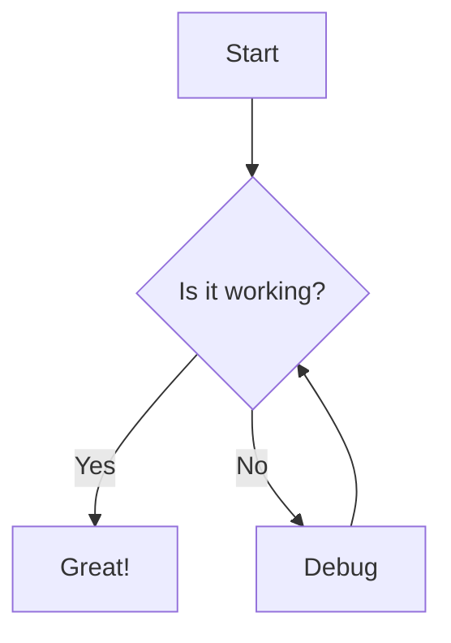
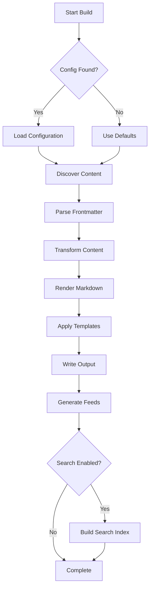
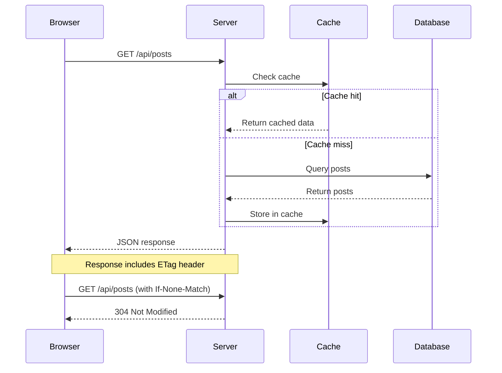
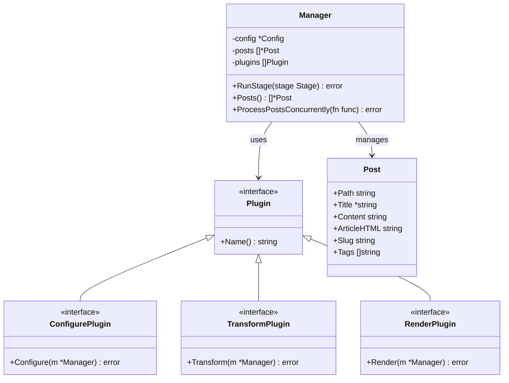
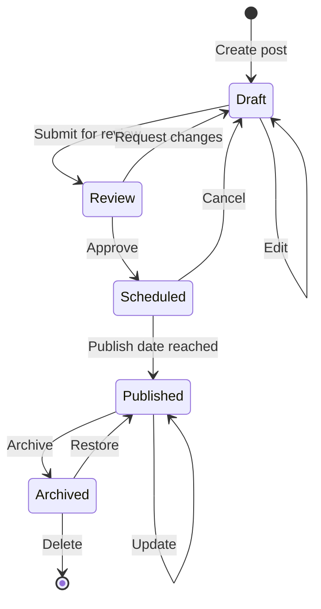
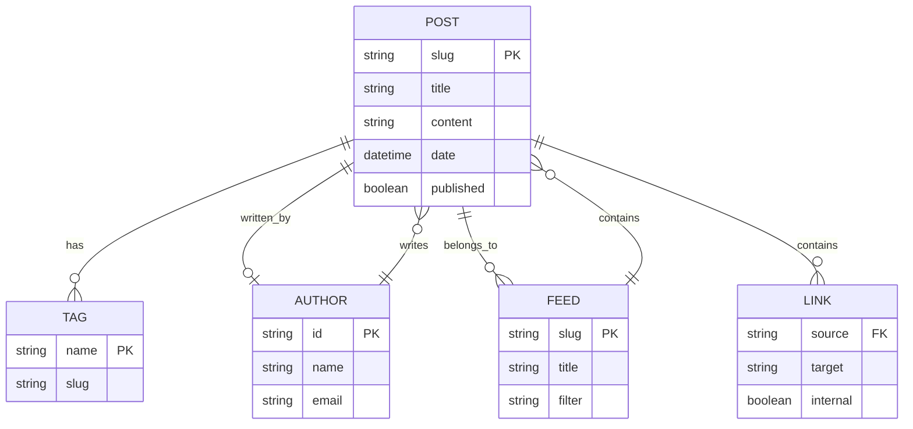
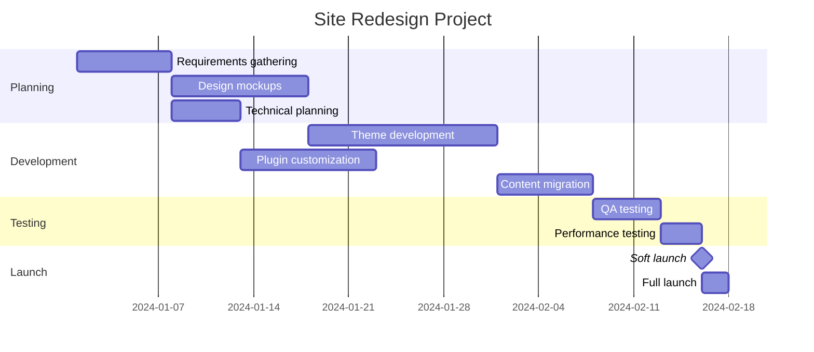
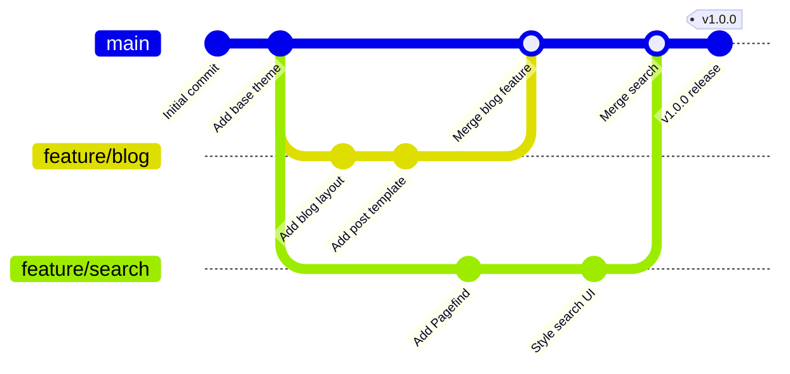

# Built-in Plugins Reference

This reference documents all built-in plugins that ship with markata-go. Plugins are organized by their lifecycle stage.

**Related guides:**
- [[plugin-development|Plugin Development]] - Create your own plugins
- [[configuration-guide|Configuration]] - Configure plugins
- [[feeds-guide|Feeds]] - Feed plugins in detail

## Plugin Lifecycle Overview

```
Configure -> Glob -> Load -> Transform -> Render -> Collect -> Write -> Cleanup
```

| Stage | Purpose | Example Plugins |
|-------|---------|-----------------|
| Configure | Initialize plugin settings | templates |
| Glob | Discover content files | glob |
| Load | Parse files into posts | load, frontmatter |
| Transform | Pre-render modifications | description, reading_time, stats, breadcrumbs, jinja_md, wikilinks, toc |
| Render | Convert content to HTML | render_markdown, templates, admonitions, heading_anchors, link_collector, mermaid, glossary, csv_fence, youtube |
| Collect | Build collections/feeds | series, feeds, auto_feeds, prevnext, overwrite_check, static_file_conflicts |
| Write | Output files to disk | publish_html, random_post, publish_feeds, sitemap, rss, atom, jsonfeed, static_assets, redirects |
| Cleanup | Post-build tasks | pagefind |

---

## Glob Stage

### glob

**Name:** `glob`  
**Stage:** Glob  
**Purpose:** Discovers content files using configurable glob patterns with gitignore support.

**Configuration (TOML):**
```toml
[markata]
glob_patterns = ["**/*.md"]  # Patterns to match

[markata-go.glob]
use_gitignore = true  # Respect .gitignore patterns
```

**Behavior:**
1. Matches files against configured glob patterns (supports `**` recursive matching)
2. Excludes files matching `.gitignore` patterns if enabled
3. Deduplicates files matched by multiple patterns
4. Returns sorted list for deterministic builds

**Example:**
```toml
[markata]
glob_patterns = [
    "posts/**/*.md",
    "pages/*.md",
    "docs/**/*.md"
]

[markata-go.glob]
use_gitignore = true
```

---

## Load Stage

### load

**Name:** `load`  
**Stage:** Load  
**Purpose:** Reads discovered files and parses them into Post objects with frontmatter and content.

**Configuration:** None (uses `content_dir` from main config)

**Behavior:**
1. Reads each file as UTF-8
2. Extracts YAML frontmatter between `---` delimiters
3. Creates Post object with parsed metadata and content
4. Generates slug from frontmatter, title, or filename
5. Generates href as `/{slug}/`

**Post fields set:**
| Field | Type | Description |
|-------|------|-------------|
| `path` | string | Source file path |
| `content` | string | Raw markdown content (after frontmatter) |
| `slug` | string | URL-friendly identifier |
| `href` | string | URL path (`/{slug}/`) |
| `title` | *string | From frontmatter |
| `date` | *time.Time | From frontmatter |
| `published` | bool | From frontmatter (default: false) |
| `draft` | bool | From frontmatter (default: false) |
| `skip` | bool | From frontmatter (default: false) |
| `tags` | []string | From frontmatter |
| `description` | *string | From frontmatter |
| `template` | string | Template name from frontmatter |

**Supported date formats:**
- RFC3339: `2024-01-15T10:30:00Z`
- ISO datetime: `2024-01-15T10:30:00`
- ISO datetime with space: `2024-01-15 10:30:00`
- ISO date: `2024-01-15`
- US format: `01/15/2024`
- European format: `15-01-2024`
- Long format: `January 15, 2024`
- Short format: `Jan 15, 2024`

---

### frontmatter

**Name:** `frontmatter`  
**Stage:** Load (utility)  
**Purpose:** Parses YAML frontmatter from markdown files. Used internally by the `load` plugin.

**Behavior:**
- Extracts content between `---` delimiters
- Parses YAML into a map
- Handles edge cases: no frontmatter, empty frontmatter, unclosed delimiters

**Example frontmatter:**
```yaml
---
title: My Post
date: 2024-01-15
published: true
tags:
  - go
  - programming
description: A short description
template: post.html
custom_field: custom value
---
```

---

## Transform Stage

### auto_title

**Name:** `auto_title`  
**Stage:** Transform (first priority)  
**Purpose:** Auto-generates human-readable titles for posts that don't have one by deriving them from filenames.

**Configuration:** None required.

**Behavior:**
1. Runs with highest priority in Transform stage (before other transform plugins)
2. Skips posts that already have a title set
3. Extracts the filename without extension
4. Replaces hyphens and underscores with spaces
5. Applies title case (first letter of each word capitalized)
6. Sets `post.Title`

**Post fields set:**
| Field | Type | Description |
|-------|------|-------------|
| `title` | *string | Generated title (if not already set) |

**Example transformations:**

| Filename | Generated Title |
|----------|-----------------|
| `my-first-post.md` | "My First Post" |
| `getting_started_guide.md` | "Getting Started Guide" |
| `hello-world.md` | "Hello World" |
| `2024-01-15-release-notes.md` | "2024 01 15 Release Notes" |

**When to use:**
- For quick drafts where you want titles auto-derived
- When filenames already describe the content well
- For sites with many posts where manual titling is tedious

**Limitations:**
- Does not extract titles from H1 headings in content (only uses filename)
- Numeric prefixes in filenames (like dates) become part of the title
- Special characters are kept as-is (not removed or transformed)

---

### description

**Name:** `description`  
**Stage:** Transform  
**Purpose:** Auto-generates meta descriptions for posts that don't have one by extracting the first paragraph.

**Configuration (TOML):**
```toml
[markata]
description_max_length = 160  # Maximum characters (default: 160)
```

**Behavior:**
1. Skips posts that already have a description
2. Extracts first paragraph from content
3. Strips markdown formatting (links, images, code, emphasis, headers, HTML)
4. Truncates at word boundary with ellipsis
5. Sets `post.Description`

**Post fields set:**
| Field | Type | Description |
|-------|------|-------------|
| `description` | *string | Generated description (if not already set) |

**Example:**
```markdown
---
title: My Post
# No description - will be auto-generated
---

This is my first paragraph that will become the description.
It continues here but will be truncated at 160 characters...

## Second Section
More content here.
```

---

### reading_time

**Name:** `reading_time`  
**Stage:** Transform  
**Purpose:** Calculates word count and estimated reading time for each post.

**Configuration (TOML):**
```toml
[markata]
words_per_minute = 200  # Average reading speed (default: 200)
```

**Behavior:**
1. Counts words in content (excludes code blocks, URLs, HTML)
2. Calculates reading time based on words per minute
3. Rounds up to nearest minute (minimum 1 minute)
4. Stores results in post's Extra map

**Post fields added (in `Extra`):**
| Field | Type | Description |
|-------|------|-------------|
| `word_count` | int | Number of words |
| `reading_time` | int | Minutes to read |
| `reading_time_text` | string | Formatted string (e.g., "5 min read") |

**Template usage:**
```html
<span class="reading-time">{{ post.Extra.reading_time_text }}</span>
<span class="word-count">{{ post.Extra.word_count }} words</span>
```

---

### stats

**Name:** `stats`  
**Stage:** Transform, Collect  
**Purpose:** Calculates comprehensive content statistics for posts and aggregates them at feed and site levels.

**Configuration (TOML):**
```toml
[markata-go.stats]
words_per_minute = 200      # Average reading speed (default: 200)
include_code_in_count = false  # Include code blocks in word count (default: false)
track_code_blocks = true    # Count lines of code in code blocks (default: true)
```

**Behavior:**
1. **Transform stage:** Calculates per-post statistics
   - Word count (excluding code blocks by default)
   - Character count (letters and digits only)
   - Reading time estimate
   - Code block count and lines of code
2. **Collect stage:** Aggregates statistics
   - Per-feed totals and averages
   - Site-wide totals and averages

**Post fields added (in `Extra`):**
| Field | Type | Description |
|-------|------|-------------|
| `word_count` | int | Number of words |
| `char_count` | int | Number of characters (no whitespace) |
| `reading_time` | int | Minutes to read |
| `reading_time_text` | string | Formatted (e.g., "5 min read") |
| `code_lines` | int | Lines of code in code blocks |
| `code_blocks` | int | Number of code blocks |
| `stats` | PostStats | All stats as structured object |

**Feed statistics (via cache):**
| Field | Type | Description |
|-------|------|-------------|
| `post_count` | int | Number of posts in feed |
| `total_words` | int | Sum of word counts |
| `total_reading_time` | int | Sum of reading times |
| `total_reading_time_text` | string | Formatted (e.g., "2 hours 30 min") |
| `average_words` | int | Average word count |
| `average_reading_time` | int | Average reading time |
| `total_code_lines` | int | Total lines of code |
| `total_code_blocks` | int | Total code blocks |

**Site statistics (in `config.Extra.site_stats`):**
Same fields as feed statistics, aggregated across all posts.

**Template usage:**
```html
{# Post-level stats #}
<div class="post-meta">
    <span>{{ post.Extra.reading_time_text }}</span>
    <span>{{ post.Extra.word_count }} words</span>
    
    <span>{{ post.Extra.code_lines }} lines of code</span>
    
</div>

{# Site-level stats #}
<div class="site-stats">
    <p>{{ config.Extra.site_stats.total_posts }} posts</p>
    <p>{{ config.Extra.site_stats.total_reading_time_text }} total reading time</p>
</div>
```

**Use cases:**
- Display "X min read" on post cards
- Show word count for documentation pages
- Aggregate stats for feed index pages ("25 tutorials, ~8 hours")
- Track content creation metrics
- Display code-heavy post indicators

---

### breadcrumbs

**Name:** `breadcrumbs`  
**Stage:** Transform  
**Purpose:** Generates breadcrumb navigation trails for posts based on URL path structure with JSON-LD structured data for SEO.

**Configuration (TOML):**
```toml
[markata-go.breadcrumbs]
enabled = true           # Enable/disable breadcrumbs globally
show_home = true         # Include "Home" as first breadcrumb
home_label = "Home"      # Label for home breadcrumb
separator = "/"          # Visual separator between breadcrumbs
max_depth = 0            # Maximum depth (0 = unlimited)
structured_data = true   # Generate JSON-LD for SEO

# Alternative: under components section
[markata-go.components.breadcrumbs]
enabled = true
show_home = true
```

**Frontmatter options:**
```yaml
---
title: "My Page"
# Disable breadcrumbs for this page
breadcrumbs: false

# Or customize per-page
breadcrumbs:
  enabled: true
  show_home: false
  home_label: "Docs"

  # Manual breadcrumb trail (overrides auto-generation)
  items:
    - label: "Products"
      url: "/products/"
    - label: "Widgets"
      url: "/products/widgets/"
---
```

**Post fields set:**
| Field | Type | Description |
|-------|------|-------------|
| `post.breadcrumbs` | `[]Breadcrumb` | Array of breadcrumb items |
| `post.breadcrumb_separator` | `string` | Configured separator character |
| `post.breadcrumbs_jsonld` | `string` | JSON-LD structured data |

**Breadcrumb item structure:**
```go
type Breadcrumb struct {
    Label     string // Display text
    URL       string // Link href
    IsCurrent bool   // True for last item
    Position  int    // 1-indexed position
}
```

**Auto-generation behavior:**
1. Parses post's `href` path (e.g., `/docs/guides/getting-started/`)
2. Creates breadcrumb for each path segment
3. Humanizes segment names (e.g., `getting-started` → "Getting Started")
4. Uses post title for final segment if available
5. Optionally prepends "Home" breadcrumb

**Template usage:**
```html
{# Include the breadcrumbs component #}


{# Or manual rendering #}

<nav class="breadcrumbs" aria-label="Breadcrumb">
  <ol>
    
    <li>
      
      <span aria-current="page">{{ crumb.label }}</span>
      
      <a href="{{ crumb.url }}">{{ crumb.label }}</a>
      
    </li>
    
    <span class="separator">{{ post.breadcrumb_separator }}</span>
    
    
  </ol>
</nav>


{# Add JSON-LD to head for SEO #}

<script type="application/ld+json">
{{ post.breadcrumbs_jsonld | safe }}
</script>

```

**Generated JSON-LD example:**
```json
{
  "@context": "https://schema.org",
  "@type": "BreadcrumbList",
  "itemListElement": [
    {
      "@type": "ListItem",
      "position": 1,
      "name": "Home",
      "item": "https://example.com/"
    },
    {
      "@type": "ListItem",
      "position": 2,
      "name": "Docs",
      "item": "https://example.com/docs/"
    },
    {
      "@type": "ListItem",
      "position": 3,
      "name": "Getting Started"
    }
  ]
}
```

**Use cases:**
- Documentation sites with deep hierarchies
- Multi-section websites (products, services, about)
- Blog categories and subcategories
- SEO improvement via structured data
- Improved user navigation and orientation

---

### jinja_md

**Name:** `jinja_md`  
**Stage:** Transform  
**Purpose:** Processes Jinja2 template expressions within markdown content before rendering.

**Configuration:** Requires `jinja: true` in post frontmatter.

**Activation:**
Posts must explicitly enable Jinja processing:
```yaml
---
title: Dynamic Post
jinja: true
---
```

**Template context:**
| Variable | Type | Description |
|----------|------|-------------|
| `post` | Post | Current post object |
| `config` | Config | Site configuration |
| `posts` | []Post | All posts |
| `core` | Manager | Lifecycle manager for filtering |
| `filter` | func | Filter posts by expression |
| `map` | func | Map field values from posts |

**Example content:**
```markdown
---
title: Recent Posts Index
jinja: true
---

# Latest Posts


- [{{ p.Title }}]({{ p.Href }}) - {{ p.Date.Format "Jan 2, 2006" }}


## All Tags

- {{ tag }}

```

---

### wikilinks

**Name:** `wikilinks`  
**Stage:** Transform  
**Purpose:** Transforms `[[slug]]` and `[[slug|text]]` wikilink syntax into HTML anchor tags.

**Configuration (TOML):**
```toml
[markata]
wikilinks_warn_broken = true  # Warn about broken links (default: true)
```

**Syntax:**
```markdown
Link to another post: [[other-post-slug]]
With custom text: [[other-post-slug|Click here to read more]]
```

**Behavior:**
1. Finds all `[[...]]` patterns in content
2. Looks up target post by slug (case-insensitive)
3. If found: converts to `<a href="/slug/">Title</a>`
4. If not found: keeps original syntax, adds warning to post

**Post fields added (in `Extra`):**
| Field | Type | Description |
|-------|------|-------------|
| `wikilink_warnings` | []string | List of broken wikilink warnings |

**Example:**
```markdown
Check out my [[getting-started]] guide.
You might also like [[advanced-topics|the advanced guide]].
```

Becomes:
```html
Check out my <a href="/getting-started/">Getting Started</a> guide.
You might also like <a href="/advanced-topics/">the advanced guide</a>.
```

---

### toc

**Name:** `toc`  
**Stage:** Transform  
**Purpose:** Extracts headings from markdown and builds a hierarchical table of contents.

**Configuration (TOML):**
```toml
[markata]
toc_min_level = 2  # Minimum heading level (default: 2, h2)
toc_max_level = 4  # Maximum heading level (default: 4, h4)
```

**Behavior:**
1. Parses ATX-style headings (`# Heading`)
2. Generates URL-safe IDs from heading text
3. Handles duplicate IDs by appending numbers
4. Builds hierarchical structure

**Post fields added (in `Extra`):**
| Field | Type | Description |
|-------|------|-------------|
| `toc` | []TocEntry | Hierarchical table of contents |

**TocEntry structure:**
```go
type TocEntry struct {
    Level    int         // Heading level (2-6)
    Text     string      // Heading text
    ID       string      // Anchor ID
    Children []*TocEntry // Nested headings
}
```

**Template usage:**
```html

<nav class="toc">
    <h2>Table of Contents</h2>
    <ul>
    
        <li>
            <a href="#{{ entry.ID }}">{{ entry.Text }}</a>
            
            <ul>
            
                <li><a href="#{{ child.ID }}">{{ child.Text }}</a></li>
            
            </ul>
            
        </li>
    
    </ul>
</nav>

```

---

### structured_data

**Name:** `structured_data`  
**Stage:** Transform  
**Purpose:** Generates JSON-LD Schema.org markup, OpenGraph meta tags, and Twitter Cards for SEO and social media optimization.

**Configuration (TOML):**
```toml
[seo]
twitter_handle = "yourusername"           # Twitter/X handle (without @)
default_image = "/images/default-og.jpg"  # Fallback social image
logo_url = "/images/logo.png"             # Site logo for Schema.org

[seo.structured_data]
enabled = true  # Enable/disable (default: true)

[seo.structured_data.default_author]
type = "Person"
name = "Author Name"
url = "https://example.com/about"

[seo.structured_data.publisher]
type = "Organization"
name = "Site Name"
url = "https://example.com"
logo = "/images/logo.png"
```

**Behavior:**
1. Runs during Transform stage for each published post
2. Skips posts without titles (required for structured data)
3. Generates JSON-LD Schema.org BlogPosting markup
4. Generates OpenGraph meta tags for social sharing
5. Generates Twitter Card meta tags
6. Stores all data in `post.Extra["structured_data"]`

**Post fields set (in `Extra`):**
| Field | Type | Description |
|-------|------|-------------|
| `structured_data` | *StructuredData | Container for all SEO metadata |

**StructuredData contains:**
- `JSONLD` - JSON-LD script content (string)
- `OpenGraph` - Array of `{Property, Content}` pairs
- `Twitter` - Array of `{Name, Content}` pairs

**Frontmatter fields used:**
```yaml
---
title: "Post Title"           # Required
description: "Description"    # For meta description
date: 2024-01-15             # Publication date
author: "Author Name"         # Override default author
image: "/images/post.jpg"     # Featured image
social_image: "/images/og.jpg"  # Override for OG image
twitter: "authorhandle"       # Author's Twitter (without @)
modified: "2024-01-16"        # Last modified date
tags: ["tag1", "tag2"]        # Become keywords
---
```

**Example JSON-LD Output:**
```json
{
  "@context": "https://schema.org",
  "@type": "BlogPosting",
  "headline": "My Blog Post",
  "description": "A description of my post",
  "url": "https://example.com/my-post/",
  "datePublished": "2024-01-15T00:00:00Z",
  "dateModified": "2024-01-16T00:00:00Z",
  "author": {
    "@type": "Person",
    "name": "Author Name",
    "url": "https://example.com/about"
  },
  "publisher": {
    "@type": "Organization",
    "name": "Site Name",
    "logo": {
      "@type": "ImageObject",
      "url": "https://example.com/images/logo.png"
    }
  },
  "image": "https://example.com/images/post.jpg",
  "keywords": ["tag1", "tag2"]
}
```

**Example OpenGraph Tags:**
```html
<meta property="og:title" content="My Blog Post">
<meta property="og:description" content="A description of my post">
<meta property="og:type" content="article">
<meta property="og:url" content="https://example.com/my-post/">
<meta property="og:site_name" content="Site Name">
<meta property="og:image" content="https://example.com/images/post.jpg">
<meta property="og:image:width" content="1200">
<meta property="og:image:height" content="630">
<meta property="og:locale" content="en_US">
<meta property="article:published_time" content="2024-01-15T00:00:00Z">
<meta property="article:tag" content="tag1">
<meta property="article:tag" content="tag2">
```

**Example Twitter Card Tags:**
```html
<meta name="twitter:card" content="summary_large_image">
<meta name="twitter:site" content="@yourusername">
<meta name="twitter:creator" content="@authorhandle">
<meta name="twitter:title" content="My Blog Post">
<meta name="twitter:description" content="A description of my post">
<meta name="twitter:image" content="https://example.com/images/post.jpg">
```

**Template usage:**
```html
{# JSON-LD in head #}

<script type="application/ld+json">
{{ post.structured_data.jsonld | safe }}
</script>


{# OpenGraph tags #}

<meta property="{{ meta.property }}" content="{{ meta.content }}">


{# Twitter Card tags #}

<meta name="{{ meta.name }}" content="{{ meta.content }}">

```

**Image priority:**
1. `social_image` from frontmatter (OG-specific override)
2. `image` from frontmatter
3. `default_image` from SEO config

**Author priority:**
1. `author` field from frontmatter
2. `default_author` from structured data config
3. `author` from site config

**Disabling structured data:**
```toml
[seo.structured_data]
enabled = false
```

**Testing tools:**
- [Google Rich Results Test](https://search.google.com/test/rich-results)
- [Facebook Sharing Debugger](https://developers.facebook.com/tools/debug/)
- [Twitter Card Validator](https://cards-dev.twitter.com/validator)
- [Schema.org Validator](https://validator.schema.org/)

**Related:**
- [[structured-data-guide|Structured Data Guide]] - Detailed user guide
- [[#templates|templates]] - Template integration

---

### authors

**Name:** `authors`  
**Stage:** Transform  
**Priority:** `PriorityFirst + 1` (runs right after `auto_title`)  
**Purpose:** Resolves author IDs in post frontmatter against the site-wide authors configuration, populating rich author objects for templates.

**Configuration:**

Authors are defined in the site configuration under `[markata-go.authors]`:

```toml
[markata-go.authors]
generate_pages = false
feeds_enabled = false

[markata-go.authors.authors.waylon]
name = "Waylon Walker"
role = "author"
active = true
default = true

[markata-go.authors.authors.guest]
name = "Guest Writer"
role = "editor"
guest = true
active = true
```

**Behavior:**

1. Reads the authors map from the site configuration
2. Identifies the default author (the entry with `default = true`)
3. For each post:
   - Reads author IDs from `authors` array or `author` string in frontmatter
   - If no authors specified, assigns the default author
   - Resolves each author ID against the config map
   - Applies per-post role overrides (from extended frontmatter format)
   - Applies per-post details overrides (shown as hover tooltips in byline)
   - Populates `post.AuthorObjects` with resolved Author structs
4. Logs a warning for unrecognized author IDs

**Post fields set:**

| Field | Type | Description |
|-------|------|-------------|
| `author_objects` | []Author | Resolved author structs (computed, not serialized) |
| `authors` | []string | Author IDs (may be set if default author assigned) |

**Template access:**

- `post.author_objects` -- Array of author maps with all fields (name, role, avatar, url, details, etc.)
- `post.authors` -- Array of author ID strings
- `authors` -- Top-level map of all configured authors (ID to author map)

Each author object includes a `details` field (when set via frontmatter) that provides a per-post description of the author's contribution, displayed as a CSS tooltip on hover.

The extended frontmatter format supports key aliases for convenience (`name`/`handle` for `id`, `job`/`position`/`part`/`title` for `role`, `detail`/`description` for `details`). See the [Frontmatter Guide](../guides/frontmatter.md#authors) for the full alias table.

**Related:**
- [Authors Configuration](../guides/configuration.md#authors-configuration) -- Config setup guide
- [Frontmatter Guide](../guides/frontmatter.md) -- `authors` and `author` fields

---

## Render Stage

### admonitions

**Name:** `admonitions`  
**Stage:** Render (goldmark extension)  
**Purpose:** Renders admonition blocks (notes, warnings, tips) from markdown.

**Syntax:**
```markdown
!!! note "Optional Title"
    Content of the note goes here.
    Must be indented with 4 spaces.

!!! warning
    Default title will be "Warning"

!!! tip "Pro Tip"
    Helpful information here.
```

**Supported types:**
- `note` - General information
- `warning` - Caution/warning
- `tip` - Helpful tips
- `important` - Important information
- `danger` - Dangerous/critical warnings
- `caution` - Proceed with care

**HTML output:**
```html
<div class="admonition note">
    <p class="admonition-title">Note</p>
    <p>Content of the note goes here.</p>
</div>
```

**CSS styling:**
```css
.admonition {
    padding: 1rem;
    margin: 1rem 0;
    border-left: 4px solid;
    border-radius: 4px;
}
.admonition.note { border-color: #448aff; background: #e3f2fd; }
.admonition.warning { border-color: #ff9800; background: #fff3e0; }
.admonition.tip { border-color: #4caf50; background: #e8f5e9; }
.admonition.danger { border-color: #f44336; background: #ffebee; }
.admonition-title { font-weight: bold; margin-bottom: 0.5rem; }
```

---

### render_markdown

**Name:** `render_markdown`  
**Stage:** Render  
**Purpose:** Converts markdown content to HTML using goldmark with extensions.

**Configuration (TOML):**

```toml
[markdown.extensions]
typographer = true       # Smart quotes, dashes, ellipses (default: true)
definition_list = true   # PHP Markdown Extra definition lists (default: true)
footnote = true          # PHP Markdown Extra footnotes (default: true)
```

**Enabled extensions:**
- **GFM** - GitHub Flavored Markdown (tables, strikethrough, autolinks, task lists)
- **Syntax Highlighting** - Code block highlighting with Chroma
- **Admonitions** - Note/warning blocks
- **Auto Heading IDs** - Generates IDs for headings
- **Typographer** - Smart quotes, dashes, ellipses
- **Definition Lists** - PHP Markdown Extra style definition lists
- **Footnotes** - PHP Markdown Extra style footnotes

**Behavior:**
1. Takes `post.Content` (raw markdown)
2. Converts to HTML with all extensions
3. Stores result in `post.ArticleHTML`

**Post fields set:**
| Field | Type | Description |
|-------|------|-------------|
| `article_html` | string | Rendered HTML content |

**Supported markdown features:**
```markdown
## Tables
| Header | Header |
|--------|--------|
| Cell   | Cell   |

## Task Lists
- [x] Completed task
- [ ] Pending task

## Strikethrough
~~deleted text~~

## Code Blocks
```go
func main() {
    fmt.Println("Syntax highlighted!")
}
```

## Footnotes
Here's a sentence with a footnote.[^1]

[^1]: This is the footnote content.

## Smart Quotes
"Straight quotes" become curly.

## Definition Lists
Term
:   Definition of the term.
```

**Disabling extensions:**

All extensions are enabled by default. To disable any:

```toml
# Disable specific extensions
[markdown.extensions]
typographer = false       # Use straight quotes instead
definition_list = false   # Disable definition lists
footnote = false          # Disable footnotes

# Or disable all three
[markdown.extensions]
typographer = false
definition_list = false
footnote = false
```

---

### templates

**Name:** `templates`  
**Stage:** Render  
**Purpose:** Wraps rendered markdown content in HTML templates with theme support.

**Configuration (TOML):**
```toml
[markata]
templates_dir = "templates"  # Templates directory (default: "templates")
theme = "default"            # Theme name (default: "default")

# Or with theme options:
[markata-go.theme]
name = "default"
```

**Behavior:**
1. Looks up template from `post.Template` (default: `post.html`)
2. Renders template with post context
3. Falls back to raw `ArticleHTML` if no template exists
4. Stores result in `post.HTML`

**Template context:**
| Variable | Type | Description |
|----------|------|-------------|
| `post` | Post | Current post |
| `body` | string | `post.ArticleHTML` |
| `config` | Config | Site configuration |
| `core` | Manager | Lifecycle manager |

**Post fields set:**
| Field | Type | Description |
|-------|------|-------------|
| `html` | string | Final HTML (content + template) |

**Example template (`templates/post.html`):**
```html
<!DOCTYPE html>
<html>
<head>
    <title>{{ post.Title }} | {{ config.Title }}</title>
    <meta name="description" content="{{ post.Description }}">
</head>
<body>
    <article>
        <h1>{{ post.Title }}</h1>
        <time>{{ post.Date.Format "January 2, 2006" }}</time>
        <div class="content">{{ body | safe }}</div>
    </article>
</body>
</html>
```

---

### heading_anchors

**Name:** `heading_anchors`  
**Stage:** Render (post_render)  
**Purpose:** Adds clickable anchor links to headings in rendered HTML for easy linking to sections.

**Configuration (TOML):**
```toml
[markata-go.heading_anchors]
enabled = true        # Enable/disable the plugin (default: true)
min_level = 2         # Minimum heading level to process (default: 2, h2)
max_level = 4         # Maximum heading level to process (default: 4, h4)
position = "end"      # Anchor position: "start" or "end" (default: "end")
symbol = "#"          # Link text for the anchor (default: "#")
class = "heading-anchor"  # CSS class for the anchor link (default: "heading-anchor")
```

**Behavior:**
1. Runs after `render_markdown` to process `ArticleHTML`
2. Finds all heading tags within the configured level range
3. Extracts existing IDs or generates URL-safe IDs from heading text
4. Handles duplicate IDs by appending numbers (e.g., `my-heading`, `my-heading-1`)
5. Inserts anchor link at the configured position (start or end of heading)

**HTML output example:**
```html
<!-- Input (from render_markdown) -->
<h2 id="getting-started">Getting Started</h2>

<!-- Output (with default config, position="end") -->
<h2 id="getting-started">Getting Started <a href="#getting-started" class="heading-anchor">#</a></h2>

<!-- Output (with position="start") -->
<h2 id="getting-started"><a href="#getting-started" class="heading-anchor">#</a> Getting Started</h2>
```

**CSS styling:**
```css
.heading-anchor {
    opacity: 0;
    text-decoration: none;
    margin-left: 0.5rem;
    color: #666;
}
h2:hover .heading-anchor,
h3:hover .heading-anchor,
h4:hover .heading-anchor {
    opacity: 1;
}
```

---

### md_video

**Name:** `md_video`  
**Stage:** Render (post_render)  
**Purpose:** Converts markdown image syntax for video files into HTML video elements with GIF-like autoplay behavior by default.

**Configuration (TOML):**
```toml
[markata-go.md_video]
enabled = true                    # Enable the plugin (default: true)
video_extensions = [".mp4", ".webm", ".ogg", ".ogv", ".mov", ".m4v"]  # Extensions to treat as video
video_class = "md-video"          # CSS class for video elements (default)
controls = true                   # Show video controls (default: true)
autoplay = true                   # Auto-start playback (default: true)
loop = true                       # Loop video continuously (default: true)
muted = true                      # Mute audio (default: true, required for autoplay)
playsinline = true                # Play inline on mobile (default: true)
preload = "metadata"              # Preload hint: "none", "metadata", "auto" (default: "metadata")
```

**Why GIF-like defaults?**

The default configuration mimics animated GIF behavior because most embedded videos in blog posts are short demonstrations, screen recordings, or animations. Users expect these to play automatically without sound, similar to GIFs.

To use traditional video behavior (click to play with sound):
```toml
[markata-go.md_video]
autoplay = false
loop = false
muted = false
controls = true
```

**Markdown usage:**
```markdown


```

**Behavior:**
1. Scans `ArticleHTML` for `` tags after markdown rendering
2. Checks if the `src` attribute ends with a video extension (handles query parameters)
3. Replaces matching `` tags with `<video>` elements
4. Preserves the `alt` text as fallback content
5. Automatically detects MIME type from file extension

**HTML output:**
```html
<video autoplay loop muted playsinline controls preload="metadata" class="md-video">
  <source src="https://example.com/video.mp4" type="video/mp4">
  kickflip down the 3 stair - fingerboarding
</video>
```

**MIME type detection:**

| Extension | MIME Type |
|-----------|-----------|
| `.mp4` | `video/mp4` |
| `.webm` | `video/webm` |
| `.ogg`, `.ogv` | `video/ogg` |
| `.mov` | `video/quicktime` |
| `.m4v` | `video/x-m4v` |
| `.avi` | `video/x-msvideo` |

**CSS styling:**
```css
.md-video {
    max-width: 100%;
    height: auto;
    border-radius: 4px;
}
```

---

### youtube

**Name:** `youtube`  
**Stage:** Render (post_render)  
**Purpose:** Converts YouTube URLs on their own line into responsive embedded iframes with privacy-enhanced mode by default.

**Configuration (TOML):**
```toml
[markata-go.youtube]
enabled = true              # Enable the plugin (default: true)
privacy_enhanced = true     # Use youtube-nocookie.com (default: true)
container_class = "youtube-embed"  # CSS class for container (default)
lazy_load = true            # Enable lazy loading (default: true)
```

**Markdown usage:**

Simply paste a YouTube URL on its own line:

```markdown
Check out this video:

https://www.youtube.com/watch?v=dQw4w9WgXcQ

More content below...
```

**Supported URL formats:**
- `https://www.youtube.com/watch?v=VIDEO_ID`
- `https://youtube.com/watch?v=VIDEO_ID`
- `https://m.youtube.com/watch?v=VIDEO_ID`
- `https://youtu.be/VIDEO_ID`
- URLs with extra parameters like `&t=30` (timestamp is ignored in embed)

**HTML output:**
```html
<div class="youtube-embed">
  <iframe
    src="https://www.youtube-nocookie.com/embed/dQw4w9WgXcQ"
    title="YouTube video player"
    frameborder="0"
    allow="accelerometer; autoplay; clipboard-write; encrypted-media; gyroscope; picture-in-picture"
    allowfullscreen
    loading="lazy">
  </iframe>
</div>
```

**Privacy-enhanced mode:**

By default, the plugin uses `youtube-nocookie.com` which prevents YouTube from storing cookies on visitors' browsers until they play the video. Disable this for standard embeds:

```toml
[markata-go.youtube]
privacy_enhanced = false
```

**CSS styling (included in default theme):**
```css
.youtube-embed {
  position: relative;
  padding-bottom: 56.25%; /* 16:9 aspect ratio */
  height: 0;
  overflow: hidden;
  max-width: 100%;
  margin: 1.5rem 0;
  border-radius: 0.5rem;
}

.youtube-embed iframe {
  position: absolute;
  top: 0;
  left: 0;
  width: 100%;
  height: 100%;
  border: none;
  border-radius: 0.5rem;
}
```

**Behavior:**
1. Scans `ArticleHTML` for YouTube URLs in standalone `<p>` tags
2. URLs inside code blocks or inline with text are NOT converted
3. Extracts the 11-character video ID from the URL
4. Generates responsive embed with configurable privacy mode
5. Adds lazy loading by default for better page performance

**Notes:**
- URLs must be on their own line (in their own `<p>` tag) to be converted
- Inline URLs like "Check out https://youtube.com/watch?v=xyz" are preserved as text
- Invalid video IDs (not exactly 11 characters) are ignored

---

### image_zoom

**Name:** `image_zoom`  
**Stage:** Render (post_render), Write  
**Purpose:** Adds optional image zoom/lightbox functionality using GLightbox. Users can click/tap images to view them in a full-screen modal with support for touch gestures, keyboard navigation, and gallery mode.

**Configuration (TOML):**
```toml
[markata-go.image_zoom]
enabled = false           # Enable the plugin (default: false)
library = "glightbox"     # Lightbox library to use (default: "glightbox")
selector = ".glightbox"   # CSS selector for zoomable images (default: ".glightbox")
cdn = true                # Use CDN for library files (default: true)
auto_all_images = false   # Make all images zoomable by default (default: false)

# GLightbox-specific options
open_effect = "zoom"      # Effect when opening: "zoom", "fade", "none" (default: "zoom")
close_effect = "zoom"     # Effect when closing: "zoom", "fade", "none" (default: "zoom")
slide_effect = "slide"    # Effect when sliding: "slide", "fade", "zoom", "none" (default: "slide")
touch_navigation = true   # Enable touch/swipe gestures (default: true)
loop = false              # Loop through images in gallery (default: false)
draggable = true          # Enable dragging images to navigate (default: true)
```

**Markdown syntax:**

Mark individual images as zoomable using attribute markers:

```markdown


```

**Frontmatter option:**

Enable zoom for all images in a specific post:

```yaml
---
title: "Photo Gallery"
image_zoom: true
---
```

**Behavior:**
1. Runs after `render_markdown` to process `ArticleHTML`
2. Finds images with `{data-zoomable}` or `{.zoomable}` markers
3. Removes the markers from alt text
4. Wraps images in anchor tags with GLightbox classes
5. Adds `data-glightbox` attribute for the lightbox
6. Tracks which posts need the lightbox library
7. In Write stage, stores configuration for templates to inject JS/CSS

**HTML output:**

Input:
```markdown

```

Output:
```html
<a href="/images/sunset.jpg" class="glightbox-link">
  
</a>
```

**Post fields set (in `Extra`):**
| Field | Type | Description |
|-------|------|-------------|
| `needs_image_zoom` | bool | True if post has zoomable images |

**Config fields set (in `Extra`):**
| Field | Type | Description |
|-------|------|-------------|
| `glightbox_enabled` | bool | True if any posts need GLightbox |
| `glightbox_cdn` | bool | Whether to use CDN |
| `glightbox_options` | map | GLightbox initialization options |

**Template usage:**

The base template automatically includes GLightbox when needed:

```html

<!-- CSS in head -->
<link rel="stylesheet" href="https://cdn.jsdelivr.net/npm/glightbox@3.3.0/dist/css/glightbox.min.css">

<!-- JS before closing body -->
<script src="https://cdn.jsdelivr.net/npm/glightbox@3.3.0/dist/js/glightbox.min.js"></script>
<script>
  document.addEventListener('DOMContentLoaded', function() {
    GLightbox({ selector: '.glightbox' });
  });
</script>

```

**Keyboard shortcuts:**
| Key | Action |
|-----|--------|
| `Escape` | Close lightbox |
| `→` / `ArrowRight` | Next image |
| `←` / `ArrowLeft` | Previous image |

**Touch gestures:**
| Gesture | Action |
|---------|--------|
| Swipe left/right | Navigate images |
| Pinch | Zoom in/out |
| Drag | Pan zoomed image |

---

### image_optimization

**Name:** `image_optimization`  
**Stage:** Render (post_render), Write  
**Purpose:** Generates AVIF/WebP variants for local images and rewrites HTML to use `<picture>` with stable fallbacks.

**Configuration (TOML):**
```toml
[markata-go.image_optimization]
enabled = true
formats = ["avif", "webp"]
quality = 80
avif_quality = 80
webp_quality = 80
cache_dir = ".markata/image-cache"
avifenc_path = ""
cwebp_path = ""
```

**Configuration fields:**
| Field | Type | Default | Description |
|-------|------|---------|-------------|
| `enabled` | bool | `true` | Whether the plugin is active |
| `formats` | []string | `["avif","webp"]` | Formats to generate |
| `quality` | int | `80` | Default quality for all formats |
| `avif_quality` | int | `80` | AVIF quality override |
| `webp_quality` | int | `80` | WebP quality override |
| `cache_dir` | string | `.markata/image-cache` | Cache directory for encode metadata |
| `avifenc_path` | string | `""` | Path to `avifenc` (auto-detect if empty) |
| `cwebp_path` | string | `""` | Path to `cwebp` (auto-detect if empty) |

**Behavior:**
1. Scans `ArticleHTML` for local `` tags and skips external URLs or data URIs.
2. Wraps each local image in `<picture>` with AVIF/WebP sources.
3. Writes optimized variants next to the original output file.
4. Uses a cache key (path, mod time, size, quality, encoder) to skip re-encoding.
5. Missing encoders emit warnings and skip the format without failing the build.

**HTML output:**

Input:
```markdown

```

Output:
```html
<picture>
  <source type="image/avif" srcset="/images/cat.avif">
  <source type="image/webp" srcset="/images/cat.webp">
  
</picture>
```
| Tap outside | Close lightbox |

**CSS customization:**
```css
.glightbox-link {
  display: inline-block;
  cursor: zoom-in;
}

.glightbox-link:hover img {
  opacity: 0.9;
  transform: scale(1.02);
  transition: all 0.2s ease;
}
```

**Performance notes:**
- GLightbox JS/CSS only loaded on pages with zoomable images
- Library is ~11KB gzipped when using CDN
- Files loaded asynchronously to avoid blocking page render

---

### link_collector

**Name:** `link_collector`  
**Stage:** Render (post_render)  
**Purpose:** Collects all hyperlinks from posts and tracks inlinks (pages linking TO a post) and outlinks (pages a post links TO).

**Configuration (TOML):**
```toml
[markata-go.link_collector]
include_feeds = false  # Include feed pages in inlinks (default: false)
include_index = false  # Include index page in inlinks (default: false)
```

**Note:** The plugin also reads `url` from `config.Extra` to determine internal vs external links.

**Behavior:**
1. Runs after `render_markdown` to process `ArticleHTML`
2. Extracts all `<a href="...">` links from each post
3. Resolves relative URLs against the post's URL
4. Distinguishes internal links (same domain) from external links
5. Looks up target posts for internal links
6. Populates `Inlinks` and `Outlinks` on each post
7. Stores all links in cache for use by other plugins

**Performance:**
- Caches href extraction per post using a hash of `ArticleHTML`
- Reuses cached hrefs on unchanged posts, while still rebuilding link objects

**Post fields set:**
| Field | Type | Description |
|-------|------|-------------|
| `hrefs` | []string | All href values found in the post |
| `inlinks` | []map | Links from other posts pointing to this post (template-friendly) |
| `outlinks` | []map | Links from this post to other pages (template-friendly) |

**Link structure:**
```go
type Link struct {
    SourceURL    string  // Full URL of the source page
    SourcePost   *Post   // Source post object (if internal)
    TargetPost   *Post   // Target post object (if internal)
    RawTarget    string  // Original href value
    TargetURL    string  // Resolved full URL
    TargetDomain string  // Domain of target URL
    IsInternal   bool    // True if same domain
    IsSelf       bool    // True if self-link
    SourceText   string  // Link text from source
    TargetText   string  // Title of target post (if internal)
}
```

**Template usage:**
```html

<aside class="backlinks">
    <h3>Pages that link here</h3>
    <ul>
    
        <li><a href="{{ link.source_post.href }}">{{ link.source_post.title }}</a></li>
    
    </ul>
</aside>



<aside class="outlinks">
    <h3>Links from this page</h3>
    <ul>
    
        <li>
            <a href="{{ link.target_url }}">
                {{ link.target_text }}{{ link.target_domain }}
            </a>
            <span class="external">↗</span>
        </li>
    
    </ul>
</aside>

```

---

### chartjs

**Name:** `chartjs`  
**Stage:** Render (after render_markdown)  
**Purpose:** Converts `chartjs` code blocks into interactive Chart.js charts.

**Status:** Enabled by default. Set `enabled = false` to disable.

**Configuration (TOML):**
```toml
[markata-go.chartjs]
enabled = true                                     # Enabled by default; set to false to disable
cdn_url = "https://cdn.jsdelivr.net/npm/chart.js"  # Chart.js CDN URL
container_class = "chartjs-container"              # CSS class for wrapper div
```

**Options:**
| Option | Default | Description |
|--------|---------|-------------|
| `enabled` | `true` | Enable/disable the plugin |
| `cdn_url` | `https://cdn.jsdelivr.net/npm/chart.js` | Chart.js CDN URL |
| `container_class` | `chartjs-container` | CSS class for wrapper div |

**Markdown syntax:**
````markdown
```chartjs
{
  "type": "bar",
  "data": {
    "labels": ["Red", "Blue", "Yellow"],
    "datasets": [{
      "label": "My Dataset",
      "data": [12, 19, 3],
      "backgroundColor": ["#ff6384", "#36a2eb", "#ffce56"]
    }]
  }
}
```
````

**HTML output:**
```html
<div class="chartjs-container">
  <canvas id="chart-abc123"></canvas>
  <script>
    (function() {
      var ctx = document.getElementById('chart-abc123').getContext('2d');
      new Chart(ctx, {"type":"bar","data":{...}});
    })();
  </script>
</div>
```

**Supported chart types:**
- `bar`, `line`, `pie`, `doughnut`, `radar`, `polarArea`, `bubble`, `scatter`

**Template requirements:**
Include Chart.js in your base template:
```html
<script src="https://cdn.jsdelivr.net/npm/chart.js"></script>
```

### Examples

#### Bar Chart - Monthly Sales Data

A simple bar chart showing monthly sales performance:

```chartjs
{
  "type": "bar",
  "data": {
    "labels": ["January", "February", "March", "April", "May", "June"],
    "datasets": [{
      "label": "Monthly Sales ($)",
      "data": [12500, 19200, 15800, 22400, 18900, 25600],
      "backgroundColor": [
        "rgba(54, 162, 235, 0.7)",
        "rgba(54, 162, 235, 0.7)",
        "rgba(54, 162, 235, 0.7)",
        "rgba(54, 162, 235, 0.7)",
        "rgba(54, 162, 235, 0.7)",
        "rgba(54, 162, 235, 0.7)"
      ],
      "borderColor": "rgba(54, 162, 235, 1)",
      "borderWidth": 1
    }]
  },
  "options": {
    "responsive": true,
    "plugins": {
      "title": {
        "display": true,
        "text": "2024 Sales Performance"
      }
    },
    "scales": {
      "y": {
        "beginAtZero": true,
        "ticks": {
          "callback": "$"
        }
      }
    }
  }
}
```

#### Line Chart - Website Traffic Over Time

Track trends with a line chart showing page views and unique visitors:

```chartjs
{
  "type": "line",
  "data": {
    "labels": ["Week 1", "Week 2", "Week 3", "Week 4", "Week 5", "Week 6"],
    "datasets": [
      {
        "label": "Page Views",
        "data": [2400, 3100, 2800, 4200, 3900, 5100],
        "borderColor": "rgba(75, 192, 192, 1)",
        "backgroundColor": "rgba(75, 192, 192, 0.2)",
        "fill": true,
        "tension": 0.3
      },
      {
        "label": "Unique Visitors",
        "data": [1200, 1500, 1400, 2100, 1950, 2600],
        "borderColor": "rgba(255, 99, 132, 1)",
        "backgroundColor": "rgba(255, 99, 132, 0.2)",
        "fill": true,
        "tension": 0.3
      }
    ]
  },
  "options": {
    "responsive": true,
    "plugins": {
      "title": {
        "display": true,
        "text": "Website Traffic - Q1 2024"
      },
      "legend": {
        "position": "bottom"
      }
    },
    "scales": {
      "y": {
        "beginAtZero": true
      }
    }
  }
}
```

#### Pie Chart - Content Distribution

Visualize proportions with a pie chart showing content by category:

```chartjs
{
  "type": "pie",
  "data": {
    "labels": ["Tutorials", "How-To Guides", "Reference Docs", "Blog Posts", "Case Studies"],
    "datasets": [{
      "data": [35, 25, 20, 15, 5],
      "backgroundColor": [
        "rgba(255, 99, 132, 0.8)",
        "rgba(54, 162, 235, 0.8)",
        "rgba(255, 206, 86, 0.8)",
        "rgba(75, 192, 192, 0.8)",
        "rgba(153, 102, 255, 0.8)"
      ],
      "borderColor": [
        "rgba(255, 99, 132, 1)",
        "rgba(54, 162, 235, 1)",
        "rgba(255, 206, 86, 1)",
        "rgba(75, 192, 192, 1)",
        "rgba(153, 102, 255, 1)"
      ],
      "borderWidth": 2
    }]
  },
  "options": {
    "responsive": true,
    "plugins": {
      "title": {
        "display": true,
        "text": "Content Distribution by Type"
      },
      "legend": {
        "position": "right"
      }
    }
  }
}
```

#### Doughnut Chart with Center Text

A doughnut chart is useful for showing a primary metric with breakdown:

```chartjs
{
  "type": "doughnut",
  "data": {
    "labels": ["Completed", "In Progress", "Not Started"],
    "datasets": [{
      "data": [68, 22, 10],
      "backgroundColor": [
        "rgba(76, 175, 80, 0.8)",
        "rgba(255, 193, 7, 0.8)",
        "rgba(158, 158, 158, 0.8)"
      ],
      "borderWidth": 0
    }]
  },
  "options": {
    "responsive": true,
    "cutout": "60%",
    "plugins": {
      "title": {
        "display": true,
        "text": "Project Completion Status"
      },
      "legend": {
        "position": "bottom"
      }
    }
  }
}
```

---

### contribution_graph

**Name:** `contribution_graph`  
**Stage:** Render (after render_markdown)  
**Purpose:** Renders GitHub-style calendar heatmaps showing activity over time using Cal-Heatmap.

**Configuration (TOML):**
```toml
[markata-go.contribution_graph]
enabled = true
cdn_url = "https://cdn.jsdelivr.net/npm/cal-heatmap@4"
container_class = "contribution-graph-container"
theme = "light"
```

**Options:**
| Option | Default | Description |
|--------|---------|-------------|
| `enabled` | `true` | Enable/disable the plugin |
| `cdn_url` | `https://cdn.jsdelivr.net/npm/cal-heatmap@4` | Cal-Heatmap CDN URL |
| `container_class` | `contribution-graph-container` | CSS class for wrapper div |
| `theme` | `light` | Color theme (light, dark) |

**Markdown syntax:**
````markdown
```contribution-graph
{
  "data": [
    {"date": "2024-01-01", "value": 5},
    {"date": "2024-01-02", "value": 3},
    {"date": "2024-01-03", "value": 8}
  ],
  "options": {
    "domain": "year",
    "subDomain": "day",
    "cellSize": 12
  }
}
```
````

**HTML output:**
```html
<div class="contribution-graph-container">
  <div id="contribution-graph-1"></div>
</div>

<link rel="stylesheet" href="https://cdn.jsdelivr.net/npm/cal-heatmap@4/cal-heatmap.css">
<script src="https://cdn.jsdelivr.net/npm/cal-heatmap@4/cal-heatmap.min.js"></script>
<script>
document.addEventListener('DOMContentLoaded', function() {
  const cal = new CalHeatmap();
  cal.paint({
    itemSelector: '#contribution-graph-1',
    data: { source: [...], x: 'date', y: 'value' },
    domain: { type: 'year' },
    subDomain: { type: 'day' }
  });
});
</script>
```

**Data format:**
- `date`: ISO date string (YYYY-MM-DD)
- `value`: Numeric value (affects cell color intensity)

**Options:**
| Option | Type | Default | Description |
|--------|------|---------|-------------|
| `domain` | string | `year` | Time domain: year, month, week, day |
| `subDomain` | string | `day` | Sub-domain: day, hour, minute |
| `cellSize` | number | `10` | Cell size in pixels |
| `range` | number | `1` | Number of domain units to display |

**Use cases:**
- Blog post publishing frequency
- Contribution tracking
- Habit tracking displays

**Related:** [[analytics|Analytics Guide]]

---

### one_line_link

**Name:** `one_line_link`  
**Stage:** Render (after render_markdown)  
**Purpose:** Expands standalone URLs in paragraphs into styled link preview cards.

**Configuration (TOML):**
```toml
[markata-go.one_line_link]
enabled = true
card_class = "link-card"
fallback_title = "Link"
timeout = 5
exclude_patterns = ["^https://twitter\\.com", "^https://x\\.com"]
```

**Options:**
| Option | Default | Description |
|--------|---------|-------------|
| `enabled` | `true` | Enable/disable the plugin |
| `card_class` | `link-card` | CSS class for the link card |
| `fallback_title` | `Link` | Title when metadata unavailable |
| `timeout` | `5` | HTTP timeout in seconds |
| `exclude_patterns` | `[]` | Regex patterns for URLs to skip |

**Behavior:**
1. Finds paragraphs containing only a URL (`<p>https://...</p>`)
2. Extracts the domain from the URL
3. Converts to a styled link card

**Before:**
```html
<p>https://example.com/article</p>
```

**After:**
```html
<a href="https://example.com/article" class="link-card" target="_blank" rel="noopener noreferrer">
  <div class="link-card-content">
    <div class="link-card-title">Link</div>
    <div class="link-card-url">example.com</div>
  </div>
</a>
```

**CSS example:**
```css
.link-card {
  display: block;
  padding: 1rem;
  border: 1px solid var(--color-border);
  border-radius: 8px;
  text-decoration: none;
  transition: box-shadow 0.2s;
}
.link-card:hover {
  box-shadow: 0 2px 8px rgba(0,0,0,0.1);
}
.link-card-title {
  font-weight: bold;
  color: var(--color-text);
}
.link-card-url {
  font-size: 0.875rem;
  color: var(--color-text-muted);
}
```

---

### wikilink_hover

**Name:** `wikilink_hover`  
**Stage:** Render (after wikilinks)  
**Purpose:** Adds hover preview data attributes to wikilinks for tooltip/popup previews.

**Status:** Enabled by default. Set `enabled = false` to disable.

**Configuration (TOML):**
```toml
[markata-go.wikilink_hover]
enabled = true           # Enabled by default; set to false to disable
preview_length = 200     # Max characters for preview text
include_image = true     # Add preview image if available
screenshot_service = ""  # Optional: "https://screenshot.example.com/capture?url="
```

**Options:**
| Option | Default | Description |
|--------|---------|-------------|
| `enabled` | `true` | Enable/disable the plugin |
| `preview_length` | `200` | Max characters for preview text |
| `include_image` | `true` | Add preview image if available |
| `screenshot_service` | `""` | URL prefix for screenshot service |

**Behavior:**
1. Finds `<a class="wikilink">` tags created by the wikilinks plugin
2. Looks up the target post by href
3. Adds data attributes for hover previews

**Data attributes added:**
| Attribute | Description |
|-----------|-------------|
| `data-preview` | Truncated description or content |
| `data-preview-image` | Featured image URL (if available) |
| `data-preview-screenshot` | Screenshot service URL (if configured) |

**Before:**
```html
<a href="/my-post/" class="wikilink">My Post</a>
```

**After:**
```html
<a href="/my-post/" class="wikilink"
   data-preview="This is a description of the post..."
   data-preview-image="/images/featured.jpg">My Post</a>
```

**JavaScript for hover previews:**
```javascript
document.querySelectorAll('.wikilink[data-preview]').forEach(link => {
  link.addEventListener('mouseenter', (e) => {
    const preview = e.target.dataset.preview;
    const image = e.target.dataset.previewImage;
    // Show tooltip with preview content and optional image
  });
});
```

**Image field lookup order:**
The plugin checks these Extra fields for images:
1. `image`
2. `featured_image`
3. `cover_image`
4. `og_image`
5. `thumbnail`

### Examples

#### Basic Wikilink with Hover Preview

When you link to another post using wikilink syntax, the hover plugin automatically adds preview data:

**Markdown input:**
```markdown
Learn more about [[getting-started|getting started with markata-go]].

For advanced users, check out [[plugin-development]].
```

**Rendered HTML (with hover data):**
```html
<a href="/getting-started/" class="wikilink"
   data-preview="A comprehensive guide to installing and configuring markata-go for your first static site project."
   data-preview-image="/images/getting-started-hero.jpg">getting started with markata-go</a>

<a href="/plugin-development/" class="wikilink"
   data-preview="Learn how to extend markata-go with custom plugins that hook into the build lifecycle.">Plugin Development</a>
```

#### Implementing Hover Previews with JavaScript

Add this JavaScript to enable hover preview tooltips:

```javascript
// Simple tooltip implementation for wikilink hover previews
document.addEventListener('DOMContentLoaded', () => {
  const tooltip = document.createElement('div');
  tooltip.className = 'wikilink-tooltip';
  tooltip.style.cssText = `
    position: absolute;
    max-width: 300px;
    padding: 12px;
    background: var(--color-surface, #fff);
    border: 1px solid var(--color-border, #ddd);
    border-radius: 8px;
    box-shadow: 0 4px 12px rgba(0,0,0,0.15);
    font-size: 0.875rem;
    z-index: 1000;
    opacity: 0;
    pointer-events: none;
    transition: opacity 0.2s;
  `;
  document.body.appendChild(tooltip);

  document.querySelectorAll('.wikilink[data-preview]').forEach(link => {
    link.addEventListener('mouseenter', (e) => {
      const preview = e.target.dataset.preview;
      const image = e.target.dataset.previewImage;

      let content = '';
      if (image) {
        content += ``;
      }
      content += `<p style="margin:0">${preview}</p>`;

      tooltip.innerHTML = content;
      tooltip.style.opacity = '1';

      const rect = e.target.getBoundingClientRect();
      tooltip.style.left = `${rect.left + window.scrollX}px`;
      tooltip.style.top = `${rect.bottom + window.scrollY + 8}px`;
    });

    link.addEventListener('mouseleave', () => {
      tooltip.style.opacity = '0';
    });
  });
});
```

#### CSS Styling for Wikilinks

Style your wikilinks to indicate they have preview functionality:

```css
/* Base wikilink styling */
.wikilink {
  color: var(--color-primary);
  text-decoration: underline;
  text-decoration-style: dotted;
  text-underline-offset: 2px;
  cursor: pointer;
}

/* Indicate preview availability */
.wikilink[data-preview] {
  text-decoration-style: dashed;
}

.wikilink[data-preview]:hover {
  text-decoration-style: solid;
  background: var(--color-primary-light, rgba(0, 120, 212, 0.1));
  border-radius: 2px;
}

/* Tooltip styling */
.wikilink-tooltip {
  line-height: 1.5;
  color: var(--color-text);
}

.wikilink-tooltip img {
  display: block;
  max-height: 150px;
  object-fit: cover;
}
```

#### Using Screenshot Service for External Previews

Configure a screenshot service for richer previews:

```toml
[markata-go.wikilink_hover]
enabled = true
preview_length = 200
include_image = true
screenshot_service = "https://api.microlink.io/?screenshot=true&url="
```

This adds a `data-preview-screenshot` attribute for external screenshot generation:

```html
<a href="/complex-diagrams/" class="wikilink"
   data-preview="Learn to create complex diagrams with Mermaid.js"
   data-preview-screenshot="https://api.microlink.io/?screenshot=true&url=https://mysite.com/complex-diagrams/">
   Complex Diagrams
</a>
```

---

### encryption

**Name:** `encryption`  
**Stage:** Render (priority 50 -- after markdown rendering, before templates)  
**Purpose:** Encrypts content for private posts using AES-256-GCM client-side encryption.

**Status:** Enabled by default with `default_key = "default"`.

**Configuration (TOML):**

```toml
[encryption]
enabled = true
default_key = "default"
decryption_hint = "Contact me for access"

[encryption.private_tags]
diary = "personal"
```

**Behavior:**

1. Applies `private_tags` config -- posts with matching tags are marked `private: true`
2. Validates that every private post has an available encryption key
3. If any private post has no key, returns a **CriticalError** that halts the build
4. Encrypts `ArticleHTML` of each private post with the resolved key
5. Replaces content with an encrypted wrapper containing a password prompt

**Encryption keys** are loaded from environment variables:

```bash
MARKATA_GO_ENCRYPTION_KEY_DEFAULT=password
MARKATA_GO_ENCRYPTION_KEY_PERSONAL=another-password
```

**Post fields read:**
- `Private` -- whether the post is private
- `SecretKey` -- which encryption key to use (set via `secret_key`, `private_key`, or `encryption_key` frontmatter)
- `Tags` -- checked against `private_tags` config
- `ArticleHTML` -- the content to encrypt

**Post fields set:**
- `ArticleHTML` -- replaced with encrypted wrapper HTML
- `Extra["has_encrypted_content"]` -- `true` (for template script inclusion)
- `Extra["encryption_key_name"]` -- the key name used

**Related:** See the [Encryption Guide](/docs/guides/encryption/) for complete usage documentation.

---

## Collect Stage

### overwrite_check

**Name:** `overwrite_check`  
**Stage:** Collect (early priority)  
**Purpose:** Detects when multiple posts or feeds would write to the same output path, preventing accidental content overwrites and catching slug conflicts early in the build.

**Configuration:** No user-facing configuration required. The plugin runs automatically.

**Behavior:**
1. Runs early in the Collect stage (before feeds plugin)
2. Checks all post output paths (`{output_dir}/{slug}/index.html`)
3. Checks all feed output paths (HTML, RSS, Atom, JSON)
4. Detects conflicts where multiple sources would write to the same file
5. Fails the build with detailed error messages

**Error Output Example:**
```
detected 2 output path conflict(s):
  - markout/about/index.html: post:content/about.md, feed:about
  - markout/blog/index.html: post:content/blog.md, post:content/blog-page.md
```

**Common Conflict Scenarios:**

1. **Post and feed with same slug:**
```yaml
# content/about.md
---
slug: "about"
---
```
```toml
# markata-go.toml - conflicts!
[[markata-go.feeds]]
slug = "about"
```

2. **Two posts with same slug:**
```yaml
# content/post-a.md
---
slug: "my-page"
---
```
```yaml
# content/post-b.md
---
slug: "my-page"  # Conflict!
---
```

**Resolution strategies:**
- Rename one of the conflicting slugs
- Use different paths for feeds vs content
- Remove duplicate content

**Files checked for conflicts:**
| Source | Output Path |
|--------|-------------|
| Post | `{output_dir}/{slug}/index.html` |
| Feed HTML | `{output_dir}/{feed_slug}/index.html` |
| Feed RSS | `{output_dir}/{feed_slug}/rss.xml` |
| Feed Atom | `{output_dir}/{feed_slug}/atom.xml` |
| Feed JSON | `{output_dir}/{feed_slug}/index.json` |

---

### static_file_conflicts

**Name:** `static_file_conflicts`  
**Stage:** Collect (late priority)  
**Purpose:** Detects when static files in the `static/` directory would silently clobber generated content, causing unexpected behavior like private posts not being added to robots.txt.

**Configuration (TOML):**
```toml
[markata-go.static_file_conflicts]
enabled = true        # Enable/disable the lint rule (default: true)
static_dir = "static" # Static files directory (default: "static")
```

**Behavior:**
1. Runs late in the Collect stage (after content is processed)
2. Scans the `static/` directory for files
3. Checks for posts that would generate root-level files (robots.md → robots.txt)
4. Checks for feed output paths (rss.xml, atom.xml, sitemap.xml)
5. Reports warnings when conflicts are detected
6. Continues the build (non-blocking warning)

**Warning Output Example:**
```
WARNING: 2 static file conflict(s) detected
Static files will override generated content.

  Conflicting /robots.txt:
    Generated: pages/robots.md → /robots.txt
    Static:    static/robots.txt → /robots.txt
    The static file will override the generated one.

  Conflicting /sitemap.xml:
    Generated: sitemap → /sitemap.xml
    Static:    static/sitemap.xml → /sitemap.xml
    The static file will override the generated one.

To fix:
  - Remove the static file if you want the generated version
  - Remove or rename the source file if you want the static version
  - Disable the static_file_conflicts lint rule in config if intentional
```

**Common Conflict Scenarios:**

1. **robots.txt conflict:**
   ```
   pages/robots.md     → generates /robots.txt (with private posts excluded)
   static/robots.txt   → copied to /robots.txt (overwrites generated)
   ```
   **Impact:** Private posts may NOT be added to robots.txt Disallow rules.

2. **sitemap.xml conflict:**
   ```
   Sitemap plugin      → generates /sitemap.xml
   static/sitemap.xml  → overwrites with static version
   ```
   **Impact:** New posts won't appear in the sitemap for search engines.

3. **Feed conflicts:**
   ```
   RSS plugin          → generates /rss.xml
   static/rss.xml      → overwrites with static version
   ```

**Checked file patterns:**
| Generated Source | Checks For Static File |
|------------------|------------------------|
| `robots.md` | `static/robots.txt` |
| `sitemap.md` | `static/sitemap.xml` |
| `humans.md` | `static/humans.txt` |
| `security.md` | `static/security.txt` |
| `manifest.md` | `static/manifest.json`, `static/manifest.webmanifest` |
| RSS feed | `static/rss.xml`, `static/feed.xml` |
| Atom feed | `static/atom.xml` |
| JSON feed | `static/index.json`, `static/feed.json` |

**Disabling the lint rule:**
If the conflict is intentional (you specifically want the static file to override):
```toml
[markata-go.static_file_conflicts]
enabled = false
```

**Related:**
- [[#overwrite_check|overwrite_check]] - Detects conflicts between generated files
- [[#static_assets|static_assets]] - Copies static files to output

---

### series

**Name:** `series`  
**Stage:** Collect (PriorityEarly)  
**Purpose:** Scans posts for `series` frontmatter and auto-generates series feed configs with prev/next navigation for sequential reading.

Posts declare series membership with `series: "series-name"` in frontmatter. The plugin groups posts by series, sorts them (by `series_order` or date ascending), sets prev/next navigation, and injects series `FeedConfig` entries so the feeds plugin renders them.

**Frontmatter:**
```yaml
---
title: "Part 1: Getting Started"
series: "Building a CLI in Go"
series_order: 1  # optional, defaults to date-ascending order
---
```

**Configuration (TOML):**
```toml
[markata-go.series]
slug_prefix = "series"     # URL prefix (default: "series")
auto_sidebar = true        # Auto-enable feed sidebar (default: true)

[markata-go.series.defaults]
items_per_page = 0         # No pagination by default
sidebar = true             # Show sidebar on series posts

[markata-go.series.defaults.formats]
html = true
rss = true
atom = false
json = false

# Per-series overrides (keyed by series name)
[markata-go.series.overrides."building-a-cli-in-go"]
title = "Building a CLI in Go"
description = "A step-by-step guide to building CLIs with Go and Cobra"
```

**Behavior:**
- Posts can belong to only one series
- Series feeds are created at `/{slug_prefix}/{series-slug}/` (e.g., `/series/building-a-cli-in-go/`)
- Posts within a series get Prev/Next navigation and position indicators ("Part X of Y")
- Series feeds automatically show in the feed sidebar, taking precedence over other feeds
- Feed type is set to `FeedTypeSeries`
- Runs before the `feeds` plugin so generated configs are available for processing

**Related:**
- [[series-guide|Series Guide]] - Complete usage documentation
- [[#feeds|feeds]] - Processes the feed configs generated by this plugin
- [[#prevnext|prevnext]] - Calculates prev/next from feeds and series

---

### feeds

**Name:** `feeds`  
**Stage:** Collect  
**Purpose:** Processes configured feed definitions, filtering, sorting, and paginating posts.

**Configuration (TOML):**
```toml
[[markata-go.feeds]]
slug = "blog"
title = "Blog Posts"
description = "All blog posts"
filter = "published == true and not draft"
sort = "date"
reverse = true
items_per_page = 10

[markata-go.feeds.formats]
html = true
rss = true
atom = false
json = false

[[markata-go.feeds]]
slug = "tutorials"
title = "Tutorials"
filter = "tags contains 'tutorial'"
sort = "date"
reverse = true
```

**Feed configuration options:**
| Option | Type | Default | Description |
|--------|------|---------|-------------|
| `slug` | string | required | URL path for the feed |
| `title` | string | "" | Feed title |
| `description` | string | "" | Feed description |
| `filter` | string | "" | Filter expression |
| `sort` | string | "date" | Sort field |
| `reverse` | bool | true | Reverse sort order |
| `items_per_page` | int | 10 | Posts per page |
| `formats` | object | varies | Output formats |

**Filter expression syntax:**
```toml
# Equality
filter = "published == true"
filter = "category == 'news'"

# Contains (for arrays)
filter = "tags contains 'go'"

# Boolean combinations
filter = "published == true and not draft"
filter = "tags contains 'go' or tags contains 'python'"

# Comparisons
filter = "date >= '2024-01-01'"
```

See [[feeds-guide|Feeds Guide]] for complete filter syntax.

---

### auto_feeds

**Name:** `auto_feeds`  
**Stage:** Collect  
**Purpose:** Automatically generates feeds for tags, categories, and date archives.

**Configuration (TOML):**
```toml
[markata-go.auto_feeds.tags]
enabled = true
slug_prefix = "tags"  # Results in /tags/python/, /tags/go/, etc.

[markata-go.auto_feeds.tags.formats]
html = true
rss = true

[markata-go.auto_feeds.categories]
enabled = true
slug_prefix = "categories"

[markata-go.auto_feeds.categories.formats]
html = true
rss = true

[markata-go.auto_feeds.archives]
enabled = true
slug_prefix = "archive"
yearly_feeds = true   # /archive/2024/
monthly_feeds = false # /archive/2024/01/

[markata-go.auto_feeds.archives.formats]
html = true
rss = false
```

**Generated feeds:**

For tags:
- `/tags/python/` - Posts tagged "python"
- `/tags/go/` - Posts tagged "go"

For categories (uses `category` field from post Extra):
- `/categories/tutorials/` - Posts in tutorials category

For archives:
- `/archive/2024/` - All posts from 2024
- `/archive/2024/01/` - All posts from January 2024 (if monthly enabled)

---

### prevnext

**Name:** `prevnext`  
**Stage:** Collect  
**Purpose:** Calculates previous/next post links for navigation based on feed ordering.

**Configuration (TOML):**
```toml
[markata-go.prevnext]
enabled = true           # Enable/disable the plugin (default: true)
strategy = "first_feed"  # Strategy for determining navigation context
default_feed = "blog"    # Default feed slug (for "explicit_feed" strategy)
```

**Strategy options:**
| Strategy | Description |
|----------|-------------|
| `first_feed` | Use the first feed that contains the post (default) |
| `explicit_feed` | Always use the feed specified in `default_feed` |
| `series` | Use `series` frontmatter field, fall back to `first_feed` |
| `frontmatter` | Use `prevnext_feed` frontmatter field, fall back to `first_feed` |

**Behavior:**
1. Runs after the `feeds` plugin to access feed data
2. For each post, determines which feed to use based on strategy
3. Finds the post's position within that feed
4. Sets `Prev` and `Next` post references
5. Sets `PrevNextContext` with additional navigation metadata

**Post fields set:**
| Field | Type | Description |
|-------|------|-------------|
| `prev` | *Post | Previous post in sequence (nil if first) |
| `next` | *Post | Next post in sequence (nil if last) |
| `prev_next_feed` | string | Feed slug used for navigation |
| `prev_next_context` | *PrevNextContext | Full navigation context |

**PrevNextContext structure:**
```go
type PrevNextContext struct {
    FeedSlug  string // Slug of the feed used
    FeedTitle string // Title of the feed
    Position  int    // 1-indexed position in feed
    Total     int    // Total posts in feed
    Prev      *Post  // Previous post
    Next      *Post  // Next post
}
```

**Template usage:**
```html

<nav class="post-navigation">
    
    <a href="{{ post.Prev.Href }}" class="nav-prev">
        <span class="nav-label">Previous</span>
        <span class="nav-title">{{ post.Prev.Title }}</span>
    </a>
    

    
    <a href="{{ post.Next.Href }}" class="nav-next">
        <span class="nav-label">Next</span>
        <span class="nav-title">{{ post.Next.Title }}</span>
    </a>
    
</nav>


<!-- With context -->

<div class="series-progress">
    Post {{ post.PrevNextContext.Position }} of {{ post.PrevNextContext.Total }}
    in {{ post.PrevNextContext.FeedTitle }}
</div>

```

**Using series for tutorials:**
```yaml
---
title: "Part 2: Advanced Topics"
series: "go-tutorial"
---
```

```toml
[markata-go.prevnext]
strategy = "series"
```

---

## Write Stage

### publish_html

**Name:** `publish_html`  
**Stage:** Write  
**Purpose:** Writes individual post HTML files to the output directory.

**Configuration:** Uses `output_dir` from main config.

**Behavior:**
1. Skips posts marked as skip, unpublished, or draft
2. Creates directory: `{output_dir}/{slug}/`
3. Writes `index.html` with post's HTML content
4. Uses `post.HTML` if available, otherwise wraps `ArticleHTML` in basic template

**Output structure:**
```
output/
  getting-started/
    index.html
  advanced-topics/
    index.html
  my-first-post/
    index.html
```

---

### random_post

**Name:** `random_post`  
**Stage:** Write  
**Purpose:** Writes a static `/random/` page that picks a random eligible post in the browser.

**Configuration (TOML):**
```toml
[markata-go.random_post]
enabled = true
path = "random"               # default: "random"
exclude_tags = ["draft"]      # optional
emit_posts_json = false        # optional
```

**Outputs:**
- `/{path}/index.html`
- `/{path}/posts.json` (optional)

**Eligibility (defaults):** published, not draft/private/skip, and not tagged with any `exclude_tags`.

---

### well_known

**Name:** `well_known`  
**Stage:** Write  
**Purpose:** Generates `.well-known` endpoints from site metadata.

**Configuration:** `markata-go.well_known`

**Behavior:**
1. Resolves enabled entries from `auto_generate`
2. Renders templates in `templates/well-known/` if present
3. Writes files into `output/.well-known/`

**Generated files (defaults):**
- `/.well-known/host-meta`
- `/.well-known/host-meta.json`
- `/.well-known/webfinger`
- `/.well-known/nodeinfo` and `/nodeinfo/2.0`
- `/.well-known/time`

**Optional files:**
- `/.well-known/sshfp` (when `ssh_fingerprint` is set)
- `/.well-known/keybase.txt` (when `keybase_username` is set)

---

### publish_feeds

**Name:** `publish_feeds`  
**Stage:** Write  
**Purpose:** Writes feed output files in all configured formats (HTML, RSS, Atom, JSON, Markdown, Text).

**Behavior:**
For each feed, generates enabled formats:

| Format | File | Description |
|--------|------|-------------|
| HTML | `index.html`, `page/2/index.html` | Paginated HTML pages |
| RSS | `rss.xml` | RSS 2.0 feed |
| Atom | `atom.xml` | Atom 1.0 feed |
| JSON | `feed.json` | JSON Feed 1.1 |
| Markdown | `slug.md` | Markdown listing |
| Text | `slug.txt` | Plain text listing |

**Output structure:**
```
output/
  blog/
    index.html      # Page 1
    page/
      2/
        index.html  # Page 2
      3/
        index.html  # Page 3
    rss.xml
    atom.xml
    feed.json
  tags/
    python/
      index.html
      rss.xml
```

---

### sitemap

**Name:** `sitemap`  
**Stage:** Write  
**Purpose:** Generates a sitemap.xml file listing all published posts and feed pages.

**Configuration:** None (uses `url` from main config for absolute URLs)

**Behavior:**
1. Adds home page with highest priority
2. Adds all published posts with their dates
3. Adds feed index pages
4. Writes to `{output_dir}/sitemap.xml`

**Output example:**
```xml
<?xml version="1.0" encoding="UTF-8"?>
<urlset xmlns="http://www.sitemaps.org/schemas/sitemap/0.9">
    <url>
        <loc>https://example.com/</loc>
        <lastmod>2024-01-15</lastmod>
        <changefreq>daily</changefreq>
        <priority>1.0</priority>
    </url>
    <url>
        <loc>https://example.com/my-post/</loc>
        <lastmod>2024-01-15</lastmod>
        <changefreq>weekly</changefreq>
        <priority>0.8</priority>
    </url>
</urlset>
```

---

### rss

**Name:** `rss`  
**Stage:** Write (utility)  
**Purpose:** Generates RSS 2.0 feeds. Used by `publish_feeds`.

**Output format:** RSS 2.0 with Atom namespace for self-reference.

**Example output:**
```xml
<?xml version="1.0" encoding="UTF-8"?>
<rss version="2.0" xmlns:atom="http://www.w3.org/2005/Atom">
    <channel>
        <title>My Blog</title>
        <link>https://example.com</link>
        <description>A blog about things</description>
        <language>en-us</language>
        <lastBuildDate>Mon, 15 Jan 2024 10:00:00 +0000</lastBuildDate>
        <atom:link href="https://example.com/blog/rss.xml" rel="self" type="application/rss+xml"/>
        <item>
            <title>My First Post</title>
            <link>https://example.com/my-first-post/</link>
            <description>Post description or excerpt...</description>
            <pubDate>Mon, 15 Jan 2024 10:00:00 +0000</pubDate>
            <guid isPermaLink="true">https://example.com/my-first-post/</guid>
        </item>
    </channel>
</rss>
```

---

### atom

**Name:** `atom`  
**Stage:** Write (utility)  
**Purpose:** Generates Atom 1.0 feeds. Used by `publish_feeds`.

**Output format:** Atom 1.0

**Example output:**
```xml
<?xml version="1.0" encoding="UTF-8"?>
<feed xmlns="http://www.w3.org/2005/Atom">
    <title>My Blog</title>
    <id>https://example.com/blog/atom.xml</id>
    <updated>2024-01-15T10:00:00Z</updated>
    <link href="https://example.com" rel="alternate" type="text/html"/>
    <link href="https://example.com/blog/atom.xml" rel="self" type="application/atom+xml"/>
    <author>
        <name>Author Name</name>
    </author>
    <entry>
        <title>My First Post</title>
        <id>https://example.com/my-first-post/</id>
        <updated>2024-01-15T10:00:00Z</updated>
        <published>2024-01-15T10:00:00Z</published>
        <link href="https://example.com/my-first-post/" rel="alternate" type="text/html"/>
        <summary type="text">Post description</summary>
        <content type="html">Full HTML content...</content>
    </entry>
</feed>
```

---

### jsonfeed

**Name:** `jsonfeed`  
**Stage:** Write (utility)  
**Purpose:** Generates JSON Feed 1.1 documents. Used by `publish_feeds`.

**Output format:** [JSON Feed 1.1](https://jsonfeed.org/version/1.1)

**Example output:**
```json
{
    "version": "https://jsonfeed.org/version/1.1",
    "title": "My Blog",
    "home_page_url": "https://example.com",
    "feed_url": "https://example.com/blog/feed.json",
    "description": "A blog about things",
    "language": "en",
    "authors": [
        { "name": "Author Name" }
    ],
    "items": [
        {
            "id": "https://example.com/my-first-post/",
            "url": "https://example.com/my-first-post/",
            "title": "My First Post",
            "content_html": "<p>Full HTML content...</p>",
            "content_text": "Plain text content...",
            "summary": "Post description",
            "date_published": "2024-01-15T10:00:00Z",
            "tags": ["go", "programming"]
        }
    ]
}
```

---

### static_assets

**Name:** `static_assets`  
**Stage:** Write  
**Purpose:** Copies static assets from theme and project directories to output.

**Configuration (TOML):**
```toml
[markata]
theme = "default"  # Theme name for theme static files
```

**Behavior:**
1. Copies theme static files from `themes/{theme}/static/`
2. Copies project static files from `static/`
3. Project files override theme files (local customization)

**Directory structure:**
```
mysite/
  themes/
    default/
      static/
        css/
          theme.css
        js/
          theme.js
  static/
    css/
      custom.css    # Overrides or adds to theme
    images/
      logo.png
  output/
    css/
      theme.css     # From theme
      custom.css    # From project
    js/
      theme.js      # From theme
    images/
      logo.png      # From project
```

---

### palette_css

**Name:** `palette_css`  
**Stage:** Write (after static_assets)  
**Purpose:** Generates CSS custom properties from the configured color palette, enabling theme customization without modifying CSS files directly.

**Configuration (TOML):**
```toml
[markata-go.theme]
palette = "nord"  # Palette name (built-in or custom)
```

**Built-in palettes:**
- `catppuccin-latte` - Light pastel theme
- `catppuccin-mocha` - Dark pastel theme
- `dracula` - Dark purple/pink theme
- `gruvbox-dark` - Dark retro groove theme
- `gruvbox-light` - Light retro groove theme
- `nord` - Arctic, north-bluish color palette
- `one-dark` - Atom One Dark inspired
- `rose-pine` - All-natural pine, faux fur, and soho vibes
- `solarized-dark` - Precision dark theme
- `solarized-light` - Precision light theme
- `tokyo-night` - Dark theme inspired by Tokyo night lights

**Behavior:**
1. Reads palette name from `config.Extra["theme"]["palette"]`
2. Loads the palette definition (built-in or from `palettes/` directory)
3. Maps palette semantic colors to theme CSS variable names
4. Generates `css/variables.css` with CSS custom properties
5. Includes default font families, spacing, and layout values

**Generated CSS structure:**
```css
/* CSS Custom Properties - Nord Theme */
:root {
  --color-primary: #88c0d0;
  --color-primary-light: #8fbcbb;
  --color-primary-dark: #8fbcbb;

  /* Semantic colors */
  --color-text: #eceff4;
  --color-text-muted: #d8dee9;
  --color-background: #2e3440;
  --color-surface: #3b4252;
  --color-border: #4c566a;

  /* Status colors */
  --color-success: #a3be8c;
  --color-warning: #ebcb8b;
  --color-error: #bf616a;
  --color-info: #81a1c1;

  /* Font families */
  --font-body: system-ui, -apple-system, ...;
  --font-heading: var(--font-body);
  --font-mono: ui-monospace, ...;

  /* Font sizes, spacing, layout... */
}
```

**Custom palettes:**
Create a TOML file in the `palettes/` directory:

```toml
# palettes/my-palette.toml
name = "My Custom Palette"
type = "dark"  # or "light"

[colors]
accent = "#ff6b6b"
accent-hover = "#ee5a5a"
text-primary = "#f8f8f2"
text-muted = "#b0b0b0"
bg-primary = "#1a1a2e"
bg-surface = "#16213e"
border = "#2d3a5a"
success = "#50fa7b"
warning = "#f1fa8c"
error = "#ff5555"
info = "#8be9fd"
```

**Template usage:**
Variables are automatically available in your CSS:

```css
.my-component {
  background: var(--color-surface);
  color: var(--color-text);
  border: 1px solid var(--color-border);
}

.button-primary {
  background: var(--color-primary);
  color: var(--color-background);
}
```

**Why use palettes?**
- Switch themes by changing one config value
- Consistent colors across your entire site
- Built-in palettes tested for accessibility
- Easy to create and share custom themes

---

### chroma_css

**Name:** `chroma_css`  
**Stage:** Configure + Write  
**Purpose:** Generates CSS for syntax highlighting from Chroma themes. Creates `css/chroma.css` with syntax highlighting styles that work with `render_markdown`'s CSS-class-based highlighting.

**Configuration (TOML):**
```toml
# Explicit theme setting
[markdown.highlight]
theme = "github-dark"  # Chroma theme name
```

Or auto-derived from palette:
```toml
[theme]
palette = "catppuccin-mocha"  # Automatically selects matching Chroma theme
```

**Behavior:**
1. During Configure: Reads theme from `markdown.highlight.theme` or derives from palette
2. Falls back to variant-appropriate default (dark palettes -> github-dark, light palettes -> github)
3. During Write: Generates `{output_dir}/css/chroma.css` with syntax highlighting styles

**Available Chroma Themes:**

Light themes:
- `github`, `gruvbox-light`, `solarized-light`, `catppuccin-latte`
- `rose-pine-dawn`, `xcode`, `vs`, `friendly`, `tango`

Dark themes:
- `github-dark`, `gruvbox`, `solarized-dark`, `catppuccin-mocha`
- `dracula`, `monokai`, `nord`, `onedark`, `rose-pine`
- `tokyo-night`, `vim`

**Example CSS Output:**
```css
/* Syntax highlighting - generated from Chroma theme: github-dark */

.chroma { color: #e6edf3; background-color: #0d1117 }
.chroma .err { color: #f85149 }
.chroma .lntd { vertical-align: top; padding: 0; margin: 0; border: 0; }
.chroma .lntable { border-spacing: 0; padding: 0; margin: 0; border: 0; }
.chroma .hl { background-color: #2d333b }
.chroma .ln { color: #6e7681; }
.chroma .k { color: #ff7b72 }  /* Keyword */
.chroma .kc { color: #79c0ff }  /* KeywordConstant */
.chroma .kd { color: #ff7b72 }  /* KeywordDeclaration */
/* ... additional token styles ... */
```

**Template usage:**
Include the generated CSS in your base template:
```html
<link rel="stylesheet" href="/css/chroma.css">
```

**Palette to Chroma Theme Mapping:**

| Palette | Chroma Theme |
|---------|--------------|
| `catppuccin-mocha` | `catppuccin-mocha` |
| `catppuccin-latte` | `catppuccin-latte` |
| `dracula` | `dracula` |
| `nord` | `nord` |
| `gruvbox-dark` | `gruvbox` |
| `gruvbox-light` | `gruvbox-light` |
| `solarized-dark` | `solarized-dark` |
| `solarized-light` | `solarized-light` |
| `rose-pine` | `rose-pine` |
| `tokyo-night` | `tokyo-night` |

**Related plugins:**
- [[#render_markdown|render_markdown]] - Uses CSS classes for syntax highlighting
- [[#palette_css|palette_css]] - Generates theme color variables

---

### redirects

**Name:** `redirects`  
**Stage:** Write  
**Purpose:** Generates HTML redirect pages from a `_redirects` file for URL migration and link preservation.

**Configuration (TOML):**
```toml
[markata-go.redirects]
redirects_file = "static/_redirects"  # Path to redirects file (default)
redirect_template = ""                 # Custom template path (optional)
```

**Redirects file format (`static/_redirects`):**
```
# Comments start with #
# Format: /old-path /new-path

/old-post/          /new-post/
/blog/2020/hello/   /posts/hello-world/
/about-me/          /about/
```

**Behavior:**
1. Reads the `_redirects` file (skips silently if not found)
2. Parses redirect rules (ignores comments, empty lines, wildcards)
3. For each rule, creates `{output_dir}/{old-path}/index.html`
4. Uses HTML meta refresh and canonical link for SEO-friendly redirects
5. Caches results to avoid regeneration on unchanged content

**Supported redirect syntax:**
- Simple redirects: `/old /new`
- Paths must start with `/`
- Wildcards (`*`) are ignored (not supported for static generation)
- Status codes in the file are ignored (always uses meta refresh)

**Generated HTML:**
```html
<!DOCTYPE html>
<html lang="en">
<head>
  <meta http-equiv="Refresh" content="0; url='/new-path/'" />
  <link rel="canonical" href="/new-path/" />
  <meta name="description" content="/old-path/ has been moved to /new-path/." />
  <title>/old-path/ has been moved to /new-path/</title>
</head>
<body>
  <h1>Page Moved</h1>
  <p><code>/old-path/</code> has moved to <a href="/new-path/">/new-path/</a></p>
</body>
</html>
```

**Custom template:**
Create a custom template with these available variables:

```html
<!-- templates/redirect.html -->
<!DOCTYPE html>
<html>
<head>
    <meta http-equiv="Refresh" content="0; url='{{ .New }}'" />
    <link rel="canonical" href="{{ .New }}" />
    <title>Redirecting...</title>
</head>
<body>
    <p>Redirecting from {{ .Original }} to <a href="{{ .New }}">{{ .New }}</a></p>
</body>
</html>
```

```toml
[markata-go.redirects]
redirect_template = "templates/redirect.html"
```

**Template variables:**
| Variable | Type | Description |
|----------|------|-------------|
| `.Original` | string | Source path (e.g., `/old-post/`) |
| `.New` | string | Destination path (e.g., `/new-post/`) |
| `.Config` | *Config | Site configuration object |

---

### qrcode

**Name:** `qrcode`  
**Stage:** Write  
**Purpose:** Generates QR code images for each post's URL, useful for print materials or sharing.

**Configuration (TOML):**
```toml
[markata-go.qrcode]
enabled = true
format = "svg"              # "svg" or "png"
size = 200                  # Size in pixels
output_dir = "qrcodes"      # Subdirectory in output
error_correction = "M"      # L, M, Q, H
foreground = "#000000"      # QR code color
background = "#ffffff"      # Background color
```

**Options:**
| Option | Default | Description |
|--------|---------|-------------|
| `enabled` | `true` | Enable/disable QR code generation |
| `format` | `svg` | Output format: `svg` or `png` |
| `size` | `200` | Image size in pixels |
| `output_dir` | `qrcodes` | Output subdirectory name |
| `error_correction` | `M` | Error correction level |
| `foreground` | `#000000` | QR code foreground color |
| `background` | `#ffffff` | QR code background color |

**Error correction levels:**
| Level | Recovery | Use Case |
|-------|----------|----------|
| `L` | ~7% | Clean environments |
| `M` | ~15% | Standard use (default) |
| `Q` | ~25% | Industrial/outdoor |
| `H` | ~30% | Maximum durability |

**Behavior:**
1. For each non-skipped post, builds the absolute URL
2. Generates QR code in the configured format
3. Saves to `{output_dir}/{qrcode_output_dir}/{slug}.{format}`
4. Adds `qrcode_url` to post's Extra map

**Output structure:**
```
output/
  qrcodes/
    hello-world.svg
    my-first-post.svg
    another-article.svg
```

**Post field set:**
| Field | Type | Description |
|-------|------|-------------|
| `qrcode_url` | string | Relative URL to QR code image |

**Template usage:**
```html

<div class="qr-code">
    
    <p>Scan to visit this page</p>
</div>

```

**Print stylesheet example:**
```css
@media print {
    .qr-code {
        display: block;
        page-break-inside: avoid;
        text-align: center;
        margin-top: 2rem;
    }
    .qr-code img {
        width: 150px;
        height: 150px;
    }
}
@media screen {
    .qr-code {
        display: none; /* Hide on screen, show in print */
    }
}
```

**Custom colors example:**
```toml
[markata-go.qrcode]
foreground = "#2e3440"  # Nord dark
background = "#eceff4"  # Nord light
```

---

## Default Plugin Order

When using `DefaultPlugins()`, plugins execute in this order:

```go
[]lifecycle.Plugin{
    // Glob stage
    NewGlobPlugin(),

    // Load stage
    NewLoadPlugin(),

    // Transform stage (in order)
    NewAutoTitlePlugin(),      // Auto-generate titles from filenames
    NewDescriptionPlugin(),    // Auto-generate descriptions early
    NewReadingTimePlugin(),    // Calculate reading time
    NewStructuredDataPlugin(), // Generate SEO metadata
    NewWikilinksPlugin(),      // Process wikilinks
    NewTocPlugin(),            // Extract TOC
    NewJinjaMdPlugin(),        // Process Jinja templates

    // Render stage
    NewRenderMarkdownPlugin(),
    NewHeadingAnchorsPlugin(), // Add anchor links to headings
    NewChartJSPlugin(),        // Convert Chart.js code blocks to charts
    NewCSVFencePlugin(),       // Convert CSV code blocks to tables
    NewMermaidPlugin(),        // Convert Mermaid code blocks to diagrams
    NewGlossaryPlugin(),       // Auto-link glossary terms
    NewWikilinkHoverPlugin(),  // Add hover data to wikilinks
    NewLinkCollectorPlugin(),  // Track inlinks/outlinks
    NewTemplatesPlugin(),

    // Collect stage
    NewOverwriteCheckPlugin(), // Check for output path conflicts (early)
    NewFeedsPlugin(),
    NewAutoFeedsPlugin(),
    NewPrevNextPlugin(),       // Calculate prev/next navigation

    // Write stage
    NewStaticAssetsPlugin(),   // Copy static assets first
    NewChromaCSSPlugin(),      // Generate syntax highlighting CSS
    NewPublishFeedsPlugin(),
    NewPublishHTMLPlugin(),
    NewSitemapPlugin(),
    NewRedirectsPlugin(),      // Generate redirect pages
}
```

---

## Optional Plugins

The following plugins are not enabled by default and must be explicitly configured. They provide specialized functionality that may not be needed for all sites.

### webmentions_fetch

**Name:** `webmentions_fetch`  
**Stage:** Transform  
**Priority:** First (-200, runs before jinja_md)  
**Purpose:** Fetches incoming webmentions from webmention.io and attaches them to posts.

**Configuration (TOML):**
```toml
[markata-go.webmentions]
enabled = true
webmention_io_token = "your_token_here"  # Or use WEBMENTION_IO_TOKEN env var
cache_dir = ".cache/webmentions"
timeout = "30s"
user_agent = "markata-go/1.0 (WebMention)"
```

**Behavior:**
1. Reads cached webmentions from `{cache_dir}/received_mentions.json`
2. Groups mentions by target URL
3. For each post, matches webmentions to the post's URL (with various URL format normalizations)
4. Attaches matched webmentions to `post.Extra["webmentions"]`

**Incremental builds:**
When build cache is enabled, the plugin skips re-attaching webmentions if no posts are scheduled to rebuild.

**Fetching webmentions:**
The plugin loads from cache during builds. To fetch fresh webmentions from webmention.io:

```bash
markata-go webmentions fetch
```

This fetches all webmentions for your domain and saves them to the cache.

**Post fields set (in `Extra`):**
| Field | Type | Description |
|-------|------|-------------|
| `webmentions` | `[]ReceivedWebMention` | Array of webmentions for this post |

**ReceivedWebMention structure:**
```go
type ReceivedWebMention struct {
    Source     string    // Source URL
    Target     string    // Target URL (your post)
    WMProperty string    // Type: "like-of", "repost-of", "in-reply-to", "bookmark-of", "mention-of"
    Author     Author    // Author info (name, photo, url)
    Content    Content   // Content (text, html)
    Published  time.Time // When the mention was published
}
```

**Template usage:**
```html

<section class="webmentions">
  
  
  

  
  <div class="likes">
    <h4>{{ likes|length }} Likes</h4>
    <div class="facepile">
      
      <a href="{{ mention.Author.URL }}" title="{{ mention.Author.Name }}">
        
      </a>
      
    </div>
  </div>
  
</section>

```

**URL matching:**
The plugin tries multiple URL variants to match webmentions:
- Exact URL match
- With/without trailing slash
- Legacy `/blog/` prefix (for migrated sites)
- Double-slash normalization (common in webmention.io data)

**Related:**
- [[webmentions|WebMentions Guide]] - Complete webmentions documentation
- [[#webmentions_leaderboard|webmentions_leaderboard]] - Engagement statistics

---

### webmentions_leaderboard

**Name:** `webmentions_leaderboard`  
**Stage:** Transform  
**Priority:** -150 (after webmentions_fetch, before jinja_md)  
**Purpose:** Calculates top posts by webmention engagement and provides leaderboard data for templates.

**Configuration:** None required. Automatically processes webmentions attached by `webmentions_fetch`.

**Behavior:**
1. Iterates through all posts with webmentions
2. Counts mentions by type (likes, reposts, replies, bookmarks, mentions)
3. Creates sorted leaderboards (top 20 posts each)
4. Stores results in `config.Extra["webmention_leaderboard"]`

**Config fields set (in `Extra`):**
| Field | Type | Description |
|-------|------|-------------|
| `webmention_leaderboard` | `WebmentionLeaderboard` | Leaderboard data structure |

**WebmentionLeaderboard structure:**
```go
type WebmentionLeaderboard struct {
    TopLiked      []LeaderboardEntry  // Top 20 by likes
    TopReposted   []LeaderboardEntry  // Top 20 by reposts
    TopReplied    []LeaderboardEntry  // Top 20 by replies
    TopTotal      []LeaderboardEntry  // Top 20 by total engagement
    TotalLikes    int                 // Site-wide total likes
    TotalReposts  int                 // Site-wide total reposts
    TotalReplies  int                 // Site-wide total replies
    TotalMentions int                 // Site-wide total mentions
}

type LeaderboardEntry struct {
    Post      *Post   // Reference to the post
    Href      string  // Post URL
    Title     string  // Post title
    Likes     int     // Number of likes
    Reposts   int     // Number of reposts
    Replies   int     // Number of replies
    Bookmarks int     // Number of bookmarks
    Mentions  int     // Number of mentions
    Total     int     // Total engagement
}
```

**Template usage (in Jinja-enabled pages):**
```markdown
---
title: "Analytics"
jinja: true
---

## Webmention Leaderboard



### Most Liked Posts

| Likes | Post |
|------:|------|
| {{ entry.Likes }} | [{{ entry.Title }}]({{ entry.Href }}) |


### Most Discussed Posts

| Replies | Post |
|--------:|------|
| {{ entry.Replies }} | [{{ entry.Title }}]({{ entry.Href }}) |


### Site Totals

- **Total Likes:** {{ config.Extra.webmention_leaderboard.TotalLikes }}
- **Total Reposts:** {{ config.Extra.webmention_leaderboard.TotalReposts }}
- **Total Replies:** {{ config.Extra.webmention_leaderboard.TotalReplies }}


```

**Use cases:**
- Analytics dashboards showing top-performing content
- "Popular posts" widgets based on social engagement
- Content performance tracking
- Gamification/motivation for content creators

**Related:**
- [[webmentions|WebMentions Guide]] - Complete webmentions documentation
- [[#webmentions_fetch|webmentions_fetch]] - Fetches webmentions

---

### mermaid

**Name:** `mermaid`  
**Stage:** Render (post_render)  
**Purpose:** Converts Mermaid code blocks into rendered diagrams using Mermaid.js.

**Status:** Enabled by default. Set `enabled = false` to disable.

**Configuration (TOML):**
```toml
[markata-go.mermaid]
enabled = true                                              # Enabled by default; set to false to disable
cdn_url = "https://cdn.jsdelivr.net/npm/mermaid/dist/mermaid.esm.min.mjs"  # Mermaid CDN URL
theme = "default"                                           # Mermaid theme (default, dark, forest, neutral)
use_css_variables = true                                    # Derive diagram colors from site CSS palette (default: true)
lightbox = true                                             # Click diagrams to open in lightbox with pan/zoom (default: true)
lightbox_selector = ".glightbox-mermaid"                    # CSS selector for lightbox links (default: ".glightbox-mermaid")
```

| Field | Type | Default | Description |
|-------|------|---------|-------------|
| `enabled` | bool | `true` | Whether mermaid processing is active |
| `cdn_url` | string | mermaid CDN | URL for the Mermaid.js library |
| `theme` | string | `"default"` | Mermaid theme: default, dark, forest, neutral. Ignored when `use_css_variables` is true. |
| `use_css_variables` | bool | `true` | Read site CSS custom properties (`--color-background`, `--color-text`, `--color-primary`, `--color-code-bg`, `--color-surface`) and pass them to Mermaid's theming. Hardcoded fallbacks are used if variables are not defined. |
| `lightbox` | bool | `true` | Enable click-to-zoom lightbox overlay with interactive pan and zoom via svg-pan-zoom. |
| `lightbox_selector` | string | `".glightbox-mermaid"` | CSS selector for mermaid lightbox links. Retained for backward compatibility; the programmatic GLightbox API does not use it. |

**Behavior:**
1. Finds code blocks with `language-mermaid` class in `ArticleHTML`
2. Converts them to `<pre class="mermaid">` blocks that Mermaid.js can render
3. Automatically injects the Mermaid.js initialization script
4. Only injects the script once per post (even with multiple diagrams)
5. When `use_css_variables` is true, reads site CSS custom properties and passes them to `mermaid.initialize()` so diagrams match the site palette automatically
6. When `lightbox` is true, attaches click handlers to each rendered SVG. Clicking opens a programmatic GLightbox overlay with svg-pan-zoom for interactive pan and zoom. svg-pan-zoom (~29KB) is lazy-loaded from CDN on first click.

**Markdown usage:**
````markdown

````

**Supported diagram types:**
- Flowcharts (`graph TD`, `graph LR`)
- Sequence diagrams
- Class diagrams
- State diagrams
- Entity Relationship diagrams
- Gantt charts
- Pie charts
- Git graphs
- And more (see [Mermaid docs](https://mermaid.js.org/))

**HTML output:**
```html
<pre class="mermaid">
graph TD
    A[Start] --> B{Is it working?}
    B -->|Yes| C[Great!]
    B -->|No| D[Debug]
    D --> B
</pre>

<script type="module">
  import mermaid from 'https://cdn.jsdelivr.net/npm/mermaid/dist/mermaid.esm.min.mjs';
  mermaid.initialize({ startOnLoad: true, theme: 'default' });
</script>
```

When `lightbox` is enabled, each rendered SVG also gets a click handler that opens a GLightbox overlay. The lightbox contains a toolbar with Fit / + / - controls and supports mouse wheel zoom and click-drag panning via svg-pan-zoom.

#### Lightbox / Pan-Zoom for Diagrams

When `lightbox = true` (the default), clicking any rendered mermaid diagram opens a full-screen overlay with interactive pan and zoom.

**How it works:**
- A separate GLightbox instance (`selector: false`) is created for mermaid diagrams to avoid conflicts with image lightbox
- svg-pan-zoom v3.6.2 is lazy-loaded from CDN on first click (zero cost for pages without interaction)
- GLightbox `draggable` is set to `false` to prevent conflict with svg-pan-zoom panning
- On lightbox open, `requestAnimationFrame` is used to `resize()` + `fit()` + `center()` the diagram for reliable initial positioning

**Interaction:**

| Action | Result |
|--------|--------|
| Click diagram | Open lightbox with full-size diagram |
| Mouse wheel / pinch | Zoom in / out |
| Click + drag | Pan the diagram |
| Fit button | Reset zoom to fit diagram in viewport |
| + / - buttons | Zoom in / out incrementally |
| Escape / click overlay | Close lightbox |

**CSS classes:**

| Class | Purpose |
|-------|---------|
| `.mermaid-lightbox-wrap` | Container inside lightbox (100% width, 90vh height, overflow hidden) |
| `.mermaid-lightbox-toolbar` | Absolute-positioned button toolbar (top-right) |
| `.mermaid-pz-btn` | Themed control buttons using `var(--color-surface)`, `var(--color-border)`, `var(--color-text)` |
| `.svg-pan-zoom_viewport` | Added by svg-pan-zoom; styled with `cursor: grab` / `cursor: grabbing` |

**GLightbox theming:**

The lightbox overlay is themed to match the site's dark palette. CSS overrides in `components.css` apply to:
- `.goverlay` -- dark background overlay
- `.ginlined-content` -- content container
- Navigation buttons and description area

**Performance:**
- svg-pan-zoom JS (~29KB, BSD-2 license) is only loaded on first diagram click
- GLightbox CSS/JS is loaded with the page (shared with image_zoom if enabled)
- Pan-zoom instance is destroyed on lightbox close to prevent memory leaks

### Examples

#### Flowchart - Build Process

Visualize processes and decision trees with flowcharts:



#### Sequence Diagram - API Request Flow

Show interactions between components over time:



#### Class Diagram - Plugin Architecture

Document code structure and relationships:



#### State Diagram - Post Lifecycle

Show state transitions for content:



#### Entity Relationship Diagram - Content Model

Document data relationships:



#### Gantt Chart - Project Timeline

Plan and visualize project schedules:



#### Git Graph - Branch History

Visualize git workflows:



---

### glossary

**Name:** `glossary`  
**Stage:** Render (post_render) + Write  
**Purpose:** Automatically links glossary terms in post content and exports a glossary JSON file.

**Status:** Enabled by default. Set `enabled = false` to disable.

**Configuration (TOML):**
```toml
[markata-go.glossary]
enabled = true              # Enabled by default; set to false to disable
link_class = "glossary-term"  # CSS class for glossary links (default)
case_sensitive = false      # Case-sensitive term matching (default: false)
tooltip = true              # Add title attribute with description (default: true)
max_links_per_term = 1      # Max times to link each term (0 = all, default: 1)
exclude_tags = ["glossary"] # Tags to exclude from linking (default: ["glossary"])
export_json = true          # Export glossary.json file (default: true)
glossary_path = "glossary"  # Path prefix for glossary posts (default)
template_key = "glossary"   # Frontmatter key to identify glossary posts (default)
```

**Glossary post format:**
Create posts in the `glossary/` directory (or set `glossary_path`):

```yaml
---
title: "API"
description: "Application Programming Interface - a set of protocols for building software"
templateKey: glossary
aliases:
  - "APIs"
  - "Application Programming Interface"
---

An **API** (Application Programming Interface) is a set of protocols,
routines, and tools for building software applications...
```

**Behavior:**
1. Scans posts to identify glossary definitions (by path or `templateKey`)
2. Builds a lookup table of terms and aliases
3. In non-glossary posts, finds term occurrences and wraps them in links
4. Protects content inside `<a>`, `<code>`, and `<pre>` tags from linking
5. Respects `max_links_per_term` to avoid over-linking
6. Exports `glossary.json` to the output directory

**HTML output:**
```html
<!-- Before -->
<p>You can use the API to fetch data.</p>

<!-- After -->
<p>You can use the <a href="/glossary/api/" class="glossary-term" title="Application Programming Interface - a set of protocols for building software">API</a> to fetch data.</p>
```

**Exported glossary.json:**
```json
{
  "terms": [
    {
      "term": "API",
      "slug": "api",
      "description": "Application Programming Interface - a set of protocols for building software",
      "aliases": ["APIs", "Application Programming Interface"],
      "href": "/glossary/api/"
    }
  ]
}
```

**CSS styling:**
```css
.glossary-term {
    text-decoration: underline dotted;
    text-underline-offset: 2px;
    cursor: help;
}
.glossary-term:hover {
    text-decoration: underline solid;
}
```

---

### csv_fence

**Name:** `csv_fence`  
**Stage:** Render (post_render)  
**Purpose:** Converts CSV code blocks into HTML tables for easy data display.

**Status:** Enabled by default. Set `enabled = false` to disable.

**Configuration (TOML):**
```toml
[markata-go.csv_fence]
enabled = true          # Enabled by default; set to false to disable
table_class = "csv-table"  # CSS class for generated tables (default)
has_header = true       # Treat first row as header (default: true)
delimiter = ","         # CSV field delimiter (default: ",")
```

**Markdown usage:**
````markdown
```csv
Name,Age,City
Alice,30,New York
Bob,25,Los Angeles
Charlie,35,Chicago
```
````

**Per-block options:**
You can override global settings per code block:

````markdown
```csv delimiter=";" has_header="false" table_class="data-table"
Alice;30;New York
Bob;25;Los Angeles
```
````

**Behavior:**
1. Finds code blocks with `language-csv` class in `ArticleHTML`
2. Parses the CSV content with the configured delimiter
3. Generates an HTML table with `<thead>` (if `has_header`) and `<tbody>`
4. Properly escapes all cell content for HTML safety

**HTML output:**
```html
<table class="csv-table">
  <thead>
    <tr>
      <th>Name</th>
      <th>Age</th>
      <th>City</th>
    </tr>
  </thead>
  <tbody>
    <tr>
      <td>Alice</td>
      <td>30</td>
      <td>New York</td>
    </tr>
    <tr>
      <td>Bob</td>
      <td>25</td>
      <td>Los Angeles</td>
    </tr>
    <tr>
      <td>Charlie</td>
      <td>35</td>
      <td>Chicago</td>
    </tr>
  </tbody>
</table>
```

**CSS styling:**
```css
.csv-table {
    border-collapse: collapse;
    width: 100%;
    margin: 1rem 0;
}
.csv-table th,
.csv-table td {
    border: 1px solid #ddd;
    padding: 0.5rem;
    text-align: left;
}
.csv-table th {
    background: #f5f5f5;
    font-weight: bold;
}
.csv-table tr:nth-child(even) {
    background: #fafafa;
}
```

**Markdown usage:**
````markdown
```csv
Name,Age,City
Alice,30,New York
Bob,25,Los Angeles
Charlie,35,Chicago
```
````

**Per-block options:**
You can override global settings per code block:

````markdown
```csv delimiter=";" has_header="false" table_class="data-table"
Alice;30;New York
Bob;25;Los Angeles
```
````

**Behavior:**
1. Finds code blocks with `language-csv` class in `ArticleHTML`
2. Parses the CSV content with the configured delimiter
3. Generates an HTML table with `<thead>` (if `has_header`) and `<tbody>`
4. Properly escapes all cell content for HTML safety

**HTML output:**
```html
<table class="csv-table">
  <thead>
    <tr>
      <th>Name</th>
      <th>Age</th>
      <th>City</th>
    </tr>
  </thead>
  <tbody>
    <tr>
      <td>Alice</td>
      <td>30</td>
      <td>New York</td>
    </tr>
    <tr>
      <td>Bob</td>
      <td>25</td>
      <td>Los Angeles</td>
    </tr>
    <tr>
      <td>Charlie</td>
      <td>35</td>
      <td>Chicago</td>
    </tr>
  </tbody>
</table>
```

**CSS styling:**
```css
.csv-table {
    border-collapse: collapse;
    width: 100%;
    margin: 1rem 0;
}
.csv-table th,
.csv-table td {
    border: 1px solid #ddd;
    padding: 0.5rem;
    text-align: left;
}
.csv-table th {
    background: #f5f5f5;
    font-weight: bold;
}
.csv-table tr:nth-child(even) {
    background: #fafafa;
}
```

**Enabling the plugin:**
```go
plugins := append(plugins.DefaultPlugins(), plugins.NewCSVFencePlugin())
```

Or by name:
```go
pluginList, _ := plugins.PluginsByNames([]string{
    // ... default plugins ...
    "csv_fence",
})
```

---

## Cleanup Stage

### pagefind

**Name:** `pagefind`  
**Stage:** Cleanup  
**Priority:** Last (runs after all files are written)  
**Purpose:** Generates a full-text search index using [Pagefind](https://pagefind.app/) after the site is built.

**Configuration (TOML):**
```toml
[search]
enabled = true              # Enable/disable search (default: true)
position = "navbar"         # Search UI position: navbar, sidebar, footer, custom
placeholder = "Search..."   # Search input placeholder text
show_images = true          # Show thumbnails in results (default: true)
excerpt_length = 200        # Characters for result excerpts (default: 200)

[search.pagefind]
bundle_dir = "_pagefind"    # Output directory for search index (default)
root_selector = ""          # CSS selector for searchable content (optional)
exclude_selectors = []      # CSS selectors to exclude from indexing
```

**Options:**
| Option | Default | Description |
|--------|---------|-------------|
| `enabled` | `true` | Enable/disable search functionality |
| `position` | `"navbar"` | Where to show search UI |
| `placeholder` | `"Search..."` | Search input placeholder |
| `show_images` | `true` | Show thumbnails in results |
| `excerpt_length` | `200` | Characters for result excerpts |
| `pagefind.bundle_dir` | `"_pagefind"` | Output directory for index |
| `pagefind.root_selector` | `""` | CSS selector for searchable content |
| `pagefind.exclude_selectors` | `[]` | Elements to exclude from indexing |

**Requirements:**
- Pagefind CLI must be installed: `npm install -g pagefind`
- If not installed, the plugin logs a warning but does not fail the build

**Behavior:**
1. Runs in Cleanup stage with `PriorityLast` (after all HTML files are written)
2. Checks if search is enabled in configuration
3. Checks if `pagefind` CLI is available in PATH
4. Executes `pagefind --site {output_dir}` with configured options
5. Generates search index in `{output_dir}/_pagefind/`

**Generated files:**
```
output/
  _pagefind/
    pagefind.js           # Main search library
    pagefind-ui.js        # UI component
    pagefind-ui.css       # UI styles
    pagefind.*.pf_index   # Index chunks
    pagefind.*.pf_meta    # Metadata chunks
```

**Template integration:**

The default post template includes `data-pagefind-*` attributes for indexing:

```html
<article data-pagefind-body>
    <h1 data-pagefind-meta="title">{{ post.title }}</h1>
    <p data-pagefind-meta="excerpt">{{ post.description }}</p>

    
    <span data-pagefind-filter="tag" style="display:none">{{ tag }}</span>
    

    <div class="content">{{ body | safe }}</div>
</article>
```

**Search UI component:**

The base template includes the search component:

```html



```

**Disabling search:**
```toml
[search]
enabled = false
```

**Graceful degradation:**
- If Pagefind is not installed, search UI is hidden
- If search is disabled, no index is generated
- Site functions normally without search functionality

**Lazy loading:**
Pagefind CSS and JS are loaded on user interaction (hover on search, press `/`, press `Ctrl+K`) rather than eagerly on page load. This saves ~30-50KB on initial page load for pages where search is not used.

See [[search|Search Guide]] for detailed usage and customization.

---

### css_minify

**Name:** `css_minify`
**Stage:** Write (PriorityLast)
**Purpose:** Minifies all CSS files in the output directory to reduce file sizes and improve performance scores.

**Configuration (TOML):**
```toml
[markata-go.css_minify]
enabled = true                      # Enable CSS minification (default: true)
exclude = ["variables.css"]         # Files to skip (exact names or glob patterns)
preserve_comments = ["Copyright"]   # Strings that mark comments to preserve
```

**Options:**
| Option | Default | Description |
|--------|---------|-------------|
| `enabled` | `true` | Enable/disable CSS minification |
| `exclude` | `[]` | File patterns to skip (supports `*`, `?`, `[` glob syntax) |
| `preserve_comments` | `[]` | Substrings identifying comments to keep in output |

**Behavior:**
1. Runs with `PriorityLast` in Write stage (after all CSS-generating plugins: `palette_css`, `chroma_css`, `css_bundle`)
2. Walks the output directory recursively for `.css` files
3. Skips files matching exclusion patterns (exact match or glob)
4. Extracts comments containing `preserve_comments` substrings
5. Minifies content using `tdewolff/minify/v2` CSS minifier
6. Prepends preserved comments to minified output
7. Writes minified content back to the same file
8. Logs statistics: files processed, files skipped, total size reduction percentage

**Example output:**
```
[css_minify] Starting minification
[css_minify] Completed: 8 files processed, 1 skipped
[css_minify] Size reduction: 45230 -> 28940 bytes (36.0% smaller)
```

**Related plugins:**
- [[#palette_css|palette_css]] - Generates palette CSS (minified by this plugin)
- [[#chroma_css|chroma_css]] - Generates syntax highlighting CSS (minified by this plugin)
- [[#js_minify|js_minify]] - Companion JS minification plugin

---

### js_minify

**Name:** `js_minify`
**Stage:** Write (PriorityLast)
**Purpose:** Minifies all JavaScript files in the output directory to reduce file sizes and improve performance scores.

**Configuration (TOML):**
```toml
[markata-go.js_minify]
enabled = true                      # Enable JS minification (default: true)
exclude = ["pagefind-ui.js"]        # Files to skip (exact names or glob patterns)
```

**Options:**
| Option | Default | Description |
|--------|---------|-------------|
| `enabled` | `true` | Enable/disable JS minification |
| `exclude` | `[]` | File patterns to skip (supports `*`, `?`, `[` glob syntax) |

**Behavior:**
1. Runs with `PriorityLast` in Write stage (after all JS-generating plugins)
2. Walks the output directory recursively for `.js` files
3. Automatically skips `.min.js` files (already minified)
4. Skips files matching exclusion patterns (exact match or glob)
5. Minifies content using `tdewolff/minify/v2` JS minifier
6. Writes minified content back to the same file
7. Logs statistics: files processed, files skipped, total size reduction percentage

**Example output:**
```
[js_minify] Starting minification
[js_minify] Completed: 12 files processed, 2 skipped
[js_minify] Size reduction: 145337 -> 72100 bytes (50.4% smaller)
```

**Typical reduction by file:**
| File | Original | Minified | Reduction |
|------|----------|----------|-----------|
| `view-transitions.js` | 13.3KB | ~6.5KB | ~51% |
| `conditional-css.js` | ~3KB | ~1.5KB | ~50% |
| `copy-code.js` | ~2KB | ~1KB | ~50% |

**Related plugins:**
- [[#css_minify|css_minify]] - Companion CSS minification plugin

---

## Disabling Plugins

To use only specific plugins, configure them explicitly:

```go
import "github.com/example/markata-go/pkg/plugins"

// Minimal set for basic builds
minimalPlugins := plugins.MinimalPlugins()

// Or pick specific plugins
customPlugins := []lifecycle.Plugin{
    plugins.NewGlobPlugin(),
    plugins.NewLoadPlugin(),
    plugins.NewRenderMarkdownPlugin(),
    plugins.NewPublishHTMLPlugin(),
}
```

Or use plugin names:

```go
pluginList, warnings := plugins.PluginsByNames([]string{
    "glob",
    "load",
    "render_markdown",
    "publish_html",
})
```

---

## Creating Custom Plugins

Implement the `lifecycle.Plugin` interface and optionally stage-specific interfaces:

```go
type MyPlugin struct{}

func (p *MyPlugin) Name() string {
    return "my_plugin"
}

// Implement stage interfaces as needed:
// - lifecycle.ConfigurePlugin
// - lifecycle.GlobPlugin
// - lifecycle.LoadPlugin
// - lifecycle.TransformPlugin
// - lifecycle.RenderPlugin
// - lifecycle.CollectPlugin
// - lifecycle.WritePlugin
// - lifecycle.CleanupPlugin

func (p *MyPlugin) Transform(m *lifecycle.Manager) error {
    return m.ProcessPostsConcurrently(func(post *models.Post) error {
        // Process each post
        post.Set("my_field", "my_value")
        return nil
    })
}
```

Register your plugin:

```go
plugins.RegisterPluginConstructor("my_plugin", func() lifecycle.Plugin {
    return &MyPlugin{}
})
```

See [[plugin-development|Plugin Development Guide]] for complete instructions.
