This page is the visual regression test for the site. Every feature
markata-go renders is exercised here at least once, so if something looks
wrong anywhere, it should look wrong here first. Read it top to bottom on a
wide screen, a narrow screen, and in reader mode.

[[toc]]

# Heading one with **strong**, _emphasis_, and `code`

## Heading two with ==highlight== and ~~strike~~

### Heading three

#### Heading four

##### Heading five

###### Heading six

## Paragraphs and inline formatting

Lorem ipsum dolor sit amet, consectetur adipiscing elit, sed do eiusmod tempor
incididunt ut labore et dolore magna aliqua. Ut enim ad minim veniam, quis
nostrud exercitation ullamco laboris nisi ut aliquip ex ea commodo consequat.
Duis aute irure dolor in reprehenderit in voluptate velit esse cillum dolore eu
fugiat nulla pariatur. Excepteur sint occaecat cupidatat non proident, sunt in
culpa qui officia deserunt mollit anim id est laborum.

This text has **bold**, _italic_, ***bold italic***, ~~strikethrough~~,
==highlighted==, and `inline code`. Smart quotes turn "straight quotes" into
curly ones, three dots... into an ellipsis, and dashes -- like this -- into
en dashes and em dashes---like that.

Keys render as keycaps: ++Ctrl+Alt+Del++ and ++Win+9++ and ++Cmd+Shift+P++.

A [normal link](https://waylonwalker.com), a bare autolink
https://waylonwalker.com/til/, an email <hello@example.com>, and an
[internal link with a preview](/) that shows a hover card on wide screens.

Hashtags in body text become tags: #meta #sample

## Glossary

There is a glossary item in vibe coding here and clippy no simpy. Terms that
match a glossary entry get a dotted underline and an instant definition card on hover or focus. Now you
don't have to manually link to how to create a virtual environment every time
you mention virtual environments.

## Lists

- Unordered item
- Another item with **bold**
  - Nested item
  - Nested item with `code`
    - Third level
- Back to top level

1. Ordered item
2. Second item
   1. Nested ordered
   2. Another nested
3. Third item

- [x] Write the press release
- [ ] Update the website
- [ ] Contact the media

Term
: A definition list entry.

Another term
: With a second definition.
: And a third line of definition.

## Blockquotes

> Lorem ipsum dolor sit amet, consectetur adipiscing elit, sed do eiusmod
> tempor incididunt ut labore et dolore magna aliqua. Ut enim ad minim veniam,
> quis nostrud exercitation ullamco laboris nisi ut aliquip ex ea commodo
> consequat.

> Design is not just what it looks like and feels like. Design is how it works.
Steve Jobs

> Nested quotes work too.
>
> > This one is nested.

## Tables

| Syntax    | Description | Right | Center |
| --------- | ----------- | ----: | :----: |
| Header    | Title       |     1 |   a    |
| Paragraph | Text        |    22 |   b    |
| `code`    | **bold**    |   333 |   c    |

A CSV fence becomes a table:

```csv
Name,Age,City
Alice,30,New York
Bob,25,Los Angeles
Charlie,35,Chicago
```

## Footnotes as sidenotes

Standard footnotes become margin sidenotes on wide screens[^1] and tap
popovers on narrow ones[^2]. The end-of-page footnote list is hidden while
the notes fit in the margin.

[^1]: This is the first sidenote. It sits in the right margin next to the
    paragraph that references it.
[^2]: The second note is pushed down so it never overlaps the first.

## Horizontal rule

---

## Images and figures

{.sample-image loading=lazy}

Attributes in `{...}` must end the paragraph; text on the next line becomes part of the paragraph and disables them.

{.rounded loading=lazy}

A video by image syntax renders as an autoplaying, muted `<video>` inside a `<figure>`:


## Code blocks

Plain fence, no language:

```
$ markata-go build
Building 1 post...
```

Highlighted with a language:

```python
import this

print("that")
```

With a title, a language badge, a copy button, and highlighted lines:

```python title="hello.py" {2,4-5}
import typer

app = typer.Typer()

@app.command()
def hello(name: str = "World"):
    """Prints a greeting message."""
    typer.echo(f"Hello, {name}!")

if __name__ == "__main__":
    app()
```

```toml title="markata-go.toml" hl_lines="2"
[markata-go]
title = "My Site"
url = "https://example.com"
```

```bash title="install"
curl -fsSL https://markata-go.dev/install.sh | sh
```

```json
{"type": "bar", "data": {"labels": ["Red", "Blue"], "datasets": [{"data": [12, 19]}]}}
```

```diff
- old line
+ new line
  unchanged
```

A very long line to check horizontal scrolling inside the code block:

```text
Lorem ipsum dolor sit amet, consectetur adipiscing elit, sed do eiusmod tempor incididunt ut labore et dolore magna aliqua. Ut enim ad minim veniam, quis nostrud exercitation ullamco laboris nisi ut aliquip ex ea commodo consequat.
```

## Charts

```chartjs
{
  "type": "bar",
  "data": {
    "labels": ["Jan", "Feb", "Mar", "Apr", "May", "Jun"],
    "datasets": [{
      "label": "Revenue",
      "data": [5000, 6000, 7500, 8200, 9500, 10500]
    }]
  }
}
```

```chartjs
{
  "type": "line",
  "data": {
    "labels": ["Mon", "Tue", "Wed", "Thu", "Fri"],
    "datasets": [
      {"label": "Reads", "data": [12, 19, 3, 5, 2], "tension": 0.3},
      {"label": "Shares", "data": [2, 3, 20, 5, 1], "tension": 0.3}
    ]
  }
}
```

## Admonitions

!!! note "Sample note"

    This is a sample note with a custom title.

!!! note

    A note without a title uses the type as its title.

???+ note "Collapsible and open"

    This is a sample.

    It's collapsible and open by default.

??? note "Collapsible and closed"

    This is a sample.

    It's collapsible and closed by default.

!!! danger "Be careful"

    This is super dangerous.

    ## A heading inside an admonition

    With a list:

    - one
    - two

    ```python
    print("and code")
    ```

!!! info

    This is an info block.

!!! tip

    This is a tip.

!!! hint

    This is a hint.

!!! success

    This is a success.

!!! warning

    This is a warning.

!!! caution

    This is a caution.

!!! attention

    This is an attention.

!!! error

    This is an error.

!!! bug

    This is a bug.

!!! important

    This is important.

!!! reminder

    This is a reminder.

!!! seealso

    This is a see-also.

!!! todo

    This is a todo.

!!! settings

    This is a settings block.

!!! example

    This is an example.

!!! quote

    This is a quote.

!!! abstract

    This is an abstract.

## Reading callouts

!!! takeaway

    Takeaways are boxed summaries the reader should leave with. Put the one
    sentence you want remembered here.

!!! pullquote

    A pull quote is large and centered, breaking up a long stretch of prose.

!!! pullquote "Jane Author"

    With a title, the title renders as the attribution.

!!! aside

    Asides are marginal notes for author commentary that should sit beside
    the flow, not for citations (use footnotes for those).

## Containers

::: container {.bg-pink-500}
_here be dragons_

here
:::

::: warning
_here be dragons_
be careful
:::

:::: outer {.outer-container}
::: inner {.inner-container}
_nested_ containers with **markdown** inside

## A heading inside a container

```python
import this
```
:::

second inner block
::::

::::: cards
:::: card
### Card one
Content of card one.
::::
:::: card
### Card two
Content of card two.
::::
:::: card
### Card three
Content of card three.
::::
:::::

## Inline attributes

A paragraph with a class. {.lead}

A paragraph with an id. {#custom-id}

[A styled link](https://waylonwalker.com){.button}

## Heading with an anchor {#anchored}

Every heading gets an anchor link on hover; this one has a custom id.

## Wikilinks

A wikilink to this page: [[sample]]. A wikilink with custom text:
[[sample|the sample page]]. A wikilink to a section: [[sample#tables]]. A
broken wikilink renders visibly: [[this-page-does-not-exist]].

## Mermaid diagrams

Flowchart with the default layout:

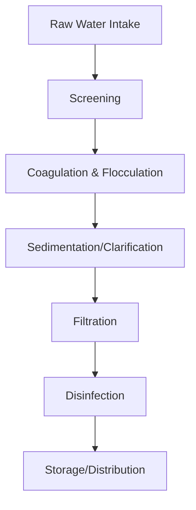

Flowchart with the ELK layout and hand-drawn look, via diagram frontmatter:

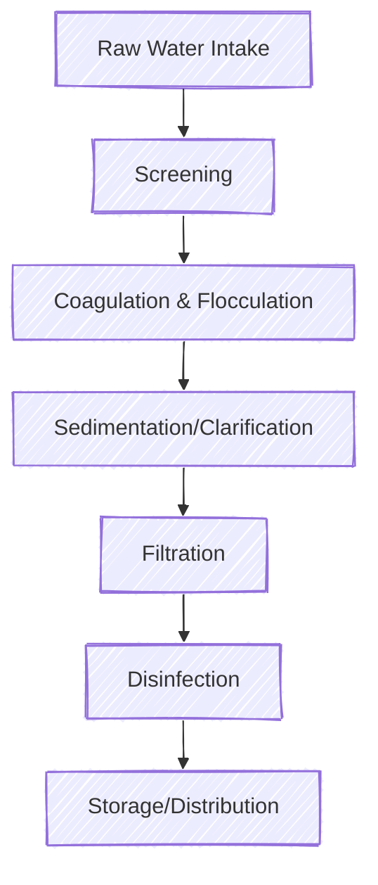

A large graph:

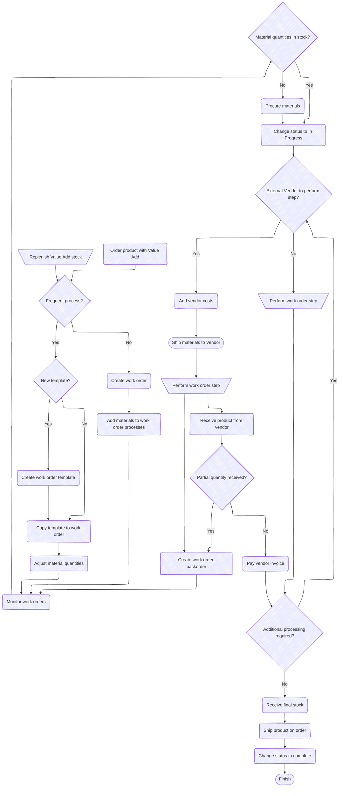

Sequence diagram:

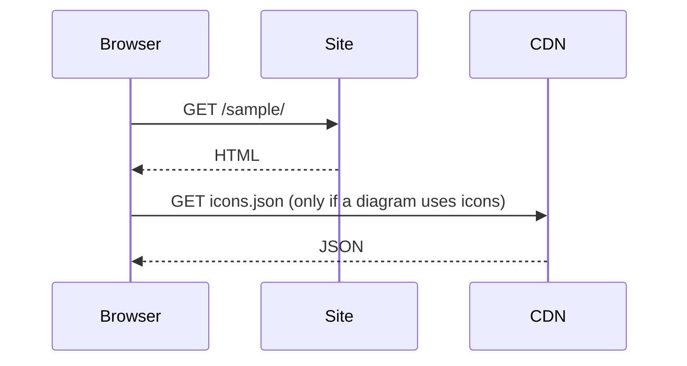

Class diagram:

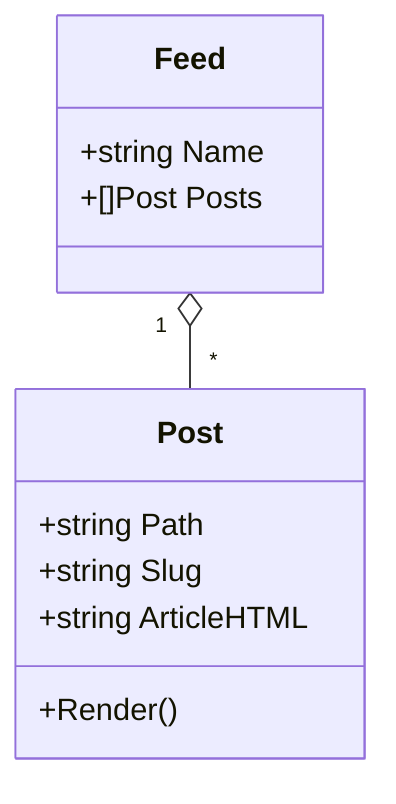

State diagram:

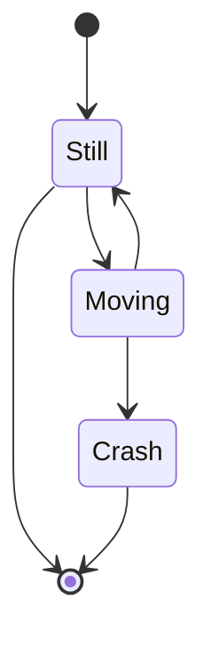

Entity relationship:

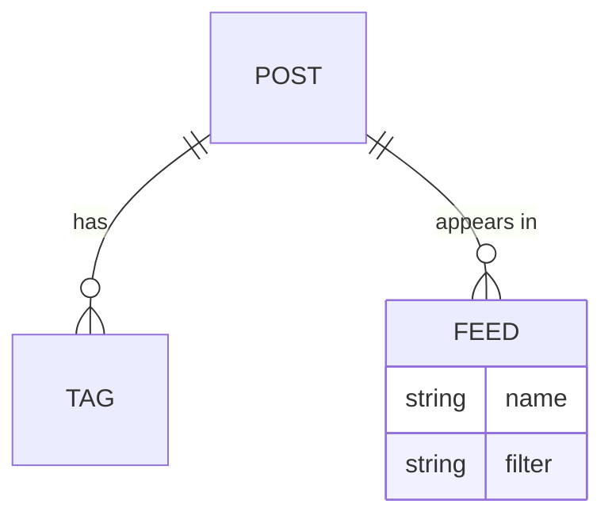

Gantt:

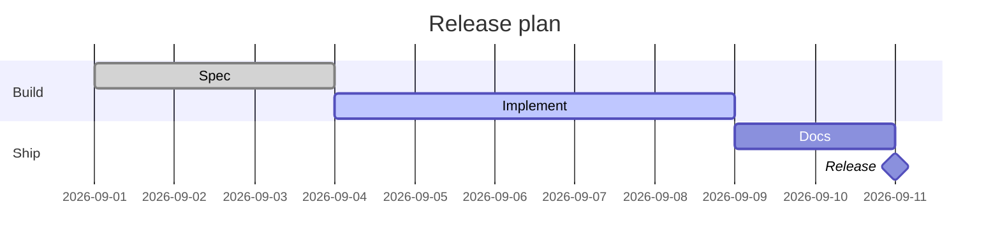

Pie:

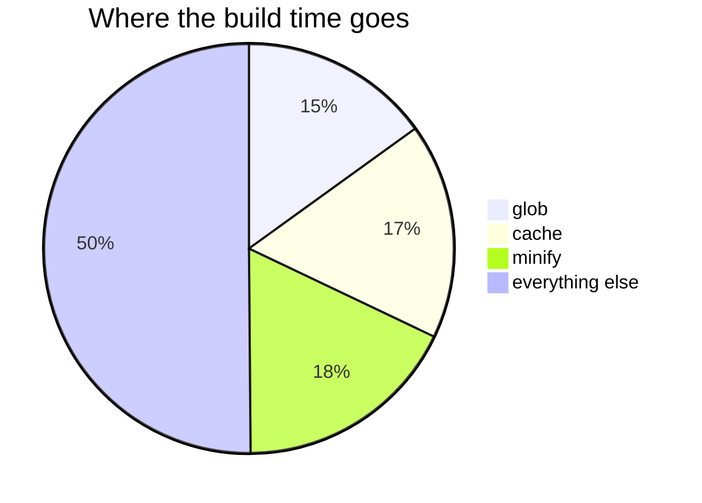

XY chart:

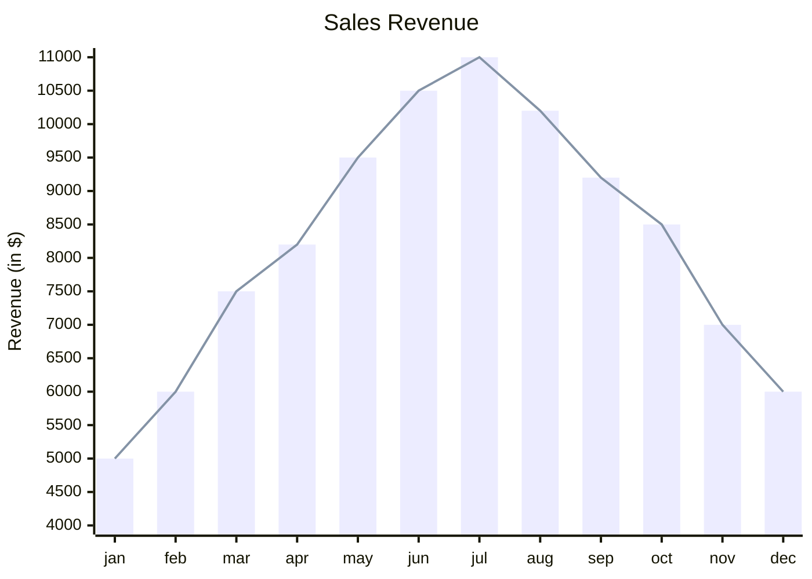

Quadrant chart:

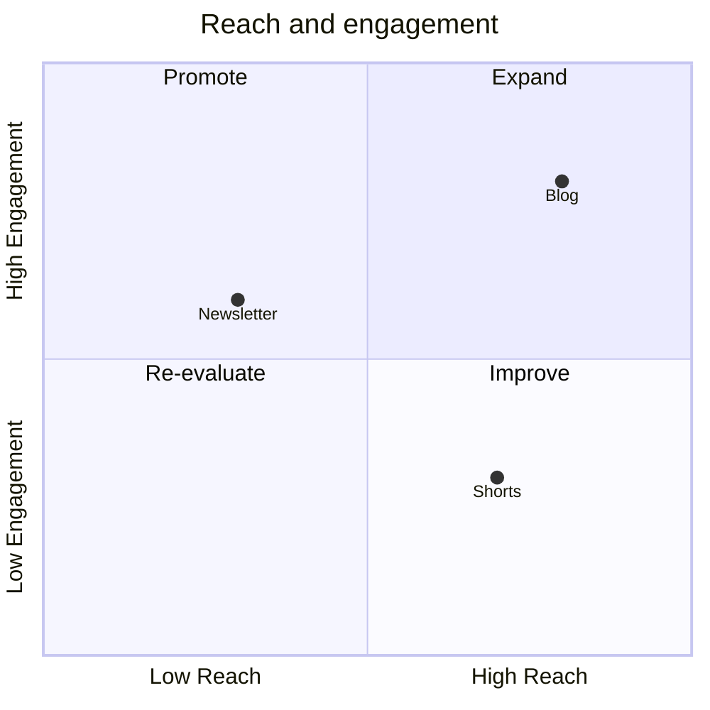

Git graph:

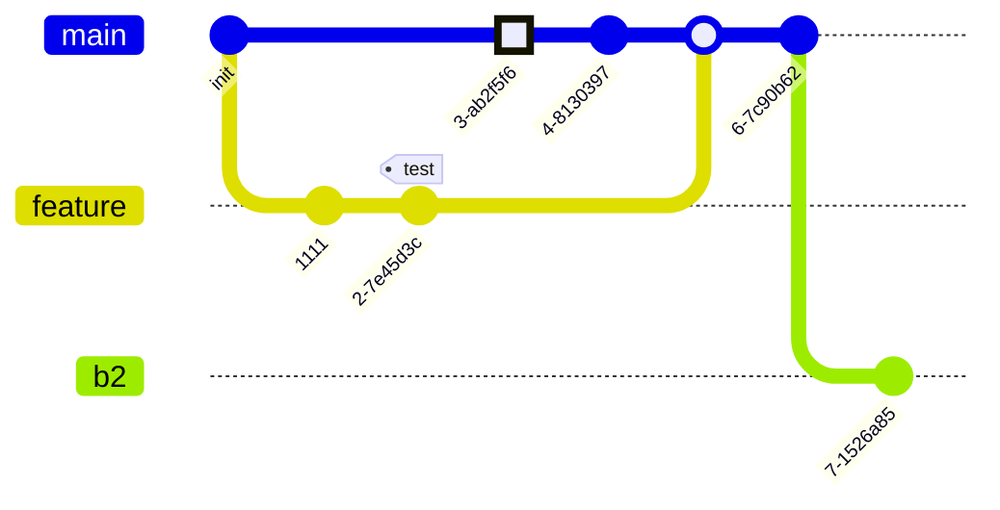

Mindmap:

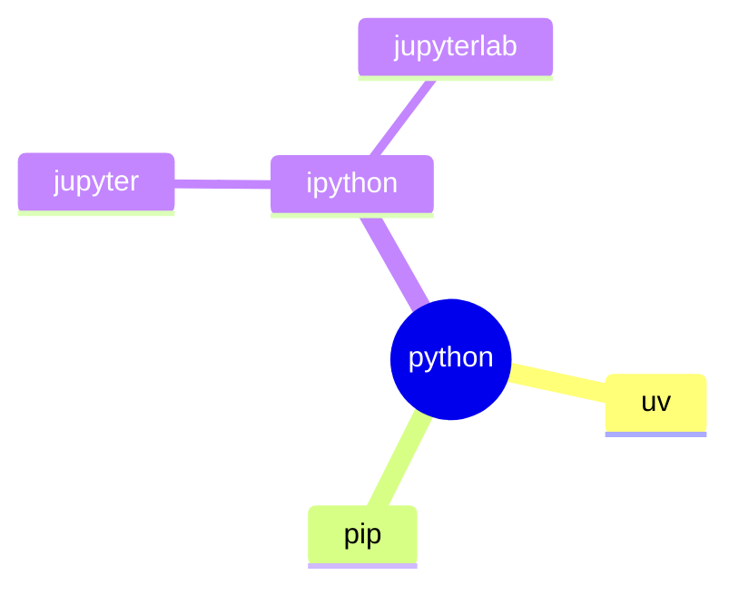

Timeline:

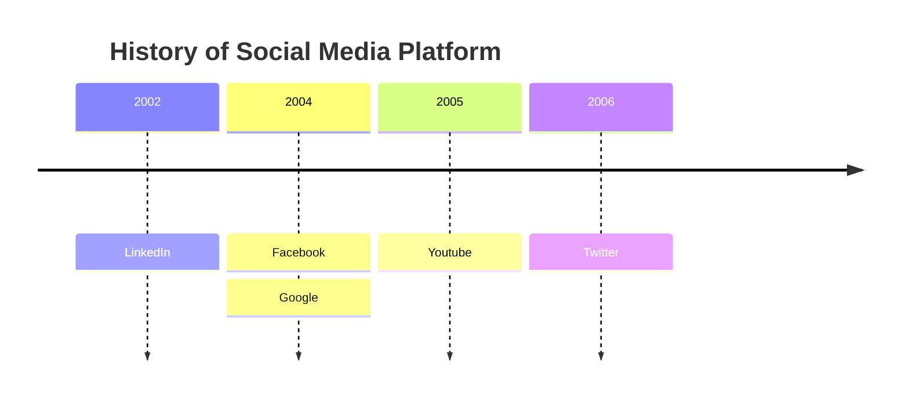

User journey:

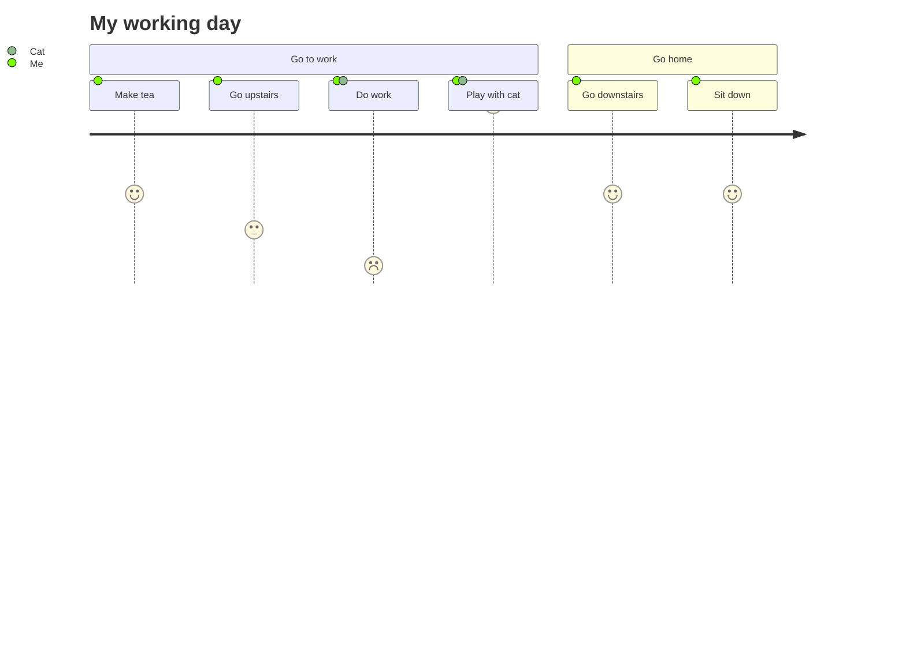

Sankey:

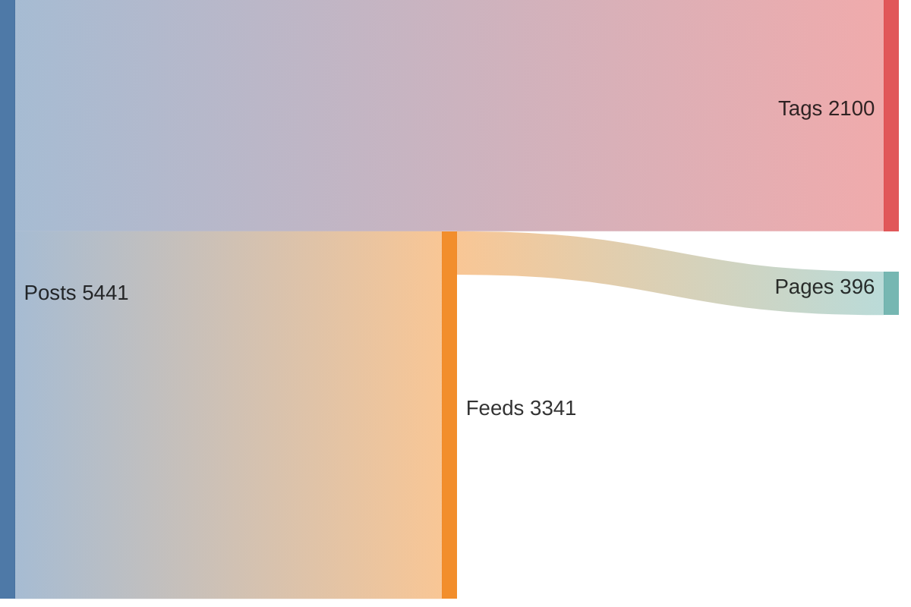

Block diagram:

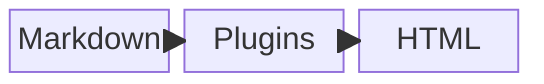

Packet diagram:

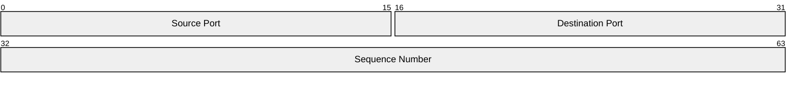

Kanban:

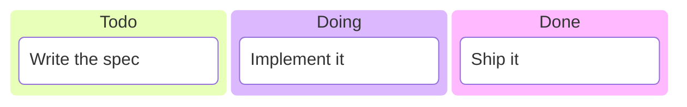

Architecture with built-in icons:

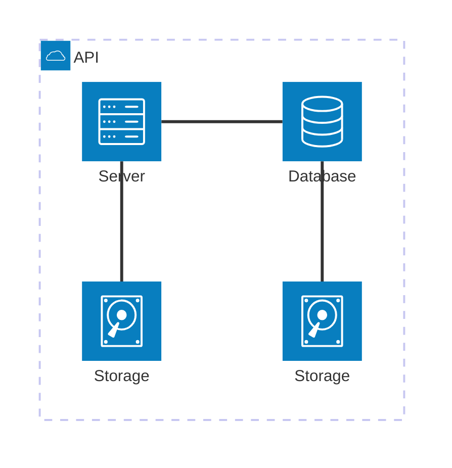

Architecture with the `logos` Iconify pack (fetched only because this page
uses it):

```mermaid
architecture-beta
    group api(logos:aws-lambda)[API]

    service db(logos:aws-aurora)[Database] in api
    service disk1(logos:aws-glacier)[Storage] in api
    service disk2(logos:aws-s3)[Storage] in api
    service server(logos:aws-ec2)[Server] in api

    db:L -- R:server
    disk1:T -- B:server
    disk2:T -- B:db
```

The source of that diagram, shown in a nested fence:

```` markdown
``` mermaid
architecture-beta
    group api(logos:aws-lambda)[API]

    service db(logos:aws-aurora)[Database] in api
    service server(logos:aws-ec2)[Server] in api

    db:L -- R:server
```
````

Mermaid inside an admonition:

!!! note "Diagram in a note"

    ```mermaid
    flowchart LR
        A[Note] --> B[Diagram]
    ```

## Raw HTML

HTML without the `markdown` attribute is passed through untouched:

<div class="sample-raw-html">
# this is not a heading

This is <em>raw</em> HTML.
</div>

<details>
<summary>A native details element</summary>

Content inside details, with **markdown** after a blank line.

</details>

## One-line links and embeds

A standalone URL on its own line becomes a link card:

https://waylonwalker.com/til/

YouTube links on their own line become players:

https://youtu.be/dQw4w9WgXcQ

https://www.youtube.com/watch?v=dQw4w9WgXcQ

## Special characters and escaping

Characters that must not break rendering: `<script>`, &amp;, &lt;tag&gt;,
\*not emphasis\*, \_not italic\_, `--->`, 5 > 3 && 2 < 4, "quotes" and
'apostrophes', unicode → ← ↑ ↓ ✓ ✗ 🚀 🔥 👍.

A line ending with two spaces  
forces a line break.

## The end

Below this section the page should show the post graph (if enabled), share
buttons, the previous / next footer navigation, and webmentions.
