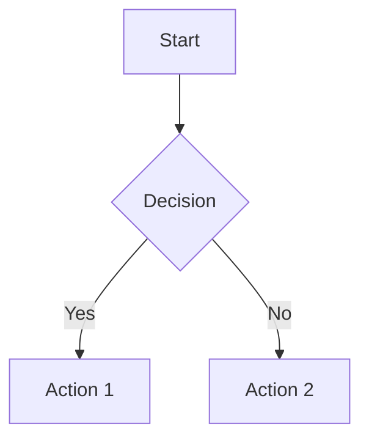

# Optional Plugins Specification

This document specifies optional plugins that extend the static site generator with additional features. Unlike default plugins, these must be explicitly enabled in the configuration.

## Plugin Overview

```
┌─────────────────────────────────────────────────────────────────────┐
│                       OPTIONAL PLUGIN SET                           │
├─────────────────────────────────────────────────────────────────────┤
│  CONTENT ENHANCEMENT                                                │
│    ├─ glossary          Auto-link terms to definition posts        │
│    ├─ mermaid           Render Mermaid diagrams                    │
│    ├─ chartjs           Render Chart.js charts                     │
│    ├─ csv_fence         Convert CSV code blocks to tables          │
│    └─ md_video          Convert image syntax to video tags         │
│                                                                      │
│  LINK ENHANCEMENT                                                    │
│    ├─ one_line_link     Rich previews for URLs on own line         │
│    └─ wikilink_hover    Hover previews for wikilinks               │
│                                                                      │
│  OUTPUT GENERATION                                                   │
│    └─ qrcode            Generate QR codes for posts                │
└─────────────────────────────────────────────────────────────────────┘
```

---

## Enabling Optional Plugins

Optional plugins must be explicitly enabled in your configuration. Add them to the `hooks` list:

```toml
[markata-go]
hooks = [
    "default",
    "glossary",
    "mermaid",
    "csv_fence",
]
```

Each plugin also has an `enabled` configuration option (default: `true`) that allows temporarily disabling a plugin without removing it from the hooks list:

```toml
[markata-go.mermaid]
enabled = false  # Disable mermaid without removing from hooks
```

---

## Content Enhancement Plugins

### `glossary`

**Stage:** `render` (late priority, after markdown conversion) + `write` (for JSON export)

**Purpose:** Automatically link glossary terms in post content to their definition pages.

**Dependencies:** None (uses standard library)

**Configuration:**

```toml
[markata-go.glossary]
enabled = true
link_class = "glossary-term"       # CSS class for glossary links
case_sensitive = false             # Match terms case-insensitively
tooltip = true                     # Add tooltip with description
max_links_per_term = 1             # Link only first occurrence (0 = all)
exclude_tags = ["glossary"]        # Don't link in glossary posts themselves
export_json = true                 # Export glossary.json to output
glossary_path = "glossary"         # Path prefix for glossary posts
template_key = "glossary"          # templateKey value identifying glossary posts
```

**Configuration Fields:**

| Field | Type | Default | Description |
|-------|------|---------|-------------|
| `enabled` | bool | `true` | Whether the plugin is active |
| `link_class` | string | `"glossary-term"` | CSS class for glossary links |
| `case_sensitive` | bool | `false` | Whether term matching is case-sensitive |
| `tooltip` | bool | `true` | Add title attribute with description |
| `max_links_per_term` | int | `1` | Max links per term per post (0 = unlimited) |
| `exclude_tags` | []string | `["glossary"]` | Tags that should not have terms linked |
| `export_json` | bool | `true` | Whether to export glossary.json |
| `glossary_path` | string | `"glossary"` | Path prefix for glossary definition posts |
| `template_key` | string | `"glossary"` | templateKey frontmatter value identifying glossary posts |

**Post Frontmatter (Definition Posts):**

```yaml
---
title: API
templateKey: glossary
description: Application Programming Interface - a set of protocols...
aliases:
  - APIs
  - Application Programming Interface
---
```

**Behavior:**

1. Scan posts with `templateKey: glossary` or in configured glossary path
2. Build term → definition lookup including aliases
3. For each non-glossary post, find term occurrences in `article_html`
4. Replace with linked version: `<a href="/glossary/api/" class="glossary-term" title="...">API</a>`
5. At write stage: optionally export `glossary.json` with all terms

**Protected Content:**

The plugin protects the following HTML elements from term linking:
- `<a>` tags (prevents double-linking)
- `<code>` tags (preserves code samples)
- `<pre>` tags (preserves preformatted content)

**Output Files:**

| File | Description |
|------|-------------|
| `{output}/glossary.json` | JSON export of all terms |

**Example glossary.json:**

```json
{
  "terms": [
    {
      "term": "API",
      "slug": "api",
      "description": "Application Programming Interface",
      "aliases": ["APIs"],
      "href": "/glossary/api/"
    }
  ]
}
```

**Interface requirements:**

The plugin MUST implement:
- `Plugin` - Basic plugin interface with `Name()` method
- `ConfigurePlugin` - To read configuration
- `RenderPlugin` - For term linking during the render stage
- `WritePlugin` - For JSON export during the write stage
- `PriorityPlugin` - To ensure late execution after markdown rendering

---

### `mermaid`

**Stage:** `render` (late priority, after markdown conversion)

**Purpose:** Convert Mermaid code blocks into rendered diagrams.

**Dependencies:** None (client-side rendering via CDN)

**Configuration:**

```toml
[markata-go.mermaid]
enabled = true
cdn_url = "https://cdn.jsdelivr.net/npm/mermaid@10/dist/mermaid.esm.min.mjs"
theme = "default"                  # default, dark, forest, neutral
```

**Configuration Fields:**

| Field | Type | Default | Description |
|-------|------|---------|-------------|
| `enabled` | bool | `true` | Whether the plugin is active |
| `cdn_url` | string | `"https://cdn.jsdelivr.net/npm/mermaid@10/dist/mermaid.esm.min.mjs"` | URL for Mermaid.js library |
| `theme` | string | `"default"` | Mermaid theme (default, dark, forest, neutral) |

**Syntax:**

````markdown

````

**Behavior:**

1. Find all `<pre><code class="language-mermaid">` blocks
2. Replace with `<pre class="mermaid">{diagram code}</pre>`
3. Inject Mermaid.js script (once per post with mermaid content)

**Output:**

```html
<pre class="mermaid">
graph TD
    A[Start] --> B{Decision}
    B -->|Yes| C[Action 1]
    B -->|No| D[Action 2]
</pre>

<script type="module">
  import mermaid from 'https://cdn.jsdelivr.net/npm/mermaid@10/dist/mermaid.esm.min.mjs';
  mermaid.initialize({ startOnLoad: true, theme: 'default' });
</script>
```

**Supported Diagram Types:**

| Type | Description |
|------|-------------|
| `graph` / `flowchart` | Flow diagrams |
| `sequenceDiagram` | Sequence diagrams |
| `classDiagram` | Class diagrams |
| `stateDiagram` | State diagrams |
| `erDiagram` | Entity relationship |
| `gantt` | Gantt charts |
| `pie` | Pie charts |
| `gitGraph` | Git graphs |
| `mindmap` | Mind maps |
| `timeline` | Timelines |

**Interface requirements:**

The plugin MUST implement:
- `Plugin` - Basic plugin interface with `Name()` method
- `ConfigurePlugin` - To read configuration
- `RenderPlugin` - To process posts during the render stage
- `PriorityPlugin` - To ensure late execution after markdown rendering

---

### `chartjs`

> **Note:** This plugin is planned but not yet implemented.

**Stage:** `render` (late priority, after markdown conversion)

**Purpose:** Convert Chart.js JSON blocks into rendered charts.

**Dependencies:** None (client-side rendering via CDN)

**Configuration:**

```toml
[markata-go.chartjs]
enabled = true
cdn_url = "https://cdn.jsdelivr.net/npm/chart.js"
default_options = {}               # Default Chart.js options
```

**Syntax:**

````markdown
```chartjs
{
  "type": "bar",
  "data": {
    "labels": ["Red", "Blue", "Yellow"],
    "datasets": [{
      "label": "Votes",
      "data": [12, 19, 3],
      "backgroundColor": ["#f87171", "#60a5fa", "#fbbf24"]
    }]
  }
}
```
````

**Behavior:**

1. Find all `<pre><code class="language-chartjs">` blocks
2. Parse JSON content
3. Replace with canvas element and initialization script
4. Inject Chart.js script (once per page)

**Output:**

```html
<div class="chartjs-container">
  <canvas id="chart-1"></canvas>
</div>

<script>
  new Chart(document.getElementById('chart-1'), {
    type: 'bar',
    data: { ... }
  });
</script>

<script src="https://cdn.jsdelivr.net/npm/chart.js"></script>
```

**Supported Chart Types:**

| Type | Description |
|------|-------------|
| `bar` | Bar chart |
| `line` | Line chart |
| `pie` | Pie chart |
| `doughnut` | Doughnut chart |
| `radar` | Radar chart |
| `polarArea` | Polar area chart |
| `bubble` | Bubble chart |
| `scatter` | Scatter plot |

---

### `csv_fence`

**Stage:** `render` (late priority, after markdown conversion)

**Purpose:** Convert CSV code blocks into HTML tables.

**Dependencies:** None (uses standard library csv module)

**Configuration:**

```toml
[markata-go.csv_fence]
enabled = true
table_class = "csv-table"          # CSS class for table
has_header = true                  # First row is header
delimiter = ","                    # CSV delimiter
```

**Configuration Fields:**

| Field | Type | Default | Description |
|-------|------|---------|-------------|
| `enabled` | bool | `true` | Whether the plugin is active |
| `table_class` | string | `"csv-table"` | CSS class for generated table |
| `has_header` | bool | `true` | Whether first row is a header |
| `delimiter` | string | `","` | CSV field delimiter |

**Syntax:**

````markdown
```csv
Name,Age,City
Alice,30,New York
Bob,25,Los Angeles
Charlie,35,Chicago
```
````

**Behavior:**

1. Find all `<pre><code class="language-csv">` blocks
2. Parse CSV content
3. Generate HTML table with `<thead>` (if header) and `<tbody>`

**Output:**

```html
<table class="csv-table">
  <thead>
    <tr>
      <th>Name</th>
      <th>Age</th>
      <th>City</th>
    </tr>
  </thead>
  <tbody>
    <tr>
      <td>Alice</td>
      <td>30</td>
      <td>New York</td>
    </tr>
    <tr>
      <td>Bob</td>
      <td>25</td>
      <td>Los Angeles</td>
    </tr>
    <tr>
      <td>Charlie</td>
      <td>35</td>
      <td>Chicago</td>
    </tr>
  </tbody>
</table>
```

**Advanced Usage:**

Per-block options can override global configuration:

````markdown
```csv delimiter=";" has_header="false" table_class="custom-table"
1;2;3
4;5;6
```
````

**Interface requirements:**

The plugin MUST implement:
- `Plugin` - Basic plugin interface with `Name()` method
- `ConfigurePlugin` - To read configuration
- `RenderPlugin` - To process posts during the render stage
- `PriorityPlugin` - To ensure late execution after markdown rendering

---

## Link Enhancement Plugins

### `one_line_link`

> **Note:** This plugin is planned but not yet implemented.

**Stage:** `render` (late priority, after markdown conversion)

**Purpose:** Expand URLs that appear alone on a line into rich preview cards.

**Dependencies:** None (optional: external HTTP client for metadata fetching)

**Configuration:**

```toml
[markata-go.one_line_link]
enabled = true
card_class = "link-card"
fetch_metadata = true              # Fetch title/description from URL
cache_metadata = true              # Cache fetched metadata
fallback_title = "Link"            # Title when fetch fails
timeout = 5                        # Fetch timeout in seconds

# URL patterns to exclude from expansion
exclude_patterns = [
    "^https://twitter.com",
    "^https://x.com",
]

# Custom templates per domain
[markata-go.one_line_link.templates]
"github.com" = "github-card.html"
"youtube.com" = "youtube-card.html"
```

**Syntax:**

```markdown
Check out this article:

https://example.com/awesome-article

And continue reading...
```

**Behavior:**

1. Find URLs that are alone on their own line (paragraph containing only a URL)
2. Fetch page metadata (title, description, image) if enabled
3. Replace with rich card HTML

**Output:**

```html
<p>Check out this article:</p>

<a href="https://example.com/awesome-article" class="link-card">
  <div class="link-card-image" style="background-image: url('...')"></div>
  <div class="link-card-content">
    <div class="link-card-title">Awesome Article Title</div>
    <div class="link-card-description">A brief description...</div>
    <div class="link-card-url">example.com</div>
  </div>
</a>

<p>And continue reading...</p>
```

**Detection Rules:**

| Pattern | Expanded? |
|---------|-----------|
| `https://example.com` (alone) | Yes |
| `Check out https://example.com` | No (inline) |
| `[Link](https://example.com)` | No (already link) |
| `<https://example.com>` | No (autolink) |

---

### `wikilink_hover`

> **Note:** This plugin is planned but not yet implemented.

**Stage:** `render` (late priority, after wikilinks plugin)

**Purpose:** Add hover previews to wikilinks showing target post content.

**Dependencies:** None

**Configuration:**

```toml
[markata-go.wikilink_hover]
enabled = true
preview_length = 200               # Characters to show in preview
include_image = true               # Include featured image if available
screenshot_service = ""            # URL of screenshot service (optional)
screenshot_width = 400
screenshot_height = 300
```

**Behavior:**

1. Find all wikilink anchors (`<a>` tags created by wikilinks plugin)
2. Add `data-preview` attribute with preview content
3. Optionally add screenshot URL

**Output:**

```html
<a href="/other-post/"
   class="wikilink"
   data-preview="Preview text from the target post..."
   data-preview-image="/other-post/featured.jpg">
  Other Post
</a>
```

**JavaScript Integration:**

The plugin adds data attributes; JavaScript handles the hover display:

```javascript
document.querySelectorAll('[data-preview]').forEach(link => {
  link.addEventListener('mouseenter', showPreview);
  link.addEventListener('mouseleave', hidePreview);
});
```

**Screenshot Service:**

If `screenshot_service` is configured:

```toml
screenshot_service = "https://screenshot.example.com/capture?url="
```

Output:

```html
<a href="/other-post/"
   data-preview-screenshot="https://screenshot.example.com/capture?url=https://mysite.com/other-post/">
  Other Post
</a>
```

---

## Output Generation Plugins

### `qrcode`

> **Note:** This plugin is planned but not yet implemented.

**Stage:** `write`

**Purpose:** Generate QR code images for each post's URL.

**Dependencies:** External QR code library (to be determined)

**Configuration:**

```toml
[markata-go.qrcode]
enabled = true
format = "svg"                     # "svg" or "png"
size = 200                         # Size in pixels
output_dir = "qrcodes"             # Subdirectory in output
filename_template = "{slug}.{format}"
error_correction = "M"             # L, M, Q, H
foreground = "#000000"
background = "#ffffff"
include_logo = false               # Embed site logo in center
logo_path = "static/logo.png"
```

**Behavior:**

1. For each post, generate QR code for its absolute URL
2. Save to output directory
3. Add `qrcode_url` field to post model

**Output Files:**

```
output/
  qrcodes/
    hello-world.svg
    another-post.svg
```

**Post Model Extension:**

Posts with QR codes will have the `qrcode_url` field set in their Extra map.

**Template Usage:**

```jinja2



```

---

## Plugin Dependencies

For the implemented plugins:

| Plugin | Required | Optional |
|--------|----------|----------|
| `glossary` | - | - |
| `mermaid` | - | - |
| `csv_fence` | - | - |

Planned plugins may have additional dependencies when implemented.

---

## Plugin Interaction

### Execution Order

When using multiple optional plugins, order matters:

```toml
hooks = [
    "default",           # Includes wikilinks
    "glossary",          # After render (needs article_html)
    "mermaid",           # After render
    "chartjs",           # After render
    "csv_fence",         # After render
    "md_video",          # After render
    "one_line_link",     # After render
    "wikilink_hover",    # After wikilinks (needs wikilink anchors)
    "qrcode",            # At save stage
]
```

### Conflicts

| Plugins | Issue | Resolution |
|---------|-------|------------|
| `glossary` + `wikilinks` | Terms in wikilinks get double-linked | Glossary excludes content inside `<a>` tags |
| `mermaid` + `csv_fence` | None | Process independently |
| `one_line_link` + any | URLs in code blocks | Exclude `<pre>` and `<code>` content |

---

## Disabling Optional Plugins

```toml
[markata-go]
hooks = ["default", "mermaid", "csv_fence"]
disabled_hooks = ["mermaid"]  # Disable mermaid specifically
```

Or set the `enabled` config option to false:

```toml
[markata-go.mermaid]
enabled = false
```

---

## Creating Custom Optional Plugins

Follow the pattern established by these plugins:

1. **Configuration**: Define config struct with sensible defaults
2. **Enabled Check**: Always check `config.Enabled` first
3. **Priority**: Use `lifecycle.PriorityLate` to run after markdown rendering
4. **Concurrent Processing**: Use `m.ProcessPostsConcurrently()` for post processing
5. **Error Handling**: Return errors, don't panic

Example plugin structure:

1. **Configuration**: Define config with sensible defaults
2. **Enabled Check**: Always check `config.enabled` first
3. **Priority**: Use late priority to run after markdown rendering
4. **Concurrent Processing**: Process posts concurrently when possible
5. **Error Handling**: Return errors, don't panic

**Plugin skeleton (pseudocode):**

```
class MyPluginConfig:
    enabled: bool = true
    option: string = "default"

class MyPlugin:
    config: MyPluginConfig

    function name() -> string:
        return "my_plugin"

    function priority(stage) -> int:
        if stage == STAGE_RENDER:
            return PRIORITY_LATE
        return PRIORITY_DEFAULT

    function configure(manager) -> error:
        # Read config from manager.config.extra["my_plugin"]
        return null

    function render(manager) -> error:
        if not config.enabled:
            return null

        return manager.process_posts_concurrently(post =>
            if post.skip or post.article_html == "":
                return null
            # Process post.article_html
            return null
        )
```

**Interface requirements:**

The plugin MUST implement:
- `Plugin` - Basic plugin interface with `Name()` method
- `ConfigurePlugin` - To read configuration
- `RenderPlugin` - To process posts during the render stage
- `PriorityPlugin` - To control execution order

---

## See Also

- [PLUGINS.md](./PLUGINS.md) - Plugin development guide
- [DEFAULT_PLUGINS.md](./DEFAULT_PLUGINS.md) - Default plugins
- [CONFIG.md](./CONFIG.md) - Plugin configuration
- [THEMES.md](./THEMES.md) - Styling for plugin output
